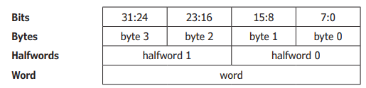
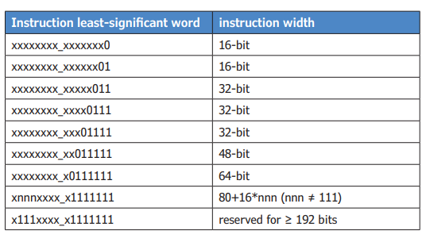
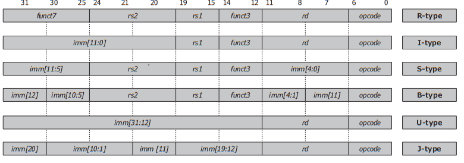
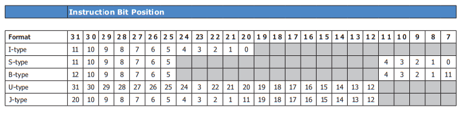
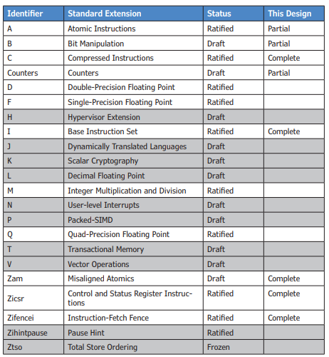
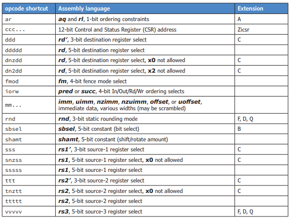
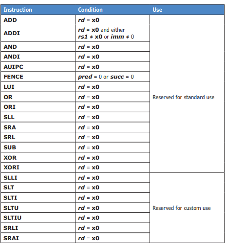
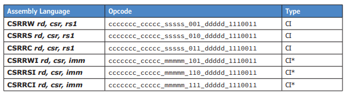

 # 1. Архитектура набора команд RISC-V

Архитектура набора команд RISC-V (ISA) представляет собой семейство из четырех отдельных, но связанных базовых наборов команд. Эти четыре ISA имеют либо разную ширину регистров, либо разное количество регистров, но связаны тем, что все они используют одно и то же кодирование инструкций для большей части базового набора команд.

Четыре базовых набора команд называются RV32I (32-битный базовый целочисленный ISA), RV32E (32-битный базовый целочисленный встроенный ISA), RV64I (64-битный базовый целочисленный ISA) и RV128I (128-битный базовый целочисленный ISA). 

Единственное различие между RV32E и RV32I заключается в том, что RV32E содержит всего 16 32-битных регистров, а не 32 32-битных регистра, как RV32I. Руководство по набору команд RISC-V оправдывает это различие, утверждая, что 16 регистров составляют 25% площади и требуют 25% мощности для ядра RISC-V, и что это сокращение необходимо для встроенных систем.

RV64I содержит 64-битные регистры и обрабатывает 64-битные адреса. Все инструкции, которые применимы к RV32I, также присутствуют в RV64I, за исключением того, что эти инструкции теперь работают с 64-битными величинами, а не с 32-битными величинами. Это означает, что один и тот же код может выполняться на обеих архитектурах, но результаты будут различаться. RV64I содержит отдельные инструкции для выполнения 32-битных операций, которые будут возвращать тот же результат, что и RV32I, в младшем слове регистра, и с расширением знака в старшем слове регистра. Руководство по набору команд RISC-V признает, что это могло быть ошибкой, но что сейчас уже слишком поздно что-либо менять.

RV128I будет содержать 128-битные регистры и обрабатывать 128-битные адреса. Эта версия ISA RISC-V будет содержать те же проблемы относительно RV64I, что и RV64I по отношению к RV32I.

## 1.1 Обзор 

Память RISC-V адресуется по байтам и по своей природе является little-endian. Фактическая ширина шины памяти считается деталью реализации и может быть такой широкой или узкой, как требует приложение. В качестве напоминания, нумерация байтов для системы little-endian показана на рисунке 2.1, который показывает 32-битную ширину для данных.

Рисунок 1: Нумерация битов/байтов/полубайтов/слов.

RISC-V работает с числами в дополнительном коде, хотя предусмотрены возможности для беззнаковых чисел для адресов. Непосредственные данные почти всегда расширяются по знаку до полной ширины 32 бита перед использованием. 

Все базовые архитектуры RISC-V используют фиксированный размер инструкции в 32 бита, и все инструкции должны быть выровнены по длине в памяти. Это означает, что два наименее значащих бита адреса инструкции должны быть равны нулю, иначе будет сгенерировано исключение "Неправильное выравнивание адреса инструкции". Однако Руководство по набору инструкций RISC-V также предусматривает переменные длины инструкций, где длина является кратной 16 битам, включая опцию 16-битных инструкций. В случае 16-битных инструкций только наименее значащий бит адреса инструкции должен быть равен нулю. 

Длина инструкции RISC-V кодируется в наименее значащих битах инструкции. Хотя Руководство по набору инструкций RISC-V определяет метод кодирования инструкций длиной до 192 бит, в спецификации в настоящее время заморожены только 16-битные и 32-битные инструкции. Таблица 1 показывает кодирование длины инструкции.

Таблица 1: Кодирование длины инструкции

### 1.1.1 Форматы инструкций

Почти все, в настоящее время определенные инструкции RISC-V, используют один из всего шести основных форматов инструкций длиной 32 бита, что значительно упрощает декодирование инструкций. Рисунок 2 показывает эти форматы инструкций.

Рисунок 2: Форматы инструкций

Формат инструкции типа R используется для операций «регистр-регистр» (Register-Register). В этом формате инструкция считывает два исходных операнда из регистров и записывает результат операции в другой регистр. Исходные операнды при этом не изменяются, если только один из исходных регистров не используется также как регистр назначения.

Формат инструкции типа I используется для операций «регистр-непосредственное значение» (Register-Immediate). В этом формате инструкции считывают один исходный операнд из регистра, второй операнд берут из поля непосредственного значения в коде операции и записывают результат операции в регистр. Исходный операнд при этом не изменяется, если только исходный регистр не используется также как регистр назначения. В формате инструкции типа I непосредственное значение имеет длину 12 бит и расширяется со знаком до полных 32 бит для использования в операции. Это обеспечивает диапазон от –2048 до +2047 для непосредственных данных. Безусловное расширение со знаком обычно весьма полезно, но в некоторых случаях может создавать неудобства, о чём будет рассказано далее.

Формат инструкции типа S используется исключительно для операций записи (Store), и непосредственные данные всегда являются смещением адреса. Как и в других случаях с непосредственными данными, 12-битное смещение всегда расширяется со знаком, что даёт диапазон смещений от –2048 до +2047 относительно базового адреса в регистре.

Формат инструкции типа B используется исключительно для команд перехода (Branch), и 12-битные непосредственные данные также являются смещением адреса. В этом формате смещение в инструкции расширяется со знаком и затем сдвигается влево на один бит, чтобы гарантировать, что оно является чётным, что даёт диапазон от –212 до +212 – 2 для перехода. Биты в смещении организованы таким образом, чтобы максимально совпадать с битами смещения в формате инструкций типа S.

Формат инструкции типа U используется для команд, которым требуются более широкие непосредственные данные. В этом формате непосредственные операнды имеют ширину 20 бит и заполняют старшие биты (самые значащие) 32-битного слова, при этом младшие 12 бит этого слова устанавливаются в ноль.

Формат инструкции типа J используется исключительно для одного типа команд перехода (Jump), и 12-битные непосредственные данные также являются смещением адреса. В этом формате смещение в инструкции расширяется со знаком и затем сдвигается влево на один бит, чтобы гарантировать, что оно является чётным, что даёт диапазон от –212 до +212 – 2 для прыжка. Биты в смещении организованы таким образом, чтобы максимально совпадать с битами смещений в форматах инструкций типа U и I.

### 1.1.2 Позиции непосредственных данных в инструкциях

Таблица 2 показывает позиции битов для непосредственных данных в тех инструкциях, которые содержат непосредственные данные. В большинстве случаев требуется только двухвходовый мультиплексор для выбора целевого бита непосредственных данных. Это упрощает необходимую логику, но значительно усложняет интерпретацию дампа памяти. Во всех случаях старший бит (наиболее значащий бит), который будет расширяться со знаком, находится в одном и том же положении внутри кода операции (opcode).

Таблица 2: Формат инструкции Непосредственные данные

### 1.1.3 Наборы регистров

Поля выбора регистров rd, rs1 и rs2 в инструкциях кодируются так, как показано в таблице 3. Регистры обозначаются именами от x0 до x31, при этом регистр x0 аппаратно зафиксирован и всегда содержит только значение ноль (только для чтения). Аппаратная фиксация x0 на нуле позволяет реализовать ряд псевдоинструкций, удобных для программирования на языке ассемблера.

В Руководстве по набору команд RISC-V также определён стандартный Application Binary Interface (ABI) с описательными именами регистров и стандартным их назначением. Большинство ассемблеров для RISC-V распознают или даже требуют использования этих описательных имён регистров.

Таблица 3: Набор регистров

| Encoding | Register Name | Register ABI Name | Register ABI Description    |
| -------- | ------------- | ----------------- | --------------------------- |
| 00000    | x0            | zero              | Hard-wired zero             |
| 00001    | x1            | ra                | Return address              |
| 00010    | x2            | sp                | Stack pointer               |
| 00011    | x3            | gp                | Global pointer              |
| 00100    | x4            | tp                | Thread pointer              |
| 00101    | x5            | t0                | Temporary register 0        |
| 00110    | x6            | t1                | Temporary register 1        |
| 00111    | x7            | t2                | Temporary register 2        |
| 01000    | x8            | s0/fp             | Saved reg 0 / Frame pointer |
| 01001    | x9            | s1                | Saved register 1            |
| 01010    | x10           | a0                | Function return value 0     |
| 01011    | x11           | a1                | Function return value 1     |
| 01100    | x12           | a2                | Function argument 2         |
| 01101    | x13           | a3                | Function argument 3         |
| 01110    | x14           | a4                | Function argument 4         |
| 01111    | x15           | a5                | Function argument 5         |
| 10000    | x16           | a6                | Function argument 6         |
| 10001    | x17           | a7                | Function argument 7         |
| 10010    | x18           | s2                | Saved register 2            |
| 10011    | x19           | s3                | Saved register 3            |
| 10100    | x20           | s4                | Saved register 4            |
| 10101    | x21           | s5                | Saved register 5            |
| 10110    | x22           | s6                | Saved register 6            |
| 10111    | x23           | s7                | Saved register 7            |
| 11000    | x24           | s8                | Saved register 8            |
| 11001    | x25           | s9                | Saved register 9            |
| 11010    | x26           | s10               | Saved register 10           |
| 11011    | x27           | s11               | Saved register 11           |
| 11100    | x28           | t3                | Temporary register 3        |
| 11101    | x29           | t4                | Temporary register 4        |
| 11110    | x30           | t5                | Temporary register 5        |
| 11111    | x31           | t6                | Temporary register 6        |

### 1.1.4 Стандартные расширения

Руководство по набору команд RISC-V также содержит ряд черновых или утверждённых стандартных расширений, выходящих за рамки базовых ISA RISC-V. Большинство из этих расширений обозначены одной буквой и показаны в таблице 4. Ряд стандартных расширений всё ещё находится в разработке и здесь рассматриваться не будет. Эти расширения выделены в таблице. Представленный здесь проект включает только часть  стандартных расширений, как показано в крайнем правом столбце таблицы.

Таблица 4: Стандартные расширения

### 1.1.5 Условные обозначения в таблицах опкодов
В оставшейся части этой главы кодировка команд будет показана в таблицах, где различные поля разделены символом подчёркивания ( _ ), чтобы сделать поля более наглядными. Поля в кодировке команды перечислены с использованием сокращений для общих полей (опкодов). Эти сокращения в большинстве случаев должны быть понятны сами по себе, но для полноты приведены в таблице 5.

Таблица 5: Сокращения опкодов

## 1.2 Базовый набор целочисленных инструкций

Базовый целочисленный набор инструкций RV32I содержит всего сорок инструкций. Эти сорок инструкций являются абсолютным минимумом для любой реализации RISC-V и достаточны для эмуляции почти всех текущих стандартных расширений RISC-V. Список этих сорока инструкций приведён в таблице 6 вместе с соответствующими опкодами. Эта таблица организована по типам опкодов, чтобы сделать информацию полезной в процессе проектирования, но отдельные инструкции будут описаны по функциональным группам.

Таблица 6: Базовый набор целочисленных инструкций

| Assembly Language     | Opcode Format                              | Type |
| --------------------- | ------------------------------------------ | ---- |
| Defined Illegal       | 1111111\_11111\_11111\_111\_11111\_1111111 | R    |
| ADD rd, rs1, rs2      | 0000000\_ttttt\_sssss\_000\_ddddd\_0110011 | R    |
| SUB rd, rs1, rs2      | 0100000\_ttttt\_sssss\_000\_ddddd\_0110011 | R    |
| SLL rd, rs1, rs2      | 0000000\_ttttt\_sssss\_001\_ddddd\_0110011 | R    |
| SLT rd, rs1, rs2      | 0000000\_ttttt\_sssss\_010\_ddddd\_0110011 | R    |
| SLTU rd, rs1, rs2     | 0000000\_ttttt\_sssss\_011\_ddddd\_0110011 | R    |
| XOR rd, rs1, rs2      | 0000000\_ttttt\_sssss\_100\_ddddd\_0110011 | R    |
| SRL rd, rs1, rs2      | 0000000\_ttttt\_sssss\_101\_ddddd\_0110011 | R    |
| SRA rd, rs1, rs2      | 0100000\_ttttt\_sssss\_101\_ddddd\_0110011 | R    |
| OR rd, rs1, rs2       | 0000000\_ttttt\_sssss\_110\_ddddd\_0110011 | R    |
| AND rd, rs1, rs2      | 0000000\_ttttt\_sssss\_111\_ddddd\_0110011 | R    |
| LB rd, offset(rs1)    | mmmmmmm\_mmmmm\_sssss\_000\_ddddd\_0000011 | I    |
| LH rd, offset(rs1)    | mmmmmmm\_mmmmm\_sssss\_001\_ddddd\_0000011 | I    |
| LW rd, offset(rs1)    | mmmmmmm\_mmmmm\_sssss\_010\_ddddd\_0000011 | I    |
| LBU rd, offset(rs1)   | mmmmmmm\_mmmmm\_sssss\_100\_ddddd\_0000011 | I    |
| LHU rd, offset(rs1)   | mmmmmmm\_mmmmm\_sssss\_101\_ddddd\_0000011 | I    |
| ADDI rd, rs1, imm     | mmmmmmm\_mmmmm\_sssss\_000\_ddddd\_0010011 | I    |
| SLLI rd, rs1, shamt   | 0000000\_shamt\_sssss\_001\_ddddd\_0010011 | I    |
| SLTI rd, rs1, imm     | mmmmmmm\_mmmmm\_sssss\_010\_ddddd\_0010011 | I    |
| SLTIU rd, rs1, imm    | mmmmmmm\_mmmmm\_sssss\_011\_ddddd\_0010011 | I    |
| XORI rd, rs1, imm     | mmmmmmm\_mmmmm\_sssss\_100\_ddddd\_0010011 | I    |
| SRLI rd, rs1, shamt   | 0000000\_shamt\_sssss\_101\_ddddd\_0010011 | I    |
| SRAI rd, rs1, shamt   | 0100000\_shamt\_sssss\_101\_ddddd\_0010011 | I    |
| ORI rd, rs1, imm      | mmmmmmm\_mmmmm\_sssss\_110\_ddddd\_0010011 | I    |
| ANDI rd, rs1, imm     | mmmmmmm\_mmmmm\_sssss\_111\_ddddd\_0010011 | I    |
| JALR rd, offset(rs1)  | mmmmmmm\_mmmmm\_sssss\_000\_ddddd\_1100111 | I    |
| FENCE fmodior\_wiorw  | 00000\_000\_00000\_0001111                 | I    |
| ECALL                 | 0000000\_00000\_00000\_000\_00000\_1110011 | I    |
| EBREAK                | 0000000\_00001\_00000\_000\_00000\_1110011 | I    |
| SB rs2, offset(rs1)   | mmmmmmm\_ttttt\_sssss\_000\_mmmmm\_0100011 | S    |
| SH rs2, offset(rs1)   | mmmmmmm\_ttttt\_sssss\_001\_mmmmm\_0100011 | S    |
| SW rs2, offset(rs1)   | mmmmmmm\_ttttt\_sssss\_010\_mmmmm\_0100011 | S    |
| BEQ rs1, rs2, offset  | mmmmmmm\_ttttt\_sssss\_000\_mmmmm\_1100011 | B    |
| BNE rs1, rs2, offset  | mmmmmmm\_ttttt\_sssss\_001\_mmmmm\_1100011 | B    |
| BLT rs1, rs2, offset  | mmmmmmm\_ttttt\_sssss\_100\_mmmmm\_1100011 | B    |
| BGE rs1, rs2, offset  | mmmmmmm\_ttttt\_sssss\_101\_mmmmm\_1100011 | B    |
| BLTU rs1, rs2, offset | mmmmmmm\_ttttt\_sssss\_110\_mmmmm\_1100011 | B    |
| BGEU rs1, rs2, offset | mmmmmmm\_ttttt\_sssss\_111\_mmmmm\_1100011 | B    |
| AUIPC rd, imm         | mmmmmmm\_mmmmm\_mmmmm\_mmm\_ddddd\_0010111 | U    |
| LUI rd, imm           | mmmmmmm\_mmmmm\_mmmmm\_mmm\_ddddd\_0110111 | U    |
| JAL rd, offset        | mmmmmmm\_mmmmm\_mmmmm\_mmm\_ddddd\_1101111 | J    |

### 1.2.1 Инструкции целочисленной арифметики

Инструкции **ADD rd, rs1, rs2** (Сложение) и **SUB rd, rs1, rs2** (Вычитание) являются инструкциями арифметических операций "регистр-регистр". В соответствии с теоретическими основами RISC, эти арифметические операции генерируют только 32-битный результат, и если требуется проверка переноса или переполнения, это должно обрабатываться отдельно программно. Для вычитания регистр **rs2** вычитается из регистра **rs1**.

Для беззнаковых операндов переполнение совпадает с переносом или заимствованием из старшего разряда, и это можно проверить напрямую с помощью условной команды перехода сразу после операции, при условии, что исходные операнды не были изменены.

Для сложения проверка на переполнение требует двух дополнительных инструкций и условного перехода, а также использования двух временных регистров. Для вычитания проверка на переполнение требует трёх дополнительных инструкций и условного перехода, плюс использование двух временных регистров. В обоих случаях оригинальные исходные регистры могут быть использованы как временные, если операнды не нужно сохранять.

Существует одна псевдоинструкция, которая использует арифметическую инструкцию "регистр-регистр":

$NEG rd, rs (Дополнение до двух или Инверсия знака) — это SUB rd, x0, rs.$

**ADDI rd, rs1, imm** (Сложение с непосредственным операндом) — это единственная арифметическая инструкция "регистр-непосредственное значение". Безусловное знаковое расширение для непосредственных данных делает ненужным существование инструкции вычитания с непосредственным операндом.

Существует значительное количество комбинаций операндов инструкций, которые приведут к отсутствию операции со стороны процессора, но определённый стандартом код для No Operation (NOP) использует инструкцию **ADDI**. Инструкция **ADDI** также используется для реализации псевдоинструкции, которая копирует один регистр в другой.

$NOP (Нет операции) — это просто ADDI x0, x0, 0.$

$MV rd, rs (Копирование регистра) — это просто ADDI rd, rs, 0.$

### 1.2.2 Инструкции логических операций

**AND rd, rs1, rs2** (Логическое И), **OR rd, rs1, rs2** (Логическое ИЛИ) и **XOR rd, rs1, rs2** (Логическое исключающее ИЛИ) — это инструкции логических операций "регистр-регистр". Как и раньше, поскольку в архитектуре RISC-V нет флагов, результат должен быть явно проверен на равенство нулю или на знак, если требуется такой тип состояния. Проверка результата на ноль или знак так же проста, как и условный переход.

**ANDI rd, rs1, imm** (Логическое И с непосредственным операндом), **ORI rd, rs1, imm** (Логическое ИЛИ с непосредственным операндом) и **XORI rd, rs1, imm** (Логическое исключающее ИЛИ с непосредственным операндом) — это инструкции логических операций "регистр-непосредственное значение".

Безусловное знаковое расширение непосредственных операндов полезно для операции AND, но менее полезно для операций OR и XOR. Например, попытка установить бит 11 с помощью операции OR приведёт к тому, что биты с 31-го по 11-й в непосредственном значении будут установлены, поэтому все эти биты также будут установлены в регистре rd.

Одна псевдоинструкция использует логическую инструкцию с непосредственным операндом:

$NOT rd, rs (Дополнение до одного или Логическое НЕ) — это просто XORI rd, rs, -1.$

### 1.2.3 Инструкции сдвига

**SLL rd, rs1, rs2** (Логический сдвиг влево), **SRA rd, rs1, rs2** (Арифметический сдвиг вправо) и **SRL rd, rs1, rs2** (Логический сдвиг вправо) — это инструкции сдвига. Количество сдвига указывается в пяти младших разрядах регистра **rs2**, что позволяет выполнять сдвиги от нуля до тридцати одного бита. Остальные биты регистра **rs2** игнорируются.

Два логических сдвига вводят нули, тогда как арифметический сдвиг повторяет бит знака.

В наборе команд RV32I отсутствуют инструкции циклического сдвига, поэтому циклические сдвиги должны имитироваться путём комбинирования результата двух сдвигов с использованием двух временных регистров.

**SLLI rd, rs1, shamt** (Логический сдвиг влево с непосредственным значением), **SRAI rd, rs1, shamt** (Арифметический сдвиг вправо с непосредственным значением) и **SRLI rd, rs1, shamt** (Логический сдвиг вправо с непосредственным значением) — это инструкции сдвига с непосредственным операндом. Количество сдвига указывается пятью битами поля непосредственного значения в коде операции. Этот указатель сдвига является беззнаковым, что позволяет выполнять сдвиги от нуля до тридцати одного бита. Остальные биты в поле непосредственного значения используются как часть кода операции.

### 1.2.4 Инструкции сравнения

**SLT rd, rs1, rs2** (Установить, если меньше) и **SLTU rd, rs1, rs2** (Установить, если меньше, беззнаковое) — это инструкции сравнения для знаковых и беззнаковых данных. Эти инструкции устанавливают регистр **rd** в 0x1, если сравнение (**rs1 < rs2**) истинно, и в 0x0 в противном случае. Эти операции предоставляют альтернативу выделенным флагам за счёт использования целого регистра.

Существует три псевдо-инструкции сравнения:

$SGTZ rd, rs (Установить, если больше нуля) — это SLT rd, x0, rs$

$SLTZ rd, rs (Установить, если меньше нуля) — это SLT rd, rs, x0$

$SNEZ rd, rs (Установить, если не равно нулю) — это SLTU rd, x0, rs$

**SLTI rd, rs1, imm** (Установить, если меньше чем непосредственное значение) и **SLTIU rd, rs1, imm** (Установить, если меньше чем непосредственное значение, беззнаковое) являются знаковыми и беззнаковыми инструкциями сравнения с непосредственным операндом. Эти инструкции устанавливают регистр rd в значение 0x1, если сравнение **(rs1 < imm)** истинно, и в 0x0 в противном случае. Непосредственный операнд всегда знаковорасширяется, даже для инструкции SLTIU.

Только одна инструкция сравнения с непосредственным операндом предоставляет полезную псевдо-инструкцию:

$SEQZ rd, rs (Установить, если равно нулю) — это SLTIU rd, rs, 1$

### 1.2.5 Инструкции генерации констант

Существует две инструкции генерации констант. В этих инструкциях непосредственные операнды шириной двадцать бит заполняют старшие биты 32-битного слова, при этом младшие 12 бит устанавливаются в ноль.

**AUIPC rd, imm** (Добавить старшие биты непосредственного операнда к PC) позволяет создавать 32-битные PC-относительные адреса для использования с загрузками, сохранениями и переходами, добавляя непосредственный операнд к счетчику команд (PC) этой инструкции и сохраняя результат в регистр rd.

**LUI rd, imm** (Загрузить старшие биты непосредственного операнда) позволяет создавать 32-битные константы или абсолютные адреса, загружая непосредственный операнд напрямую в регистр **rd**.

Эти две инструкции обычно сопровождаются инструкцией **ADDI** для загрузки младших 12 бит. Однако, поскольку непосредственный операнд инструкции **ADDI** знаковорасширяется перед сложением, требуется осторожность, чтобы компенсировать это знаковое расширение. Компенсация требует добавления старшего значащего бита операнда ADDI к 20-битному операнду в одной из этих инструкций.

Большинство ассемблеров RISC-V предоставляют пару псевдо-инструкций, которые автоматически разворачиваются в необходимую последовательность из двух инструкций для работы с 32-битным значением:

- **LI rd, imm** (Загрузить непосредственный операнд) загружает 32-битную константу или абсолютный адрес в регистр **rd**. Общая реализация будет состоять из инструкции **LUI rd, imm**[31:12] + **imm**[11], за которой следует **ADDI rd, x0, imm**[11:0]. Компоновщик выполнит сложение для значения непосредственного операнда **LUI** во время стадии компоновки (link phase). Некоторые ассемблеры достаточно умны, чтобы использовать только инструкцию LUI или только ADDI, если значение константы находится в нужном диапазоне.

- **LA rd, symbol** (Загрузить адрес) загружает 32-битный PC-относительный адрес в регистр **rd**. Общая реализация будет состоять из инструкции **AUIPC rd, imm**[31:12] + **imm**[11], за которой следует **ADDI rd, x0, imm**[11:0]. Компоновщик вычислит требуемое значение непосредственного операнда и затем выполнит сложение для значения непосредственного операнда **AUIPC** во время стадии компоновки.

### 1.2.6 Безусловные инструкции перехода

Существует два типа безусловных инструкций перехода, и эти две инструкции могут реализовать большинство инструкций передачи управления, известных программистам на ассемблере.

В архитектуре RISC-V нет выделенного указателя стека, но эти две инструкции предоставляют регистр связи (link register), который аналогичен вершине стека возврата. Этот регистр должен быть сохранён подпрограммой в случае, если подпрограмма вызывает другую подпрограмму. В соглашении о вызовах RISC-V регистр x1 используется как этот регистр возвратного адреса, хотя эти инструкции могут использовать любой регистр для этой цели.

**JAL rd, offset** (Прыжок и связь) добавляет смещение из инструкции к счётчику команд (PC) этой инструкции. Одновременно счётчик команд для следующей инструкции записывается в регистр **rd**, используемый как регистр связи. 20-битное смещение в инструкции знаковорасширяется и затем сдвигается влево на один бит, чтобы гарантировать, что оно чётное, что даёт диапазон от –2²⁰ до +2²⁰ – 2 для прыжка. Чётное смещение требуется, потому что инструкции RISC-V должны быть выровнены по полуслову (2 байта).

**JALR rd, offset(rs1)** (Прыжок и связь через регистр) добавляет смещение из инструкции к содержимому регистра **rs1** и записывает результат в счётчик команд. Одновременно счётчик команд для следующей инструкции записывается в регистр **rd**. Смещение для этой инструкции составляет 12 бит, что даёт диапазон от –2¹¹ до +2¹¹ – 1 для смещения.

Одна из особенностей этой инструкции в том, что аппаратно должен быть установлен младший бит результата сложения в ноль, чтобы сделать целевой адрес чётным, перед его загрузкой в PC. Если этой инструкции предшествует либо **AUIPC**, либо **LUI**, то эффективный диапазон прыжка охватывает всё адресное пространство.

Существует две псевдо-инструкции PC-относительных переходов:

- **J offset** (Прыжок) — это  **JAL x0, offset**. Это обычный PC-относительный прыжок, без необходимости возврата.

- **JAL offset** (Прыжок и связь) — это  **JAL x1, offset**, следуя соглашению, что регистр x1 используется как регистр возвратного адреса. Это аналогично вызову подпрограммы с PC-относительным адресом.

Существует три псевдо-инструкции перехода, которые используют регистр для адреса:

- **JR rs** (Прыжок по регистру) — это  **JALR x0, 0(rs)**. Это обычный прыжок по абсолютному адресу, возврат не требуется.

- **JALR rs (Прыжок и связь через регистр)** — это **JALR x1, 0(rs)**. Это также обычный прыжок по абсолютному адресу, но с сохранением адреса возврата. Это может заменить специализированную инструкцию **CALL**, в зависимости от ассемблера.

- **RET** (Возврат из подпрограммы) — это **JALR x0, 0(x1)**. Эта инструкция возвращает счётчик команд (PC) к адресу, хранящемуся в регистре возвратного адреса.

Некоторые ассемблеры также распознают две другие псевдо-инструкции, которые используют регистр для адреса, хотя режим адресации на самом деле PC-относительный для поддержки позиционно-независимого кода:

- **CALL rd, symbol** (Вызов подпрограммы) разворачивается в последовательность из двух инструкций:
**AUIPC rd, imm**[31:12] + **imm**[11], за которой следует **JALR x1, imm**[11:0] **(rd)**.
Если **rd** опущен в коде на ассемблере, предполагается использование регистра x6.

- **TAIL rs, symbol** (Хвостовой вызов подпрограммы) разворачивается в последовательность из двух инструкций:
**AUIPC rs, imm**[31:12] + **imm**[11], за которой следует **JALR x0, imm**[11:0] (**rs**).
Если **rs** опущен в коде на ассемблере, обычно предполагается использование регистра x6, согласно соглашению о вызовах в RISC-V. В JALR здесь используется регистр x0, чтобы избежать повреждения стека возвратов.

### 1.2.7 Условные инструкции перехода

Условные инструкции перехода сравнивают содержимое двух регистров, и если условие, заданное инструкцией, выполняется, то смещение из инструкции прибавляется к счётчику команд (PC) этой инструкции. 12-битное смещение в инструкции знаковорасширяется и затем сдвигается влево на один бит, чтобы гарантировать, что оно чётное, что даёт диапазон от –2¹² до +2¹² – 2 для перехода.

- **BEQ rs1, rs2, offset** (Переход, если равно) выполняет переход, если содержимое двух регистров идентично.

- **BNE rs1, rs2, offset** (Переход, если не равно) выполняет переход, если содержимое двух регистров различно.

- **BGE rs1, rs2, offset** (Переход, если больше или равно) выполняет переход, если содержимое регистра **rs1** больше либо равно содержимому регистра **rs2**, рассматривая оба как знаковые числа.

- **BGEU rs1, rs2, offset** (Переход, если больше или равно, беззнаковый) выполняет переход, если содержимое регистра **rs1** больше либо равно содержимому регистра **rs2**, рассматривая оба как беззнаковые числа.

- **BLT rs1, rs2, offset** (Переход, если меньше) выполняет переход, если содержимое регистра **rs1** меньше содержимого регистра **rs2**, рассматривая оба как знаковые числа.
  
- **BLTU rs1, rs2, offset** (Переход, если меньше, беззнаковый) выполняет переход, если содержимое регистра **rs1** меньше содержимого регистра **rs2**, рассматривая оба как беззнаковые числа.

Эти шесть инструкций достаточно для покрытия всех возможных случаев, потому что изменение порядка выбранных регистров создаёт противоположное условие теста. Это противоположное условие создаёт четыре псевдо-инструкции:

- **BGT rs, rt, offset** (Переход, если >) — это **BLT rt, rs, offset**;

- **BGTU rs, rt, offset** (Переход, если >, беззнаковый) — это **BLTU rt, rs, offset**;

- **BLE rs, rt, offset** (Переход, если ≤) — это **BGE rt, rs, offset**;

- **BLEU rs, rt, offset** (Переход, если ≤, беззнаковый) — это **BGEU rt, rs, offset**.

Когда запрограммированный ноль из регистра x0 используется в качестве одного из операндов, создаются ещё шесть псевдо-инструкций:

- **BEQZ rs, offset** (Переход, если = ноль) — это **BEQ rs, x0, offset**;

- **BNEZ rs, offset** (Переход, если ≠ ноль) — это **BNE rs, x0, offset**;

- **BGEZ rs, offset** (Переход, если ≥ ноль) — это **BGE rs, x0, offset**;

- **BLEZ rs, offset** (Переход, если ≤ ноль) — это **BGE x0, rs, offset**;

- **BGTZ rs, offset** (Переход, если > ноль) — это **BLT x0, rs, offset**;

- **BLTZ rs, offset** (Переход, если < ноль) — это **BLT rs, x0, offset**.

### 1.2.8 Инструкции загрузки и сохранения данных

Основной принцип концепции RISC состоит в том, что только инструкции загрузки (load) и сохранения (store) обращаются к памяти, и обычно используют только один простой режим адресации. Все инструкции загрузки и сохранения в RISC-V используют режим адресации "база + смещение" (base+offset), при этом в инструкции доступно 12-битное смещение. Как и для других непосредственных данных, смещение всегда знаково расширяется, что даёт диапазон от –2¹¹ до +2¹¹ – 1 относительно базового адреса в регистре.

Руководство по набору инструкций RISC-V не накладывает никаких требований на выравнивание для загрузок и сохранений и явно допускает, что невыравненные доступы могут быть реализованы как в аппаратуре, так и в программном обеспечении. Беззнаковые версии загрузки байтов и полуслов (byte и halfword loads) очень полезны для реализации невыравненных загрузок в программном обеспечении.

- **LB rd, offset(rs1)** (Загрузка байта) загружает один байт из памяти в наименее значимый байт регистра **rd**, выполняя знаковое расширение байта для заполнения оставшихся трёх байт регистра.

- **LBU rd, offset(rs1)** (Загрузка байта, беззнаковая) загружает один байт из памяти в наименее значимый байт регистра **rd**, заполняя оставшиеся три байта регистра нулями.

- **LH rd, offset(rs1)** (Загрузка полуслова) загружает одно полуслово из памяти в младшую половину регистра **rd**, выполняя знаковое расширение полуслова для заполнения старшей половины регистра.

- **LHU rd, offset(rs1)** (Загрузка полуслова, беззнаковая) загружает одно полуслово из памяти в младшую половину регистра **rd**, заполняя старшую половину регистра нулями.

- **LW rd, offset(rs1)** (Загрузка слова) загружает одно слово из памяти в регистр **rd**.

- **SB rs2, offset(rs1)** (Сохранение байта) сохраняет наименее значимый байт регистра **rs2** в память.
  
- **SH rs2, offset(rs1)** (Сохранение полуслова) сохраняет наименее значимое полуслово регистра **rs2** в память.

- **SW rs2, offset(rs1)** (Сохранение слова) сохраняет содержимое регистра rs2 в память.

### 1.2.9 Инструкции упорядочивания памяти

Инструкции упорядочивания памяти включены в базовый набор инструкций для поддержки суперскалярных, внеочередных (out-of-order) или многоядерных процессоров RISC-V. Описанный здесь дизайн не обладает этими характеристиками, поэтому для получения более подробной информации о порядке доступа к памяти необходимо обратиться к руководству по набору инструкций RISC-V.

**FENCE fm, pred, succ** (Барьер) — это инструкция, используемая для упорядочивания транзакций ввода с устройства, вывода на устройство, чтения из памяти и записи в память на внешней шине, если такие транзакции не гарантируются к выполнению в порядке программного кода. См. руководство по инструкциям RISC-V для значений различных полей этой инструкции.

**FENCE.I** (Барьер инструкций) — это инструкция, используемая для упорядочивания записей в память инструкций относительно выборки инструкций, для самомодифицирующегося кода. Эта инструкция ранее входила в базовый набор команд, но недавно была перемещена в отдельное стандартное расширение под названием «Zifenci» (Instruction-Fetch Fence extension). Эта инструкция обычно включена во все реализации и приведена здесь по этой причине.

### 1.2.10 Инструкции вызова окружения и точки останова

Инструкции вызова окружения и точки останова включены в набор команд RV32I для поддержки доступа к системному программному обеспечению или службам. Обе эти инструкции генерируют исключение. Важно помнить, что при возникновении исключения сохраняется адрес инструкции, вызвавшей исключение, а не адрес следующей инструкции.

**ECALL** (Вызов окружения) генерирует исключение вызова окружения, что по сути является запросом на выполнение системной службы. В отличие от многих архитектур, инструкция **ECALL** не использует непосредственные данные в коде операции для передачи параметров этого запроса.

**EBREAK** (Точка останова окружения) генерирует исключение точки останова и вызывает возврат управления в отладочную среду.

### 1.2.11 Прочие инструкции

Одна 32-битная инструкция не попадает ни в одну другую категорию, и на самом деле она не является инструкцией, а представляет собой битовую последовательность, которая гарантированно вызовет исключение «Недопустимая инструкция». Это полезно для обнаружения стёртой флеш-памяти, а также помогает декодеру сжатых опкодов, который может выводить этот шаблон для принудительного вызова исключения.

Определённая недопустимая инструкция — это просто 32 бита, все единицы.

### 1.2.12 Инструкции HINT

Жёсткая привязка регистра x0 к нулю означает, что большое количество опкодов RISC-V становятся бесполезными, и руководство по набору инструкций RISC-V резервирует многие из этих кодировок как инструкции **HINT** (подсказки), которые могут "передавать подсказки по производительности микроархитектуре". На данный момент ни одна из этих инструкций не определена как выполняющая какое-либо действие. Поэтому поведение по умолчанию — ничего не делать — естественно вытекает из конструкции с регистром x0, который является только для чтения и всегда равен нулю, и нам не нужно уделять этим инструкциям особого внимания.

Псевдоинструкция **NOP** (No Operation — нет операции) закодирована с использованием одной из таких кодировок, которые в противном случае были бы **HINT**. В таблице 7 перечислены инструкции **HINT**. Большинство этих кодировок зарезервированы для будущего стандартного использования, но также есть достаточно много зарезервированных для пользовательского применения.

Таблица 7: HINT-инструкции RV32I

## 1.3 Расширение регистров управления и статуса (CSR)

Архитектура RISC-V предоставляет 12-битное адресное пространство для регистров управления и статуса (CSR), что в сумме даёт 4096 уникальных адресов CSR. Однако, несколько битов этих адресов зарезервированы для кодирования уровней доступа, поэтому фактическое количество доступных регистров CSR значительно меньше.

Изначально инструкции CSR входили в обязательную часть спецификации RISC-V, поскольку они были необходимы для доступа к трём 64-битным счётчикам производительности, которые также считались обязательными. Обязательность трёх 64-битных счётчиков не является проблемой для процессора RISC-V, работающего под управлением Linux. В результате, счётчики производительности и инструкции CSR были впоследствии перенесены в опциональное расширение, называемое «Zicsr» (расширение инструкций управления и статуса CSR).

На практике инструкции CSR всегда требуются, так как они необходимы для обработки прерываний и исключений. В таблице 8 приведены инструкции CSR.

Таблица 8: Инструкции управления и статуса (CSR)

Инструкции работы с регистрами CSR используют формат инструкции I-типа, при этом адрес CSR занимает поле непосредственных данных (immediate). В общем случае эти инструкции читают один операнд из регистра **rs1** и один операнд из CSR, затем записывают данные как в регистр **rd**, так и в CSR.
Если в инструкции указан регистр x0 в качестве **rd** или **rs1**, поведение этих инструкций изменяется, как описано ниже. Эти изменения усложняют проектирование логики.

Инструкции CSR-Immediate используют модифицированный формат I-типа, в котором поле **rs1** заменено на 5-битное непосредственное значение, расширяемое нулями для использования в инструкции. За исключением этой замены, такие инструкции работают аналогично соответствующим инструкциям работы с регистром CSR.
5-битное непосредственное значение означает, что только пять младших бит в регистре CSR могут быть установлены или очищены напрямую с помощью этих инструкций.

### 1.3.1 Инструкции чтения и записи CSR

**CSRRW rd, csr, rs1** (Атомарное чтение и запись CSR) считывает указанный регистр CSR и записывает это значение в регистр **rd**. В то же время содержимое регистра **rs1** записывается в указанный CSR. Это атомарная операция, поэтому если поля **rd** и **rs1** указывают на один и тот же регистр, происходит обмен содержимым между регистром CSR и регистром **rd**.

Если в качестве операнда **rd** указан регистр x0, поведение инструкции CSRRW изменяется: чтение CSR не производится, а выполняется только запись в CSR. 

Это приводит к появлению псевдоинструкции:

$CSRW csr, rs (Запись в CSR) — это CSRRW x0, csr, rs.$ Чтение CSR не происходит.

**CSRRWI rd, csr, imm** (Атомарное чтение и запись CSR с непосредственным значением) работает аналогично инструкции **CSRRW**, включая особый случай, когда в качестве **rd** указан регистр x0, за исключением того, что вместо регистра **rs1** используется непосредственное значение из инструкции.

Также возникает одна псевдоинструкция:

$CSRWI csr, imm (Запись в CSR с непосредственным значением) — это CSRRWI x0, csr, imm.$ Чтение CSR не происходит.
