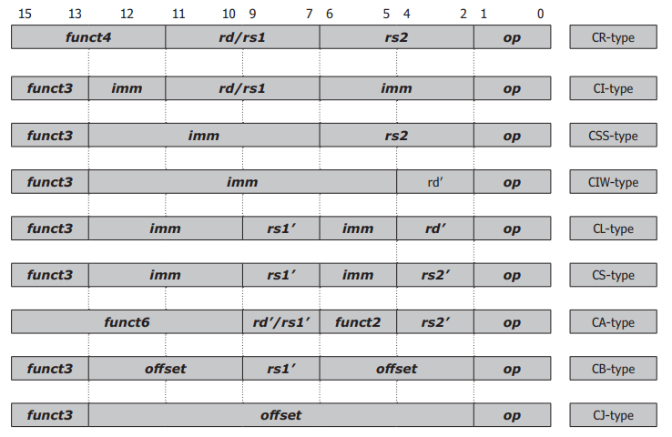

 # 1. Архитектура набора команд RISC-V

Архитектура набора команд RISC-V (ISA) представляет собой семейство из четырех отдельных, но связанных базовых наборов команд. Эти четыре ISA имеют либо разную ширину регистров, либо разное количество регистров, но связаны тем, что все они используют одно и то же кодирование команд для большей части базового набора команд.

Четыре базовых набора команд называются RV32I (32-битный базовый целочисленный ISA), RV32E (32-битный базовый целочисленный встроенный ISA), RV64I (64-битный базовый целочисленный ISA) и RV128I (128-битный базовый целочисленный ISA). Из них только RV32I и RV64I на данный момент заморожены.
RV32I содержит 32 32-битных регистра и поддерживает 32-битное адресное пространство. Это базовый ISA, который мы будем реализовывать в представленном здесь проекте.

Единственное различие между RV32E и RV32I заключается в том, что RV32E содержит всего 16 32-битных регистров, а не 32 32-битных регистра, как RV32I. Руководство по набору команд RISC-V объясняет это различие, утверждая, что 16 регистров составляют 25% площади и требуют 25% мощности для ядра RISC-V, и что это сокращение необходимо для встроенных систем.

RV64I содержит 64-битные регистры и обрабатывает 64-битные адреса. Все инструкции, которые применимы к RV32I, также присутствуют в RV64I, за исключением того, что эти инструкции теперь работают с 64-битными величинами, а не с 32-битными величинами. Это означает, что один и тот же код может выполняться на обеих архитектурах, но результаты будут различаться. RV64I содержит отдельные инструкции для выполнения 32-битных операций, которые будут возвращать тот же результат, что и RV32I, в младшем слове регистра, и с расширением знака в старшем слове регистра. Руководство по набору команд RISC-V признает, что это могло быть ошибкой, но что сейчас уже слишком поздно что-либо менять.

RV128I будет содержать 128-битные регистры и обрабатывать 128-битные адреса. Эта версия ISA RISC-V будет содержать те же проблемы относительно RV64I, что и RV64I по отношению к RV32I.

## 1.1 Обзор 

Память RISC-V адресуется по байтам и по своей природе является little-endian. Фактическая ширина шины памяти считается деталью реализации и может быть такой широкой или узкой, как требует приложение. В качестве напоминания, нумерация байтов для системы little-endian показана на рисунке 2.1, который показывает 32-битную ширину для данных.

Рисунок 1: Нумерация битов/байтов/полубайтов/слов.

RISC-V работает с числами в дополнительном коде, хотя предусмотрены возможности для беззнаковых чисел для адресов. Непосредственные данные почти всегда расширяются по знаку до полной ширины 32 бита перед использованием. 

Все базовые архитектуры RISC-V используют фиксированный размер инструкции в 32 бита, и все инструкции должны быть выровнены по длине в памяти. Это означает, что два наименее значащих бита адреса инструкции должны быть равны нулю, иначе будет сгенерировано исключение "Неправильное выравнивание адреса инструкции". Однако Руководство по набору инструкций RISC-V также предусматривает переменные длины инструкций, где длина является кратной 16 битам, включая опцию 16-битных инструкций. В случае 16-битных инструкций только наименее значащий бит адреса инструкции должен быть равен нулю. 

Длина инструкции RISC-V кодируется в наименее значащих битах инструкции. Хотя Руководство по набору инструкций RISC-V определяет метод кодирования инструкций длиной до 192 бит, в спецификации в настоящее время заморожены только 16-битные и 32-битные инструкции. Таблица 1 показывает кодирование длины инструкции.

Таблица 1: Кодирование длины инструкции

| Инструкция (младший значащий фрагмент) | Ширина инструкции |
|----------------------------------------|--------------------|
| xxxxxxxx_xxxxxxx0                      | 16 бит             |
| xxxxxxxx_xxxxxx01                      | 16 бит             |
| xxxxxxxx_xxxxx011                      | 32 бит             |
| xxxxxxxx_xxxx0111                      | 32 бит             |
| xxxxxxxx_xxx01111                      | 32 бит             |
| xxxxxxxx_xx011111                      | 48 бит             |
| xxxxxxxx_x0111111                      | 64 бит             |
| xnnnxxxx_x1111111          | 80 + 16×nnn (nnn ≠ 111)    |
| x111xxxx_x1111111                      | зарезервировано для ≥ 192 бит |

### 1.1.1 Форматы инструкций

Почти все, в настоящее время определенные инструкции RISC-V, используют один из всего шести основных форматов инструкций длиной 32 бита, что значительно упрощает декодирование инструкций. Рисунок 2 показывает эти форматы инструкций.

Рисунок 2: Форматы инструкций

Формат инструкции типа R используется для операций «регистр-регистр» (Register-Register). В этом формате инструкция считывает два исходных операнда из регистров и записывает результат операции в другой регистр. Исходные операнды при этом не изменяются, если только один из исходных регистров не используется также как регистр назначения.

Формат инструкции типа I используется для операций «регистр-непосредственное значение» (Register-Immediate). В этом формате инструкции считывают один исходный операнд из регистра, второй операнд берут из поля непосредственного значения в коде операции и записывают результат операции в регистр. Исходный операнд при этом не изменяется, если только исходный регистр не используется также как регистр назначения. В формате инструкции типа I непосредственное значение имеет длину 12 бит и расширяется со знаком до полных 32 бит для использования в операции. Это обеспечивает диапазон от –2048 до +2047 для непосредственных данных. Безусловное расширение со знаком обычно весьма полезно, но в некоторых случаях может создавать неудобства, о чём будет рассказано далее.

Формат инструкции типа S используется исключительно для операций записи (Store), и непосредственные данные всегда являются смещением адреса. Как и в других случаях с непосредственными данными, 12-битное смещение всегда расширяется со знаком, что даёт диапазон смещений от –2048 до +2047 относительно базового адреса в регистре.

Формат инструкции типа B используется исключительно для команд перехода (Branch), и 12-битные непосредственные данные также являются смещением адреса. В этом формате смещение в инструкции расширяется со знаком и затем сдвигается влево на один бит, чтобы гарантировать, что оно является чётным, что даёт диапазон от –212 до +212 – 2 для перехода. Биты в смещении организованы таким образом, чтобы максимально совпадать с битами смещения в формате инструкций типа S.

Формат инструкции типа U используется для команд, которым требуются более широкие непосредственные данные. В этом формате непосредственные операнды имеют ширину 20 бит и заполняют старшие биты (самые значащие) 32-битного слова, при этом младшие 12 бит этого слова устанавливаются в ноль.

Формат инструкции типа J используется исключительно для одного типа команд перехода (Jump), и 12-битные непосредственные данные также являются смещением адреса. В этом формате смещение в инструкции расширяется со знаком и затем сдвигается влево на один бит, чтобы гарантировать, что оно является чётным, что даёт диапазон от –212 до +212 – 2 для прыжка. Биты в смещении организованы таким образом, чтобы максимально совпадать с битами смещений в форматах инструкций типа U и I.

### 1.1.2 Позиции непосредственных данных в инструкциях

Таблица 2 показывает позиции битов для непосредственных данных в тех инструкциях, которые содержат непосредственные данные. В большинстве случаев требуется только двухвходовый мультиплексор для выбора целевого бита непосредственных данных. Это упрощает необходимую логику, но значительно усложняет интерпретацию дампа памяти. Во всех случаях старший бит (наиболее значащий бит), который будет расширяться со знаком, находится в одном и том же положении внутри кода операции (opcode).

Таблица 2: Формат инструкции Непосредственные данные

 Позиция битов инструкции

| Формат | 31  | 30 | 29 | 28 | 27 | 26 | 25 | 24 | 23 | 22 | 21 | 20 | 19 | 18 | 17 | 16 | 15 | 14 | 13 | 12 | 11 | 10 | 9  | 8  | 7  |
|--------|-----|----|----|----|----|----|----|----|----|----|----|----|----|----|----|----|----|----|----|----|----|----|----|----|----|
| I-type | 11  | 10  | 9  | 8  | 7  | 6  | 5  | 4  | 3  | 2  | 1   | 0   |    |    |    |    |    |    |    |    |    |    |    |    |
| S-type | 11  | 10  | 9  | 8  | 7  | 6  | 5  |   |   |   |   |   |   |   |   |    |    |    |    |    | 4   | 3   | 2   | 1   |0
| B-type | 12  | 10  | 9  | 8  | 7  | 6  | 5  |   |   |   |   |   |   |   |   |    |    |    |    |    | 4   | 3   | 2   | 1   |11
| U-type | 31  | 30 | 29 | 28 | 27 | 26 | 25 | 24 | 23 | 22 | 21 | 20  | 19  | 18  | 17  |16  |15   |14  | 13 | 12 |    |    |    |    |
| J-type | 20  | 10 | 9 | 8 | 7 | 6 | 5 | 4 | 3 | 2 | 1 | 11  | 19  | 18  | 17  |16  |15   |14  | 13 | 12 |    |    |    |    |

### 1.1.3 Наборы регистров

Поля выбора регистров rd, rs1 и rs2 в инструкциях кодируются так, как показано в таблице 3. Регистры обозначаются именами от x0 до x31, при этом регистр x0 аппаратно зафиксирован и всегда содержит только значение ноль (только для чтения). Аппаратная фиксация x0 на нуле позволяет реализовать ряд псевдоинструкций, удобных для программирования на языке ассемблера.

В Руководстве по набору команд RISC-V также определён стандартный Application Binary Interface (ABI) с описательными именами регистров и стандартным их назначением. Большинство ассемблеров для RISC-V распознают или даже требуют использования этих описательных имён регистров.

Таблица 3: Набор регистров

| Кодировка (rd, rs1, rs2) | Имя регистра | ABI имя регистра | Описание ABI регистра             |
|-------------------------|--------------|------------------|-----------------------------------|
| 00000                   | x0           | zero             | Жёстко зафиксированный ноль        |
| 00001                   | x1           | ra               | Адрес возврата                    |
| 00010                   | x2           | sp               | Указатель стека                   |
| 00011                   | x3           | gp               | Глобальный указатель              |
| 00100                   | x4           | tp               | Указатель потока (потоков)         |
| 00101                   | x5           | t0               | Временный регистр 0               |
| 00110                   | x6           | t1               | Временный регистр 1               |
| 00111                   | x7           | t2               | Временный регистр 2               |
| 01000                   | x8           | s0/fp            | Сохраняемый регистр 0 / Указатель кадра |
| 01001                   | x9           | s1               | Сохраняемый регистр 1             |
| 01010                   | x10          | a0               | Возвращаемое значение функции 0   |
| 01011                   | x11          | a1               | Возвращаемое значение функции 1   |
| 01100                   | x12          | a2               | Аргумент функции 2                |
| 01101                   | x13          | a3               | Аргумент функции 3                |
| 01110                   | x14          | a4               | Аргумент функции 4                |
| 01111                   | x15          | a5               | Аргумент функции 5                |
| 10000                   | x16          | a6               | Аргумент функции 6                |
| 10001                   | x17          | a7               | Аргумент функции 7                |
| 10010                   | x18          | s2               | Сохраняемый регистр 2             |
| 10011                   | x19          | s3               | Сохраняемый регистр 3             |
| 10100                   | x20          | s4               | Сохраняемый регистр 4             |
| 10101                   | x21          | s5               | Сохраняемый регистр 5             |
| 10110                   | x22          | s6               | Сохраняемый регистр 6             |
| 10111                   | x23          | s7               | Сохраняемый регистр 7             |
| 11000                   | x24          | s8               | Сохраняемый регистр 8             |
| 11001                   | x25          | s9               | Сохраняемый регистр 9             |
| 11010                   | x26          | s10              | Сохраняемый регистр 10            |
| 11011                   | x27          | s11              | Сохраняемый регистр 11            |
| 11100                   | x28          | t3               | Временный регистр 3               |
| 11101                   | x29          | t4               | Временный регистр 4               |
| 11110                   | x30          | t5               | Временный регистр 5               |
| 11111                   | x31          | t6               | Временный регистр 6               |

### 1.1.4 Стандартные расширения

Руководство по набору команд RISC-V также содержит ряд черновых или утверждённых стандартных расширений, выходящих за рамки базовых ISA RISC-V. Большинство из этих расширений обозначены одной буквой и показаны в таблице 4. Ряд стандартных расширений всё ещё находится в разработке и здесь рассматриваться не будет. Эти расширения выделены в таблице. Представленный здесь проект включает только часть  стандартных расширений, как показано в крайнем правом столбце таблицы.

Таблица 4: Стандартные расширения

| Идентификатор | Стандарт                                      | Статус          | Дизайн          |
|---------------|-----------------------------------------------|-----------------|-----------------|
| A             | Атомарные инструкции                          | Ратифицировано  | Частично        |
| B             | Манипуляции с битами                          | Черновик        | Частично        |
| C             | Сжатые инструкции                             | Ратифицировано  | Полностью       |
| Counters      | Счётчики                                      | Черновик        | Частично        |
| D             | Двойная точность с плавающей запятой          | Ратифицировано  |                 |
| F             | Одинарная точность с плавающей запятой        | Ратифицировано  |                 |
| H             | Гипервизорное расширение                      | Черновик        |                 |
| I             | Базовый набор инструкций                      | Ратифицировано  | Полностью       |
| J             | Динамически транслируемые языки               | Черновик        |                 |
| K             | Скалярная криптография                        | Черновик        |                 |
| L             | Десятичная арифметика с плавающей запятой     | Черновик        |                 |
| M             | Целочисленное умножение и деление             | Ратифицировано  |                 |
| N             | Прерывания на уровне пользователя             | Черновик        |                 |
| P             | Упакованный SIMD                              | Черновик        |                 |
| Q             | Четверная точность с плавающей запятой        | Ратифицировано  |                 |
| T             | Транзакционная память                         | Черновик        |                 |
| V             | Векторные операции                            | Черновик        |                 |
| Zam           | Невыравненные атомарные операции              | Черновик        | Полностью       |
| Zicsr         | Управляющие и статусные регистры              | Ратифицировано  | Полностью       |
| Zifencei      | Барьер выборки инструкций                     | Ратифицировано  | Полностью       |
| Zihintpause   | Подсказка паузы                                | Ратифицировано  |                 |
| Ztso          | Глобальный порядок записи                     | Заморожено      |                 |

### 1.1.5 Условные обозначения в таблицах опкодов
В оставшейся части этой главы кодировка команд будет показана в таблицах, где различные поля разделены символом подчёркивания ( _ ), чтобы сделать поля более наглядными. Поля в кодировке команды перечислены с использованием сокращений для общих полей (опкодов). Эти сокращения в большинстве случаев должны быть понятны сами по себе, но для полноты приведены в таблице 5.

Таблица 5: Сокращения опкодов

| Опкод (opcode) | Сокращение (shortcut)         | Описание в ассемблере              | Расширение      |
|----------------|-------------------------------|------------------------------------|-----------------|
| ar aq          | and rl, 1-битные ограничения упорядочивания | A                |
| ccc...         | 12-битный адрес регистра управления и статуса (CSR) | Zicsr          |
| ddd            | rd’, выбор 3-битного регистра назначения | C                |
| ddddd          | rd, выбор 5-битного регистра назначения |                   |
| dnzdd          | rd, выбор 5-битного регистра назначения, x0 не допускается | C                |
| dn2dd          | rd, выбор 5-битного регистра назначения, x2 не допускается | C                |
| fmod           | fm, выбор 4-битного режима fence  |                   |
| iorw           | pred или succ, 4-битный выбор упорядочивания In/Out/Rd/Wr |                   |
| mm...          | imm, uimm, nzimm, nzuimm, offset или uoffset, непосредственные данные различных ширин (могут быть перемешаны) |                   |
| rnd            | rnd, 3-битный статический режим округления | F, D, Q           |
| sbsel          | sbsel, 5-битная константа (выбор бита) | B                |
| shamt          | shamt, 5-битная константа (сдвиг/вращение) |                   |
| sss            | rs1’, выбор 3-битного регистра источника 1 | C                |
| snzss          | rs1, выбор 5-битного регистра источника 1, x0 не допускается | C                |
| sssss          | rs1, выбор 5-битного регистра источника 1 |                   |
| ttt            | rs2’, выбор 3-битного регистра источника 2 | C                |
| tnztt          | rs2, выбор 5-битного регистра источника 2, x0 не допускается | C                |
| ttttt          | rs2, выбор 5-битного регистра источника 2 |                   |
| vvvvv          | rs3, выбор 5-битного регистра источника 3 | F, D, Q           |

## 1.2 Базовый набор целочисленных инструкций

Базовый целочисленный набор инструкций RV32I содержит всего сорок инструкций. Эти сорок инструкций являются абсолютным минимумом для любой реализации RISC-V и достаточны для эмуляции почти всех текущих стандартных расширений RISC-V. Список этих сорока инструкций приведён в таблице 6 вместе с соответствующими опкодами. Эта таблица организована по типам опкодов, чтобы сделать информацию полезной в процессе проектирования, но отдельные инструкции будут описаны по функциональным группам.

Таблица 6: Базовый набор целочисленных инструкций

| Ассемблерная команда        | Формат опкода                                | Тип  |
|-----------------------------|-----------------------------------------------|------|
| Defined Illegal             | 1111111_11111_11111_111_11111_1111111         | R    |
| ADD rd, rs1, rs2            | 0000000_ttttt_sssss_000_ddddd_0110011         | R    |
| SUB rd, rs1, rs2            | 0100000_ttttt_sssss_000_ddddd_0110011         | R    |
| SLL rd, rs1, rs2            | 0000000_ttttt_sssss_001_ddddd_0110011         | R    |
| SLT rd, rs1, rs2            | 0000000_ttttt_sssss_010_ddddd_0110011         | R    |
| SLTU rd, rs1, rs2           | 0000000_ttttt_sssss_011_ddddd_0110011         | R    |
| XOR rd, rs1, rs2            | 0000000_ttttt_sssss_100_ddddd_0110011         | R    |
| SRL rd, rs1, rs2            | 0000000_ttttt_sssss_101_ddddd_0110011         | R    |
| SRA rd, rs1, rs2            | 0100000_ttttt_sssss_101_ddddd_0110011         | R    |
| OR rd, rs1, rs2             | 0000000_ttttt_sssss_110_ddddd_0110011         | R    |
| AND rd, rs1, rs2            | 0000000_ttttt_sssss_111_ddddd_0110011         | R    |
| LB rd, offset(rs1)          | mmmmmmm_mmmmm_sssss_000_ddddd_0000011         | I    |
| LH rd, offset(rs1)          | mmmmmmm_mmmmm_sssss_001_ddddd_0000011         | I    |
| LW rd, offset(rs1)          | mmmmmmm_mmmmm_sssss_010_ddddd_0000011         | I    |
| LBU rd, offset(rs1)         | mmmmmmm_mmmmm_sssss_100_ddddd_0000011         | I    |
| LHU rd, offset(rs1)         | mmmmmmm_mmmmm_sssss_101_ddddd_0000011         | I    |
| ADDI rd, rs1, imm           | mmmmmmm_mmmmm_sssss_000_ddddd_0010011         | I    |
| SLLI rd, rs1, shamt         | 0000000_shamt_sssss_001_ddddd_0010011         | I    |
| SLTI rd, rs1, imm           | mmmmmmm_mmmmm_sssss_010_ddddd_0010011         | I    |
| SLTIU rd, rs1, imm          | mmmmmmm_mmmmm_sssss_011_ddddd_0010011         | I    |
| XORI rd, rs1, imm           | mmmmmmm_mmmmm_sssss_100_ddddd_0010011         | I    |
| SRLI rd, rs1, shamt         | 0000000_shamt_sssss_101_ddddd_0010011         | I    |
| SRAI rd, rs1, shamt         | 0100000_shamt_sssss_101_ddddd_0010011         | I    |
| ORI rd, rs1, imm            | mmmmmmm_mmmmm_sssss_110_ddddd_0010011         | I    |
| ANDI rd, rs1, imm           | mmmmmmm_mmmmm_sssss_111_ddddd_0010011         | I    |
| JALR rd, offset(rs1)        | mmmmmmm_mmmmm_sssss_000_ddddd_1100111         | I    |
| FENCE fmodior_wiorw         | 00000_000_00000_0001111                       | I    |
| ECALL                       | 0000000_00000_00000_000_00000_1110011         | I    |
| EBREAK                      | 0000000_00001_00000_000_00000_1110011         | I    |
| SB rs2, offset(rs1)         | mmmmmmm_ttttt_sssss_000_mmmmm_0100011         | S    |
| SH rs2, offset(rs1)         | mmmmmmm_ttttt_sssss_001_mmmmm_0100011         | S    |
| SW rs2, offset(rs1)         | mmmmmmm_ttttt_sssss_010_mmmmm_0100011         | S    |
| BEQ rs1, rs2, offset        | mmmmmmm_ttttt_sssss_000_mmmmm_1100011         | B    |
| BNE rs1, rs2, offset        | mmmmmmm_ttttt_sssss_001_mmmmm_1100011         | B    |
| BLT rs1, rs2, offset        | mmmmmmm_ttttt_sssss_100_mmmmm_1100011         | B    |
| BGE rs1, rs2, offset        | mmmmmmm_ttttt_sssss_101_mmmmm_1100011         | B    |
| BLTU rs1, rs2, offset       | mmmmmmm_ttttt_sssss_110_mmmmm_1100011         | B    |
| BGEU rs1, rs2, offset       | mmmmmmm_ttttt_sssss_111_mmmmm_1100011         | B    |
| AUIPC rd, imm               | mmmmmmm_mmmmm_mmmmm_mmm_ddddd_0010111         | U    |
| LUI rd, imm                 | mmmmmmm_mmmmm_mmmmm_mmm_ddddd_0110111         | U    |
| JAL rd, offset              | mmmmmmm_mmmmm_mmmmm_mmm_ddddd_1101111         | J    |

### 1.2.1 Инструкции целочисленной арифметики

Инструкции **ADD rd, rs1, rs2** (Сложение) и **SUB rd, rs1, rs2** (Вычитание) являются инструкциями арифметических операций "регистр-регистр". В соответствии с теоретическими основами RISC, эти арифметические операции генерируют только 32-битный результат, и если требуется проверка переноса или переполнения, это должно обрабатываться отдельно программно. Для вычитания регистр **rs2** вычитается из регистра **rs1**.

Для беззнаковых операндов переполнение совпадает с переносом или заимствованием из старшего разряда, и это можно проверить напрямую с помощью условной команды перехода сразу после операции, при условии, что исходные операнды не были изменены.

Для сложения проверка на переполнение требует двух дополнительных инструкций и условного перехода, а также использования двух временных регистров. Для вычитания проверка на переполнение требует трёх дополнительных инструкций и условного перехода, плюс использование двух временных регистров. В обоих случаях оригинальные исходные регистры могут быть использованы как временные, если операнды не нужно сохранять.

Существует одна псевдоинструкция, которая использует арифметическую инструкцию "регистр-регистр":

**NEG rd, rs** (Дополнение до двух или Инверсия знака) — это **SUB rd, x0, rs**.

**ADDI rd, rs1, imm** (Сложение с непосредственным операндом) — это единственная арифметическая инструкция "регистр-непосредственное значение". Безусловное знаковое расширение для непосредственных данных делает ненужным существование инструкции вычитания с непосредственным операндом.

Существует значительное количество комбинаций операндов инструкций, которые приведут к отсутствию операции со стороны процессора, но определённый стандартом код для No Operation (**NOP**) использует инструкцию **ADDI**. Инструкция **ADDI** также используется для реализации псевдоинструкции, которая копирует один регистр в другой.

**NOP** (Нет операции) — это просто **ADDI x0, x0, 0**.

**MV rd, rs** (Копирование регистра) — это просто **ADDI rd, rs, 0**.

### 1.2.2 Инструкции логических операций

**AND rd, rs1, rs2** (Логическое И), **OR rd, rs1, rs2** (Логическое ИЛИ) и **XOR rd, rs1, rs2** (Логическое исключающее ИЛИ) — это инструкции логических операций "регистр-регистр". Как и раньше, поскольку в архитектуре RISC-V нет флагов, результат должен быть явно проверен на равенство нулю или на знак, если требуется такой тип состояния. Проверка результата на ноль или знак так же проста, как и условный переход.

**ANDI rd, rs1, imm** (Логическое И с непосредственным операндом), **ORI rd, rs1, imm** (Логическое ИЛИ с непосредственным операндом) и **XORI rd, rs1, imm** (Логическое исключающее ИЛИ с непосредственным операндом) — это инструкции логических операций "регистр-непосредственное значение".

Безусловное знаковое расширение непосредственных операндов полезно для операции AND, но менее полезно для операций OR и XOR. Например, попытка установить бит 11 с помощью операции OR приведёт к тому, что биты с 31-го по 11-й в непосредственном значении будут установлены, поэтому все эти биты также будут установлены в регистре rd.

Одна псевдоинструкция использует логическую инструкцию с непосредственным операндом:

**NOT rd, rs** (Дополнение до одного или Логическое НЕ) — это просто **XORI rd, rs, -1**.

### 1.2.3 Инструкции сдвига

**SLL rd, rs1, rs2** (Логический сдвиг влево), **SRA rd, rs1, rs2** (Арифметический сдвиг вправо) и **SRL rd, rs1, rs2** (Логический сдвиг вправо) — это инструкции сдвига. Количество сдвига указывается в пяти младших разрядах регистра **rs2**, что позволяет выполнять сдвиги от нуля до тридцати одного бита. Остальные биты регистра **rs2** игнорируются.

Два логических сдвига вводят нули, тогда как арифметический сдвиг повторяет бит знака.

В наборе команд RV32I отсутствуют инструкции циклического сдвига, поэтому циклические сдвиги должны имитироваться путём комбинирования результата двух сдвигов с использованием двух временных регистров.

**SLLI rd, rs1, shamt** (Логический сдвиг влево с непосредственным значением), **SRAI rd, rs1, shamt** (Арифметический сдвиг вправо с непосредственным значением) и **SRLI rd, rs1, shamt** (Логический сдвиг вправо с непосредственным значением) — это инструкции сдвига с непосредственным операндом. Количество сдвига указывается пятью битами поля непосредственного значения в коде операции. Этот указатель сдвига является беззнаковым, что позволяет выполнять сдвиги от нуля до тридцати одного бита. Остальные биты в поле непосредственного значения используются как часть кода операции.

### 1.2.4 Инструкции сравнения

**SLT rd, rs1, rs2** (Установить, если меньше) и **SLTU rd, rs1, rs2** (Установить, если меньше, беззнаковое) — это инструкции сравнения для знаковых и беззнаковых данных. Эти инструкции устанавливают регистр **rd** в 0x1, если сравнение (**rs1 < rs2**) истинно, и в 0x0 в противном случае. Эти операции предоставляют альтернативу выделенным флагам за счёт использования целого регистра.

Существует три псевдо-инструкции сравнения:

**SGTZ rd, rs** (Установить, если больше нуля) — это **SLT rd, x0, rs**

**SLTZ rd, rs** (Установить, если меньше нуля) — это **SLT rd, rs, x0**

**SNEZ rd, rs** (Установить, если не равно нулю) — это **SLTU rd, x0, rs**

**SLTI rd, rs1, imm** (Установить, если меньше чем непосредственное значение) и **SLTIU rd, rs1, imm** (Установить, если меньше чем непосредственное значение, беззнаковое) являются знаковыми и беззнаковыми инструкциями сравнения с непосредственным операндом. Эти инструкции устанавливают регистр rd в значение 0x1, если сравнение **(rs1 < imm)** истинно, и в 0x0 в противном случае. Непосредственный операнд всегда знаковорасширяется, даже для инструкции SLTIU.

Только одна инструкция сравнения с непосредственным операндом предоставляет полезную псевдо-инструкцию:

**SEQZ rd, rs** (Установить, если равно нулю) — это **SLTIU rd, rs, 1**.

### 1.2.5 Инструкции генерации констант

Существует две инструкции генерации констант. В этих инструкциях непосредственные операнды шириной двадцать бит заполняют старшие биты 32-битного слова, при этом младшие 12 бит устанавливаются в ноль.

**AUIPC rd, imm** (Добавить старшие биты непосредственного операнда к PC) позволяет создавать 32-битные PC-относительные адреса для использования с загрузками, сохранениями и переходами, добавляя непосредственный операнд к счетчику команд (PC) этой инструкции и сохраняя результат в регистр rd.

**LUI rd, imm** (Загрузить старшие биты непосредственного операнда) позволяет создавать 32-битные константы или абсолютные адреса, загружая непосредственный операнд напрямую в регистр **rd**.

Эти две инструкции обычно сопровождаются инструкцией **ADDI** для загрузки младших 12 бит. Однако, поскольку непосредственный операнд инструкции **ADDI** знаковорасширяется перед сложением, требуется осторожность, чтобы компенсировать это знаковое расширение. Компенсация требует добавления старшего значащего бита операнда ADDI к 20-битному операнду в одной из этих инструкций.

Большинство ассемблеров RISC-V предоставляют пару псевдо-инструкций, которые автоматически разворачиваются в необходимую последовательность из двух инструкций для работы с 32-битным значением:

- **LI rd, imm** (Загрузить непосредственный операнд) загружает 32-битную константу или абсолютный адрес в регистр **rd**. Общая реализация будет состоять из инструкции **LUI rd, imm**[31:12] + **imm**[11], за которой следует **ADDI rd, x0, imm**[11:0]. Компоновщик выполнит сложение для значения непосредственного операнда **LUI** во время стадии компоновки (link phase). Некоторые ассемблеры достаточно умны, чтобы использовать только инструкцию LUI или только ADDI, если значение константы находится в нужном диапазоне.

- **LA rd, symbol** (Загрузить адрес) загружает 32-битный PC-относительный адрес в регистр **rd**. Общая реализация будет состоять из инструкции **AUIPC rd, imm**[31:12] + **imm**[11], за которой следует **ADDI rd, x0, imm**[11:0]. Компоновщик вычислит требуемое значение непосредственного операнда и затем выполнит сложение для значения непосредственного операнда **AUIPC** во время стадии компоновки.

### 1.2.6 Безусловные инструкции перехода

Существует два типа безусловных инструкций перехода, и эти две инструкции могут реализовать большинство инструкций передачи управления, известных программистам на ассемблере.

В архитектуре RISC-V нет выделенного указателя стека, но эти две инструкции предоставляют регистр связи (link register), который аналогичен вершине стека возврата. Этот регистр должен быть сохранён подпрограммой в случае, если подпрограмма вызывает другую подпрограмму. В соглашении о вызовах RISC-V регистр x1 используется как этот регистр возвратного адреса, хотя эти инструкции могут использовать любой регистр для этой цели.

**JAL rd, offset** (Прыжок и связь) добавляет смещение из инструкции к счётчику команд (PC) этой инструкции. Одновременно счётчик команд для следующей инструкции записывается в регистр **rd**, используемый как регистр связи. 20-битное смещение в инструкции знаковорасширяется и затем сдвигается влево на один бит, чтобы гарантировать, что оно чётное, что даёт диапазон от –2²⁰ до +2²⁰ – 2 для прыжка. Чётное смещение требуется, потому что инструкции RISC-V должны быть выровнены по полуслову (2 байта).

**JALR rd, offset(rs1)** (Прыжок и связь через регистр) добавляет смещение из инструкции к содержимому регистра **rs1** и записывает результат в счётчик команд. Одновременно счётчик команд для следующей инструкции записывается в регистр **rd**. Смещение для этой инструкции составляет 12 бит, что даёт диапазон от –2¹¹ до +2¹¹ – 1 для смещения.

Одна из особенностей этой инструкции в том, что аппаратно должен быть установлен младший бит результата сложения в ноль, чтобы сделать целевой адрес чётным, перед его загрузкой в PC. Если этой инструкции предшествует либо **AUIPC**, либо **LUI**, то эффективный диапазон прыжка охватывает всё адресное пространство.

Существует две псевдо-инструкции PC-относительных переходов:

- **J offset** (Прыжок) — это  **JAL x0, offset**. Это обычный PC-относительный прыжок, без необходимости возврата.

- **JAL offset** (Прыжок и связь) — это  **JAL x1, offset**, следуя соглашению, что регистр x1 используется как регистр возвратного адреса. Это аналогично вызову подпрограммы с PC-относительным адресом.

Существует три псевдо-инструкции перехода, которые используют регистр для адреса:

- **JR rs** (Прыжок по регистру) — это  **JALR x0, 0(rs)**. Это обычный прыжок по абсолютному адресу, возврат не требуется.

- **JALR rs (Прыжок и связь через регистр)** — это **JALR x1, 0(rs)**. Это также обычный прыжок по абсолютному адресу, но с сохранением адреса возврата. Это может заменить специализированную инструкцию **CALL**, в зависимости от ассемблера.

- **RET** (Возврат из подпрограммы) — это **JALR x0, 0(x1)**. Эта инструкция возвращает счётчик команд (PC) к адресу, хранящемуся в регистре возвратного адреса.

Некоторые ассемблеры также распознают две другие псевдо-инструкции, которые используют регистр для адреса, хотя режим адресации на самом деле PC-относительный для поддержки позиционно-независимого кода:

- **CALL rd, symbol** (Вызов подпрограммы) разворачивается в последовательность из двух инструкций:
**AUIPC rd, imm**[31:12] + **imm**[11], за которой следует **JALR x1, imm**[11:0] **(rd)**.
Если **rd** опущен в коде на ассемблере, предполагается использование регистра x6.

- **TAIL rs, symbol** (Хвостовой вызов подпрограммы) разворачивается в последовательность из двух инструкций:
**AUIPC rs, imm**[31:12] + **imm**[11], за которой следует **JALR x0, imm**[11:0] (**rs**).
Если **rs** опущен в коде на ассемблере, обычно предполагается использование регистра x6, согласно соглашению о вызовах в RISC-V. В JALR здесь используется регистр x0, чтобы избежать повреждения стека возвратов.

### 1.2.7 Условные инструкции перехода

Условные инструкции перехода сравнивают содержимое двух регистров, и если условие, заданное инструкцией, выполняется, то смещение из инструкции прибавляется к счётчику команд (PC) этой инструкции. 12-битное смещение в инструкции знаковорасширяется и затем сдвигается влево на один бит, чтобы гарантировать, что оно чётное, что даёт диапазон от –2¹² до +2¹² – 2 для перехода.

- **BEQ rs1, rs2, offset** (Переход, если равно) выполняет переход, если содержимое двух регистров идентично.

- **BNE rs1, rs2, offset** (Переход, если не равно) выполняет переход, если содержимое двух регистров различно.

- **BGE rs1, rs2, offset** (Переход, если больше или равно) выполняет переход, если содержимое регистра **rs1** больше либо равно содержимому регистра **rs2**, рассматривая оба как знаковые числа.

- **BGEU rs1, rs2, offset** (Переход, если больше или равно, беззнаковый) выполняет переход, если содержимое регистра **rs1** больше либо равно содержимому регистра **rs2**, рассматривая оба как беззнаковые числа.

- **BLT rs1, rs2, offset** (Переход, если меньше) выполняет переход, если содержимое регистра **rs1** меньше содержимого регистра **rs2**, рассматривая оба как знаковые числа.
  
- **BLTU rs1, rs2, offset** (Переход, если меньше, беззнаковый) выполняет переход, если содержимое регистра **rs1** меньше содержимого регистра **rs2**, рассматривая оба как беззнаковые числа.

Эти шесть инструкций достаточно для покрытия всех возможных случаев, потому что изменение порядка выбранных регистров создаёт противоположное условие теста. Это противоположное условие создаёт четыре псевдо-инструкции:

- **BGT rs, rt, offset** (Переход, если >) — это **BLT rt, rs, offset**;

- **BGTU rs, rt, offset** (Переход, если >, беззнаковый) — это **BLTU rt, rs, offset**;

- **BLE rs, rt, offset** (Переход, если ≤) — это **BGE rt, rs, offset**;

- **BLEU rs, rt, offset** (Переход, если ≤, беззнаковый) — это **BGEU rt, rs, offset**.

Когда запрограммированный ноль из регистра x0 используется в качестве одного из операндов, создаются ещё шесть псевдо-инструкций:

- **BEQZ rs, offset** (Переход, если = ноль) — это **BEQ rs, x0, offset**;

- **BNEZ rs, offset** (Переход, если ≠ ноль) — это **BNE rs, x0, offset**;

- **BGEZ rs, offset** (Переход, если ≥ ноль) — это **BGE rs, x0, offset**;

- **BLEZ rs, offset** (Переход, если ≤ ноль) — это **BGE x0, rs, offset**;

- **BGTZ rs, offset** (Переход, если > ноль) — это **BLT x0, rs, offset**;

- **BLTZ rs, offset** (Переход, если < ноль) — это **BLT rs, x0, offset**.

### 1.2.8 Инструкции загрузки и сохранения данных

Основной принцип концепции RISC состоит в том, что только инструкции загрузки (load) и сохранения (store) обращаются к памяти, и обычно используют только один простой режим адресации. Все инструкции загрузки и сохранения в RISC-V используют режим адресации "база + смещение" (base+offset), при этом в инструкции доступно 12-битное смещение. Как и для других непосредственных данных, смещение всегда знаково расширяется, что даёт диапазон от –2¹¹ до +2¹¹ – 1 относительно базового адреса в регистре.

Руководство по набору инструкций RISC-V не накладывает никаких требований на выравнивание для загрузок и сохранений и явно допускает, что невыравненные доступы могут быть реализованы как в аппаратуре, так и в программном обеспечении. Беззнаковые версии загрузки байтов и полуслов (byte и halfword loads) очень полезны для реализации невыравненных загрузок в программном обеспечении.

- **LB rd, offset(rs1)** (Загрузка байта) загружает один байт из памяти в наименее значимый байт регистра **rd**, выполняя знаковое расширение байта для заполнения оставшихся трёх байт регистра.

- **LBU rd, offset(rs1)** (Загрузка байта, беззнаковая) загружает один байт из памяти в наименее значимый байт регистра **rd**, заполняя оставшиеся три байта регистра нулями.

- **LH rd, offset(rs1)** (Загрузка полуслова) загружает одно полуслово из памяти в младшую половину регистра **rd**, выполняя знаковое расширение полуслова для заполнения старшей половины регистра.

- **LHU rd, offset(rs1)** (Загрузка полуслова, беззнаковая) загружает одно полуслово из памяти в младшую половину регистра **rd**, заполняя старшую половину регистра нулями.

- **LW rd, offset(rs1)** (Загрузка слова) загружает одно слово из памяти в регистр **rd**.

- **SB rs2, offset(rs1)** (Сохранение байта) сохраняет наименее значимый байт регистра **rs2** в память.
  
- **SH rs2, offset(rs1)** (Сохранение полуслова) сохраняет наименее значимое полуслово регистра **rs2** в память.

- **SW rs2, offset(rs1)** (Сохранение слова) сохраняет содержимое регистра rs2 в память.

### 1.2.9 Инструкции упорядочивания памяти

Инструкции упорядочивания памяти включены в базовый набор инструкций для поддержки суперскалярных, внеочередных (out-of-order) или многоядерных процессоров RISC-V. Описанный здесь дизайн не обладает этими характеристиками, поэтому для получения более подробной информации о порядке доступа к памяти необходимо обратиться к руководству по набору инструкций RISC-V.

**FENCE fm, pred, succ** (Барьер) — это инструкция, используемая для упорядочивания транзакций ввода с устройства, вывода на устройство, чтения из памяти и записи в память на внешней шине, если такие транзакции не гарантируются к выполнению в порядке программного кода. См. руководство по инструкциям RISC-V для значений различных полей этой инструкции.

**FENCE.I** (Барьер инструкций) — это инструкция, используемая для упорядочивания записей в память инструкций относительно выборки инструкций, для самомодифицирующегося кода. Эта инструкция ранее входила в базовый набор команд, но недавно была перемещена в отдельное стандартное расширение под названием «Zifenci» (Instruction-Fetch Fence extension). Эта инструкция обычно включена во все реализации и приведена здесь по этой причине.

### 1.2.10 Инструкции вызова окружения и точки останова

Инструкции вызова окружения и точки останова включены в набор команд RV32I для поддержки доступа к системному программному обеспечению или службам. Обе эти инструкции генерируют исключение. Важно помнить, что при возникновении исключения сохраняется адрес инструкции, вызвавшей исключение, а не адрес следующей инструкции.

**ECALL** (Вызов окружения) генерирует исключение вызова окружения, что по сути является запросом на выполнение системной службы. В отличие от многих архитектур, инструкция **ECALL** не использует непосредственные данные в коде операции для передачи параметров этого запроса.

**EBREAK** (Точка останова окружения) генерирует исключение точки останова и вызывает возврат управления в отладочную среду.

### 1.2.11 Прочие инструкции

Одна 32-битная инструкция не попадает ни в одну другую категорию, и на самом деле она не является инструкцией, а представляет собой битовую последовательность, которая гарантированно вызовет исключение «Недопустимая инструкция». Это полезно для обнаружения стёртой флеш-памяти, а также помогает декодеру сжатых опкодов, который может выводить этот шаблон для принудительного вызова исключения.

Определённая недопустимая инструкция — это просто 32 бита, все единицы.

### 1.2.12 Инструкции HINT

Жёсткая привязка регистра x0 к нулю означает, что большое количество опкодов RISC-V становятся бесполезными, и руководство по набору инструкций RISC-V резервирует многие из этих кодировок как инструкции **HINT** (подсказки), которые могут "передавать подсказки по производительности микроархитектуре". На данный момент ни одна из этих инструкций не определена как выполняющая какое-либо действие. Поэтому поведение по умолчанию — ничего не делать — естественно вытекает из конструкции с регистром x0, который является только для чтения и всегда равен нулю, и нам не нужно уделять этим инструкциям особого внимания.

Псевдоинструкция **NOP** (No Operation — нет операции) закодирована с использованием одной из таких кодировок, которые в противном случае были бы **HINT**. В таблице 7 перечислены инструкции **HINT**. Большинство этих кодировок зарезервированы для будущего стандартного использования, но также есть достаточно много зарезервированных для пользовательского применения.

Таблица 7: HINT-инструкции RV32I

| Инструкция | Условие                                                        | Использование                |
|------------|----------------------------------------------------------------|------------------------------|
| ADD        | rd = x0                                                        |      Зарезервировано для стандартного использования                        |
| ADDI       | rd = x0 и (rs1 ≠ x0 или imm ≠ 0)                               |         Зарезервировано для стандартного использования                     | 
| AND        | rd = x0                                                        |   Зарезервировано для стандартного использования                           |
| ANDI       | rd = x0                                                        | Зарезервировано для стандартного использования                             |
| AUIPC      | rd = x0                                                        |     Зарезервировано для стандартного использования                         |
| FENCE      | pred = 0 или succ = 0                                          | Зарезервировано для стандартного использования                             |
| LUI        | rd = x0                                                        | Зарезервировано для стандартного использования                             |
| OR         | rd = x0                                                        | Зарезервировано для стандартного использования |
| ORI        | rd = x0                                                        | Зарезервировано для стандартного использования |
| SLL        | rd = x0                                                        | Зарезервировано для стандартного использования |
| SRA        | rd = x0                                                        | Зарезервировано для стандартного использования |
| SRL        | rd = x0                                                        | Зарезервировано для стандартного использования |
| SUB        | rd = x0                                                        | Зарезервировано для стандартного использования |
| XOR        | rd = x0                                                        | Зарезервировано для стандартного использования |
| XORI       | rd = x0                                                        | Зарезервировано для стандартного использования |
| SLLI       | rd = x0                                                        |Зарезервировано для пользовательского использования                              |
| SLT        | rd = x0                                                        |Зарезервировано для пользовательского использования                              |
| SLTI       | rd = x0                                                        |Зарезервировано для пользовательского использования                              |
| SLTU       | rd = x0                                                        | Зарезервировано для пользовательского использования |
| SLTIU      | rd = x0                                                        | Зарезервировано для пользовательского использования |
| SRAI       | rd = x0                                                        | Зарезервировано для пользовательского использования |
| SRAI       | rd = x0                                                        | Зарезервировано для пользовательского использования |

## 1.3 Расширение регистров управления и статуса (CSR)

Архитектура RISC-V предоставляет 12-битное адресное пространство для регистров управления и статуса (CSR), что в сумме даёт 4096 уникальных адресов CSR. Однако, несколько битов этих адресов зарезервированы для кодирования уровней доступа, поэтому фактическое количество доступных регистров CSR значительно меньше.

Изначально инструкции CSR входили в обязательную часть спецификации RISC-V, поскольку они были необходимы для доступа к трём 64-битным счётчикам производительности, которые также считались обязательными. Обязательность трёх 64-битных счётчиков не является проблемой для процессора RISC-V, работающего под управлением Linux. В результате, счётчики производительности и инструкции CSR были впоследствии перенесены в опциональное расширение, называемое «Zicsr» (расширение инструкций управления и статуса CSR).

На практике инструкции CSR всегда требуются, так как они необходимы для обработки прерываний и исключений. В таблице 8 приведены инструкции CSR.

Таблица 8: Инструкции управления и статуса (CSR)

| Ассемблерная команда  | Опкод                                | Тип  |
|-----------------------|---------------------------------------|------|
| CSRRW rd, csr, rs1    | ccccccc_ccccc_sssss_001_ddddd_1110011 | CI   |
| CSRRS rd, csr, rs1    | ccccccc_ccccc_sssss_010_ddddd_1110011 | CI   |
| CSRRC rd, csr, rs1    | ccccccc_ccccc_sssss_011_ddddd_1110011 | CI   |
| CSRRWI rd, csr, imm   | ccccccc_ccccc_mmmmm_101_ddddd_1110011 | CI*  |
| CSRRSI rd, csr, imm   | ccccccc_ccccc_mmmmm_110_ddddd_1110011 | CI*  |
| CSRRCI rd, csr, imm   | ccccccc_ccccc_mmmmm_111_ddddd_1110011 | CI*  |

Инструкции работы с регистрами CSR используют формат инструкции I-типа, при этом адрес CSR занимает поле непосредственных данных (immediate). В общем случае эти инструкции читают один операнд из регистра **rs1** и один операнд из CSR, затем записывают данные как в регистр **rd**, так и в CSR.
Если в инструкции указан регистр x0 в качестве **rd** или **rs1**, поведение этих инструкций изменяется, как описано ниже. Эти изменения усложняют проектирование логики.

Инструкции CSR-Immediate используют модифицированный формат I-типа, в котором поле **rs1** заменено на 5-битное непосредственное значение, расширяемое нулями для использования в инструкции. За исключением этой замены, такие инструкции работают аналогично соответствующим инструкциям работы с регистром CSR.
5-битное непосредственное значение означает, что только пять младших бит в регистре CSR могут быть установлены или очищены напрямую с помощью этих инструкций.

### 1.3.1 Инструкции чтения и записи CSR

**CSRRW rd, csr, rs1** (Атомарное чтение и запись CSR) считывает указанный регистр CSR и записывает это значение в регистр **rd**. В то же время содержимое регистра **rs1** записывается в указанный CSR. Это атомарная операция, поэтому если поля **rd** и **rs1** указывают на один и тот же регистр, происходит обмен содержимым между регистром CSR и регистром **rd**.

Если в качестве операнда **rd** указан регистр x0, поведение инструкции CSRRW изменяется: чтение CSR не производится, а выполняется только запись в CSR. 

Это приводит к появлению псевдоинструкции:

**CSRW csr, rs** (Запись в CSR) — это **CSRRW x0, csr, rs**. Чтение CSR не происходит.

**CSRRWI rd, csr, imm** (Атомарное чтение и запись CSR с непосредственным значением) работает аналогично инструкции **CSRRW**, включая особый случай, когда в качестве **rd** указан регистр x0, за исключением того, что вместо регистра **rs1** используется непосредственное значение из инструкции.

Также возникает одна псевдоинструкция:

**CSRWI csr, imm** (Запись в CSR с непосредственным значением) — это **CSRRWI x0, csr, imm**. Чтение CSR не происходит.

### 1.3.2 Инструкции установки CSR

**CSRRS rd, csr, rs1** (Атомарное чтение и установка бит в CSR) считывает указанный регистр CSR и записывает это значение в регистр **rd**. В то же время значение из регистра **rs1** используется как маска бит для установки битов в значении, считанном из CSR (единица означает установку бита), и результат записывается обратно в CSR. Это атомарная операция.

Если в качестве операнда **rs1** указан регистр x0, поведение инструкции CSRRS изменяется таким образом, что запись в CSR не происходит, и выполняется только чтение CSR. Есть пара псевдоинструкций, использующих инструкцию CSRRS, одна из которых использует это поведение:

- **CSRS csr, rs** (Установить биты в CSR) — это **CSRRS x0, csr, rs**. Эта инструкция устанавливает биты в CSR без сохранения исходных данных CSR в регистре.

- **CSRR rd, csr** (Чтение CSR) — это **CSRRS rd, csr, x0**. Запись в CSR не происходит.

Изначально спецификация RISC-V требовала наличия трех 64-битных счетчиков для всех реализаций. Эти счетчики теперь являются необязательной частью привилегированной архитектуры RISC-V, но многие ассемблеры по-прежнему реализуют специализированные псевдоинструкции для доступа к CSR, связанным с этими счетчиками:

- **RDCYCLE rd** (Чтение счетчика циклов) — это **CSRRS rd, 0xc00, x0**;

- **RDCYCLEH rd** (Чтение старшей половины счетчика циклов) — это **CSRRS rd, 0xc80, x0**;

- **RDINSTRET rd** (Чтение счетчика выполненных инструкций) — это **CSRRS rd, 0xc02, x0**.

- **RDINSTRETH rd** (Чтение старшей половины счетчика выполненных инструкций) — это просто **CSRRS rd, 0xc82, x0**.

**RDTIME rd** (Чтение таймера) — это просто **CSRRS rd, 0xc01, x0**.

**RDTIMEH rd** (Чтение старшей половины таймера) — это просто **CSRRS rd, 0xc80, x0**.

**CSRRSI rd, csr, imm** (Атомарное чтение и установка бит в CSR с непосредственным значением) работает аналогично инструкции CSRRS, за исключением того, что непосредственное значение в инструкции используется вместо значения из регистра **rs1**. Когда операнд imm равен нулю, поведение инструкции CSRRSI изменяется, так что запись в CSR не происходит, и выполняется только чтение CSR. Псевдоинструкции, использующие этот особый случай, нет.

Существует одна псевдоинструкция, использующая инструкцию **CSRRSI**:

**CSRSI csr, imm** (Установить CSR с непосредственным значением) — это  **CSRRSI x0, csr, imm**.

## 1.4 Расширение умножения и деления целых чисел

Стандартное расширение «M» для умножения и деления целых чисел добавляет операции умножения и деления в набор инструкций RISC-V. Как и в случае инструкций целочисленной арифметики, не предусмотрено аппаратного обнаружения переполнения или деления на ноль, и программное обеспечение отвечает за обнаружение этих условий. Руководство по набору инструкций RISC-V полностью определяет, какие результаты должны возвращаться для различных инструкций деления и остатка в случае ошибки, но не указывает, что должна возвращать инструкция умножения в случае переполнения.

Таблица 9 показывает полный набор инструкций умножения и деления целых чисел, все из которых используют формат инструкции типа R (R-type).

Таблица 9: Инструкции умножения и деления целых чисел

| Ассемблерная команда | Опкод                                | Тип  |
|----------------------|---------------------------------------|------|
| MUL rd, rs1, rs2     | 0000001_ttttt_sssss_000_ddddd_0110011 | R    |
| MULH rd, rs1, rs2    | 0000001_ttttt_sssss_001_ddddd_0110011 | R    |
| MULHSU rd, rs1, rs2  | 0000001_ttttt_sssss_010_ddddd_0110011 | R    |
| MULHU rd, rs1, rs2   | 0000001_ttttt_sssss_011_ddddd_0110011 | R    |
| DIV rd, rs1, rs2     | 0000001_ttttt_sssss_100_ddddd_0110011 | R    |
| DIVU rd, rs1, rs2    | 0000001_ttttt_sssss_101_ddddd_0110011 | R    |
| REM rd, rs1, rs2     | 0000001_ttttt_sssss_110_ddddd_0110011 | R    |
| REMU rd, rs1, rs2    | 0000001_ttttt_sssss_111_ddddd_0110011 | R    |

Четыре разные инструкции умножения охватывают все возможные случаи при умножении знаковых (в дополнительном коде) и беззнаковых чисел. Полное умножение 32-битного числа на 32-битное требует двух инструкций умножения, так как каждая инструкция может вернуть только 32 бита результата.

**MUL rd, rs1, rs2** (Умножение) — это базовая инструкция умножения, которая возвращает младшие 32 бита произведения регистра **rs1** и регистра **rs2**. Эта инструкция работает одинаково для любой комбинации знаковых и беззнаковых значений.

**MULH rd, rs1, rs2** (Умножение, старшие биты) — это вторая половина базовой инструкции умножения, которая возвращает старшие 32 бита произведения регистра **rs1** и регистра **rs2**, предполагая, что оба они являются знаковыми числами.

**MULHSU rd, rs1, rs2** (Умножение, старшие биты, знаковое-беззнаковое) возвращает старшие 32 бита произведения регистра **rs1** и регистра **rs2**, предполагая, что регистр **rs1** содержит знаковое число, а регистр **rs2** содержит беззнаковое число.

**MULHU rd, rs1, rs2** (Умножение, старшие биты, беззнаковое) возвращает старшие 32 бита произведения регистра **rs1** и регистра **rs2**, предполагая, что оба являются беззнаковыми числами.

Руководство по набору команд RISC-V не указывает результат, возвращаемый в случае переполнения, которое происходит только при использовании знаковых операндов, когда оба являются отрицательными числами.

### 1.4.2 Инструкции деления

В отличие от случая умножения, инструкции деления целых чисел допускают только операнды одного и того же типа. Но полное деление 32-битного числа на 32-битное также требует двух инструкций для получения полного результата, который состоит из частного и остатка.

**DIV rd, rs1, rs2** (Деление) возвращает 32-битное частное при делении регистра **rs1** (делимого) на регистр **rs2** (делитель), рассматривая оба как знаковые числа.

**DIVU rd, rs1, rs2** (Деление беззнаковое) возвращает 32-битное частное при делении регистра **rs1** на регистр **rs2**, рассматривая оба как беззнаковые числа.

**REM rd, rs1, rs2** (Остаток) возвращает 32-битный остаток при делении регистра **rs1** на регистр **rs2**, рассматривая оба как знаковые числа.

**REMU rd, rs1, rs2** (Остаток беззнаковый) возвращает 32-битный остаток при делении регистра **rs1** на регистр **rs2**, рассматривая оба как беззнаковые числа.

Руководство по набору команд RISC-V указывает, что эти инструкции деления округляют результат в сторону нуля и возвращают результаты, показанные в таблице 10, в случае деления на 0 или переполнения.

Таблица 10: Результаты ошибок при делении

| Условие                | Делимое | Делитель | DIV   | REM   | DIVU | REMU |
|------------------------|---------|----------|-------|-------|------|------|
| Деление на 0           | x       | 0        | -1    | x     | 2³¹-1  | x   |
| Переполнение (только для знаковых чисел) | -2³¹    | -1       | -2³¹  | 0     | -    | -    |

# 1.5 Расширение атомарных инструкций
Стандартное расширение «A» для атомарных инструкций в первую очередь предназначено для поддержки многопроцессорных систем на базе RISC-V. В отличие от остальной части набора команд RISC-V, эти инструкции выполняют операции непосредственно с памятью, поэтому некоторые из них будут полезны в встраиваемых приложениях при работе с памятью, отображённой на порты ввода-вывода (memory-mapped I/O).

Все атомарные инструкции используют формат инструкции типа R, но включают два бита в коде операции (opcode), называемые **aq** и **rl**, которые задают ограничения на упорядочение для атомарных операций с памятью. Ограничения по упорядочению требуются, когда транзакции с памятью могут выполняться вне порядка, и они важны для многопроцессорных систем RISC-V, но могут быть безопасно проигнорированы в проекте, представленном здесь. 

В таблице 11 показан полный набор атомарных инструкций, при этом инструкции, которые не будут реализованы в этой работе, выделены серым цветом. Синтаксис на языке ассемблера для атомарных инструкций отличается от остального набора команд RISC-V: к этим инструкциям добавляется суффикс "**.W**" (для операндов слова, т.е. 32 бит). Не все ассемблеры поддерживают эти инструкции, и неясно, как ограничения упорядочения **aq** и **rl** должны обрабатываться в ассемблерном коде, поэтому они не указаны в таблице.

Таблица 11: Атомарные инструкции.

| Ассемблерная команда      | Опкод                                    |
|---------------------------|------------------------------------------|
| AMOADD.W rd, rs2, (rs1)    | 00000ar_ttttt_sssss_010_ddddd_0101111    |
| AMOSWAP.W rd, rs2, (rs1)   | 00001ar_ttttt_sssss_010_ddddd_0101111    |
| LR.W rd, (rs1)             | 00010ar_00000_sssss_010_ddddd_0101111    |
| SC.W rd, rs2, (rs1)        | 00011ar_ttttt_sssss_010_ddddd_0101111    |
| AMOXOR.W rd, rs2, (rs1)    | 00100ar_ttttt_sssss_010_ddddd_0101111    |
| AMOOR.W rd, rs2, (rs1)     | 01000ar_ttttt_sssss_010_ddddd_0101111    |
| AMOAND.W rd, rs2, (rs1)    | 01100ar_ttttt_sssss_010_ddddd_0101111    |
| AMOMIN.W rd, rs2, (rs1)    | 10000ar_ttttt_sssss_010_ddddd_0101111    |
| AMOMAX.W rd, rs2, (rs1)    | 10100ar_ttttt_sssss_010_ddddd_0101111    |
| AMOMINU.W rd, rs2, (rs1)   | 11000ar_ttttt_sssss_010_ddddd_0101111    |
| AMOMAXU.W rd, rs2, (rs1)   | 11100ar_ttttt_sssss_010_ddddd_0101111    |

### 1.5.1 Инструкции атомарных операций с памятью

Инструкции атомарных операций с памятью используют содержимое регистра **rs1** в качестве адреса памяти, считывая данные из памяти и записывая их в регистр **rd**. Одновременно эти считанные данные из памяти используются вместе с содержимым регистра **rs2** в операции, которая указана инструкцией. Результат этой операции затем записывается обратно в исходное место в памяти, при этом содержимое регистра **rs2** остается неизменным. Эта операция «чтение-модификация-запись» необходима для таких задач, как семафоры и регистры ввода-вывода, которые могут изменяться между чтением и записью.

Стандартное расширение «A» для атомарных инструкций содержит только операции с шириной слова, что указывается полем «010» в битах 14-12 кода операции (opcode). Это такое же кодирование, как используется для инструкций загрузки и записи (Load и Store), которые поддерживают полный набор доступных операндов любой ширины. Как мы увидим позже при описании реализации, добавление полного набора опций ширины для инструкций атомарных операций требует очень небольших затрат.

**AMOADD.W rd, rs2, (rs1)** (Атомарное сложение с памятью) выполняет сложение содержимого ячейки памяти и содержимого регистра **rs2**.

**AMOSWAP.W rd, rs2, (rs1)** (Атомарный обмен с памятью) обменивает содержимое ячейки памяти с содержимым регистра **rs2**.

**AMOAND.W rd, rs2, (rs1)** (Атомарное И с памятью), **AMOOR.W rd, rs2, (rs1)** (Атомарное ИЛИ с памятью) и **AMOXOR.W rd, rs2, (rs1)** (Атомарное исключающее ИЛИ с памятью) выполняют соответствующую логическую операцию между содержимым памяти и содержимым регистра **rs2**.

**AMOMAX.W rd, rs2, (rs1)** (Атомарное взятие максимума с памятью) и **AMOMAXU.W rd, rs2, (rs1)** (Атомарное взятие максимума с памятью, беззнаковое) выполняют сравнение, либо со знаком, либо без знака, между содержимым памяти и содержимым регистра **rs2**. Большее из двух значений (с учетом знака или без него) записывается обратно по адресу в памяти, тогда как содержимое регистра **rs2** остается неизменным.

**AMOMIN.W rd, rs2, (rs1)** (Атомарное взятие минимума с памятью) и **AMOMINU.W rd, rs2, (rs1)** (Атомарное взятие минимума с памятью, беззнаковое) выполняют сравнение, либо со знаком, либо без знака, между содержимым памяти и содержимым регистра **rs2**. Меньшее из двух значений (с учетом знака или без него) записывается обратно по адресу в памяти, тогда как содержимое регистра **rs2** остается неизменным.

### 1.5.2 Инструкции Load-Reserved / Store-Conditional

Инструкции Load-Reserved (LR) и Store-Conditional (SC) позволяют создавать сложные атомарные операции с памятью, с возможностью выполнения последовательности инструкций между операцией резервирования и условной записью. Такой тип сложных атомарных операций с памятью используется для создания неблокирующих (lock-free) структур данных, в первую очередь в многопроцессорных системах.

**LR.W rd, (rs1)** (Загрузка слова с резервированием) использует адрес, содержащийся в регистре **rs1**, чтобы считать данные из памяти и загрузить их в регистр **rd**. Одновременно этот адрес памяти помечается как зарезервированный на уровне аппаратуры. Этот статус резервирования требует хранения адреса в аппаратных средствах, чтобы предотвратить доступ к зарезервированному адресу из других процессоров. Данный статус будет оставаться активным до тех пор, пока соответствующая инструкция SC.W не сбросит резервирование. 

**SC.W rd, rs2, (rs1)** (Условная запись слова) записывает содержимое регистра **rs2** по адресу в памяти, заданному содержимым регистра **rs1**, но только если на этот адрес существует действительное резервирование. При этом результат успешности или неудачи данной операции записи отражается в регистре **rd**. Если запись прошла успешно, в **rd** записывается ноль; в противном случае записывается код ошибки. В настоящий момент Руководство по набору инструкций RISC-V указывает значение 1 как код ошибки при неудаче и резервирует все остальные ненулевые значения кода ошибки для возможного использования в будущем.

## 1.6 Расширение для одинарной точности с плавающей запятой

Стандартное расширение «F» для работы с числами с плавающей запятой одинарной точности добавляет двадцать шесть инструкций, которые реализуют арифметический стандарт IEEE-754-2008 с использованием формата чисел с плавающей запятой binary32. Как уже упоминалось ранее, это расширение также добавляет 32 регистра с плавающей запятой шириной 32 бита, а также один 32-битный CSR (специальный регистр управления) в архитектуру RISC-V. Для этого требуется новый формат инструкции, поскольку инструкции умножения-сложения слиянием (fused multiply-add) требуют указания четырёх адресов регистров вместо обычных трёх. В таблице 12 приведён полный набор инструкций для работы с числами с плавающей запятой одинарной точности.

Таблица 12: Инструкции с плавающей запятой одинарной точности

| Ассемблерная команда    | Опкод                                      |
|-------------------------|--------------------------------------------|
| FLW rd, offset(rs1)     | mmmmmmm_mmmmm_sssss_010_ddddd_0000111     |
| FSW rs2, offset(rs1)    | mmmmmmm_ttttt_sssss_010_mmmmm_0100111     |
| FMADD.S rd, rs1, rs2, rs3 | vvvvv00_ttttt_sssss_rnd_ddddd_1000011     |
| FMSUB.S rd, rs1, rs2, rs3 | vvvvv00_ttttt_sssss_rnd_ddddd_1000111     |
| FNMSUB.S rd, rs1, rs2, rs3 | vvvvv00_ttttt_sssss_rnd_ddddd_1001011     |
| FNMADD.S rd, rs1, rs2, rs3 | vvvvv00_ttttt_sssss_rnd_ddddd_1001111     |
| FADD.S rd, rs1, rs2      | 0000000_ttttt_sssss_rnd_ddddd_1010011     |
| FSUB.S rd, rs1, rs2      | 0000100_ttttt_sssss_rnd_ddddd_1010011     |
| FMUL.S rd, rs1, rs2      | 0001000_ttttt_sssss_rnd_ddddd_1010011     |
| FDIV.S rd, rs1, rs2      | 0001100_ttttt_sssss_rnd_ddddd_1010011     |
| FMIN.S rd, rs1, rs2      | 0010100_ttttt_sssss_000_ddddd_1010011     |
| FMAX.S rd, rs1, rs2      | 0010100_ttttt_sssss_001_ddddd_1010011     |
| FSQRT.S rd, rs1         | 0101100_00000_sssss_rnd_ddddd_1010011     |
| FSGNJ.S rd, rs1, rs2     | 0010000_ttttt_sssss_000_ddddd_1010011     |
| FSGNJN.S rd, rs1, rs2    | 0010000_ttttt_sssss_001_ddddd_1010011     |
| FSGNJX.S rd, rs1, rs2    | 0010000_ttttt_sssss_010_ddddd_1010011     |
| FCVT.W.S rd, rs1        | 1100000_00000_sssss_rnd_ddddd_1010111     |
| FCVT.WU.S rd, rs1       | 1100000_00001_sssss_rnd_ddddd_1010011     |
| FCVT.S.W rd, rs1        | 1101000_00000_sssss_rnd_ddddd_1010011     |
| FCVT.S.WU rd, rs1       | 1101000_00001_sssss_rnd_ddddd_1010011     |
| FEQ.S rd, rs1, rs2      | 1010000_ttttt_sssss_010_ddddd_1010011     |
| FLT.S rd, rs1, rs2      | 1010000_ttttt_sssss_001_ddddd_1010011     |
| FLE.S rd, rs1, rs2      | 1010000_ttttt_sssss_000_ddddd_1010011     |
| FCLASS.S rd, rs1        | 1110000_00000_sssss_001_ddddd_1010011     |
| FMV.X.W rd, rs1         | 1110000_00000_sssss_000_ddddd_1010011     |
| FMV.W.X rd, rs1         | 1111000_00000_sssss_000_ddddd_1010011     |

За исключением различных инструкций преобразования, инструкции для чисел с плавающей запятой являются общими для разных форматов с плавающей запятой, при этом ширина указывается как поле в коде операции (opcode) и обычно отображается как суффикс в мнемонике инструкции. Суффикс «S» обозначает одинарную точность (single precision).

### 1.6.1 Инструкции загрузки и записи с плавающей запятой одинарной точности

Инструкции загрузки и записи чисел с плавающей запятой одинарной точности используют обычный режим адресации база+смещение (base+offset) архитектуры RISC-V, где базовый адрес хранится в целочисленном регистре. Данные передаются из регистра с плавающей запятой или в него и состоят из одного 32-битного слова.

**FLW rd, offset(rs1)** (Загрузка слова с плавающей запятой) загружает одно слово из памяти в регистр с плавающей запятой **rd**.

**FSW rs2, offset(rs1)** (Запись слова с плавающей запятой) записывает содержимое регистра с плавающей запятой **rs2** в память.

### 1.6.2 Инструкции вычислений с плавающей запятой одинарной точности

Инструкции вычислений одинарной точности используют исключительно регистровый файл с плавающей запятой.

**FADD.S rd, rs1, rs2** (Сложение с плавающей запятой) складывает содержимое регистра **rs1** и регистра **rs2** и сохраняет результат в регистр **rd**.

**FSUB.S rd, rs1, rs2** (Вычитание с плавающей запятой) вычитает **rs2** из **rs1** и сохраняет результат в **rd**.

**FMUL.S rd, rs1, rs2** (Умножение с плавающей запятой) умножает **rs1** на **rs2** и сохраняет результат в **rd**.

**FDIV.S rd, rs1, rs2** (Деление с плавающей запятой) делит **rs1** на **rs2** и сохраняет результат в **rd**.

**FSQRT.S rd, rs1** (Квадратный корень с плавающей запятой) вычисляет квадратный корень из **rs1** и сохраняет результат в **rd**.

**FMIN.S rd, rs1, rs2** (Минимум с плавающей запятой) сравнивает **rs1** и **rs2** и сохраняет меньшее из них в **rd**.

**FMAX.S rd, rs1, rs2** (Максимум с плавающей запятой) сравнивает **rs1** и **rs2** и сохраняет большее из них в **rd**.

Инструкции слияния умножения и сложения (fused multiply-add) одинарной точности принимают три операнда, что требует нового формата кода операции. Эти четыре инструкции охватывают все четыре возможные комбинации сложения и вычитания между умножением и сложением:

**FMADD.S rd, rs1, rs2, rs3** (Слитое умножение-сложение с плавающей запятой) умножает **rs1** на **rs2**, прибавляет **rs3** и сохраняет результат в **rd**.

**FMSUB.S rd, rs1, rs2, rs3** (Слитое умножение-вычитание с плавающей запятой) умножает **rs1** на **rs2**, вычитает **rs3** и сохраняет результат в **rd**.

**FNMADD.S rd, rs1, rs2, rs3** (Слитое умножение-отрицание-сложение с плавающей запятой) умножает **rs1** на **rs2**, инвертирует знак произведения, прибавляет **rs3** и сохраняет результат в **rd**.

**FNMSUB.S rd, rs1, rs2, rs3** (Слитое умножение-отрицание-вычитание с плавающей запятой) умножает **rs1** на **rs2**, инвертирует знак произведения, вычитает **rs3** и сохраняет результат в **rd**.

### 1.6.3 Инструкции внедрения знака для чисел с плавающей запятой одинарной точности

Инструкции внедрения знака одинарной точности также используют исключительно регистровый файл с плавающей запятой. Эти инструкции изменяют только бит знака мантиссы (целое число фиксированной длины, которое представляет старшие разряды действительного числа) числа с плавающей запятой, оставляя остальные биты без изменений.

**FSGNJ.S rd, rs1, rs2** (Внедрение знака с плавающей запятой) заменяет бит знака в **rs1** битом знака из **rs2** и сохраняет результат в **rd**.

**FSGNJN.S rd, rs1, rs2** (Внедрение обратного знака с плавающей запятой) заменяет бит знака в **rs1** на дополнение бита знака из **rs2** и сохраняет результат в **rd**.

**FSGNJX.S rd, rs1, rs2** (Внедрение знака по XOR с плавающей запятой) заменяет бит знака в **rs1** на результат XOR этого бита и бита знака из **rs2**, и сохраняет результат в **rd**.

На основе этих инструкций создаются три псевдоинструкции:

- **FMV.S rd, rs** (Копирование регистра с плавающей запятой) — это **FSGNJ.S rd, rs, rs**.

- **FNEG.S rd, rs** (Инверсия знака с плавающей запятой) — это **FSGNJN.S rd, rs, rs**.

- **FABS.S rd, rs** (Модуль с плавающей запятой) — это **FSGNJX.S rd, rs, rs**.

### 1.6.4 Инструкции преобразования чисел с плавающей запятой одинарной точности

Инструкции преобразования одинарной точности преобразуют между целыми значениями в целочисленных регистрах и числами с плавающей запятой в регистрах с плавающей запятой, и наоборот. Диапазоны значений для целых чисел и чисел с плавающей запятой различаются, и руководство по набору инструкций RISC-V описывает множество граничных случаев.

**FCVT.W.S rd, rs1** (Преобразование из одинарной точности в знаковое слово) преобразует число с плавающей запятой из регистра **rs1** в знаковое целое число и записывает в **rd**.

**FCVT.WU.S rd, rs1** (Преобразование из одинарной точности в беззнаковое слово) преобразует число с плавающей запятой из **rs1** в беззнаковое целое число и записывает в **rd**.

**FCVT.S.W rd, rs1** (Преобразование из слова в число с плавающей запятой одинарной точности) преобразует знаковое целое число из **rs1** в число с плавающей запятой и записывает в **rd**.

**FCVT.S.WU rd, rs1** (Преобразование из беззнакового слова в число с плавающей запятой одинарной точности) преобразует беззнаковое целое число из **rs1** в число с плавающей запятой и записывает в **rd**.

### 1.6.5 Инструкции сравнения чисел с плавающей запятой одинарной точности

Инструкции сравнения чисел с плавающей запятой одинарной точности работают аналогично инструкциям сравнения целых чисел, за исключением того, что сравниваются регистры с плавающей запятой. Результат возвращается в целочисленный регистр **rd**.

**FEQ.S rd, rs1, rs2** (Сравнение на равенство с плавающей запятой) устанавливает целочисленный регистр **rd** в 0x1, если сравнение (**rs1 = rs2**) истинно, и в 0x0 в противном случае.

**FLT.S rd, rs1, rs2** (Сравнение на меньше с плавающей запятой) устанавливает rd в 0x1, если сравнение (**rs1 < rs2**) истинно, и в 0x0 в противном случае.

**FLE.S rd, rs1, rs2** (Сравнение на меньше или равно с плавающей запятой) устанавливает **rd** в 0x1, если сравнение (**rs1 ≤ rs2**) истинно, и в 0x0 в противном случае.

### 1.6.6 Инструкции классификации чисел с плавающей запятой одинарной точности

**FCLASS.S rd, rs1** (Классификация числа с плавающей запятой) проверяет содержимое регистра с плавающей запятой **rs1** и записывает статусную информацию в целочисленный регистр **rd**. Статус состоит из десяти битов, из которых будет установлен только один, в младших разрядах регистра **rd**. Все остальные биты регистра **rd** будут сброшены.

### 1.6.7 Инструкции перемещения чисел с плавающей запятой одинарной точности

**FMV.W.X rd, rs1** (Перемещение слова с плавающей запятой из целого) перемещает содержимое целочисленного регистра **rs1** в регистр с плавающей запятой **rd**. Если регистр с плавающей запятой шире 32 бит, то передаются только младшие 32 бита.

**FMV.X.W rd, rs1** (Перемещение слова с плавающей запятой в целое) перемещает содержимое регистра с плавающей запятой **rs1** в целочисленный регистр **rd**.

## 1.7 Расширение двойной точности для чисел с плавающей запятой

Стандартное расширение «D» для чисел с плавающей запятой двойной точности добавляет двадцать шесть инструкций, которые реализуют арифметический стандарт IEEE-754-2008 с форматом числа с плавающей запятой binary64. Это расширение требует наличия расширения «F» и также требует 64-битные регистры с плавающей запятой. Специальный регистр состояния CSR, выделенный для плавающей запятой, остаётся шириной 32 бита. 64-битные регистры с плавающей запятой всё ещё могут использоваться для представления 32-битных чисел одинарной точности с применением техники, называемой NAN-boxing.

Таблица 13 показывает полный набор инструкций для чисел с плавающей запятой двойной точности. Суффикс «D» обозначает двойную точность.

Таблица 13: Инструкции для чисел с плавающей запятой двойной точности.

| Ассемблерная команда    | Опкод                                      |
|-------------------------|--------------------------------------------|
| FLD rd, offset(rs1)     | mmmmmmm_mmmmm_sssss_011_ddddd_0000111     |
| FSD rs2, offset(rs1)    | mmmmmmm_ttttt_sssss_011_mmmmm_0100111     |
| FMADD.D rd, rs1, rs2, rs3 | vvvvv01_ttttt_sssss_rnd_ddddd_1000011     |
| FMSUB.D rd, rs1, rs2, rs3 | vvvvv01_ttttt_sssss_rnd_ddddd_1000111     |
| FNMSUB.D rd, rs1, rs2, rs3 | vvvvv01_ttttt_sssss_rnd_ddddd_1001011     |
| FNMADD.D rd, rs1, rs2, rs3 | vvvvv01_ttttt_sssss_rnd_ddddd_1001111     |
| FADD.D rd, rs1, rs2      | 0000001_ttttt_sssss_rnd_ddddd_1010011     |
| FSUB.D rd, rs1, rs2      | 0000101_ttttt_sssss_rnd_ddddd_1010011     |
| FMUL.D rd, rs1, rs2      | 0001001_ttttt_sssss_rnd_ddddd_1010011     |
| FDIV.D rd, rs1, rs2      | 0001101_ttttt_sssss_rnd_ddddd_1010011     |
| FSQRT.D rd, rs1         | 0101101_00000_sssss_rnd_ddddd_1010011     |
| FMIN.D rd, rs1, rs2      | 0010101_ttttt_sssss_000_ddddd_1010011     |
| FMAX.D rd, rs1, rs2      | 0010101_ttttt_sssss_001_ddddd_1010011     |
| FSGNJ.D rd, rs1, rs2     | 0010001_ttttt_sssss_000_ddddd_1010011     |
| FSGNJN.D rd, rs1, rs2    | 0010001_ttttt_sssss_001_ddddd_1010011     |
| FSGNJX.D rd, rs1, rs2    | 0010001_ttttt_sssss_010_ddddd_1010011     |
| FCVT.W.D rd, rs1        | 1100001_00000_sssss_rnd_ddddd_1010011     |
| FCVT.WU.D rd, rs1       | 1100001_00001_sssss_rnd_ddddd_1010011     |
| FCVT.D.W rd, rs1        | 1101001_00000_sssss_rnd_ddddd_1010011     |
| FCVT.D.WU rd, rs1       | 1101001_00001_sssss_rnd_ddddd_1010011     |
| FCVT.S.D rd, rs1        | 0100000_00001_sssss_rnd_ddddd_1010111     |
| FCVT.D.S rd, rs1        | 0100001_00000_sssss_rnd_ddddd_1010011     |
| FEQ.D rd, rs1, rs2      | 1010001_ttttt_sssss_010_ddddd_1010011     |
| FLT.D rd, rs1, rs2      | 1010001_ttttt_sssss_001_ddddd_1010011     |
| FLE.D rd, rs1, rs2      | 1010001_ttttt_sssss_000_ddddd_1010011     |
| FCLASS.D rd, rs1        | 1110001_00000_sssss_001_ddddd_1010011     |

### 1.7.1 Инструкции загрузки и сохранения чисел с плавающей запятой двойной точности

Инструкции загрузки и сохранения чисел с плавающей запятой двойной точности используют стандартный режим адресации RISC-V типа «база + смещение», где базовый адрес хранится в целочисленном регистре. Данные передаются в регистр с плавающей запятой или из него и состоят из двух 32-битных слов.

**FLD rd, offset(rs1)** (Загрузка числа с плавающей запятой двойной точности) загружает два слова из памяти в регистр с плавающей запятой **rd**.

**FSD rs2, offset(rs1)** (Сохранение числа с плавающей запятой двойной точности) сохраняет содержимое регистра с плавающей запятой **rs2** в память.

### 1.7.2 Инструкции вычислений с числами с плавающей запятой двойной точности

Инструкции вычислений для чисел с плавающей запятой двойной точности используют исключительно регистровый файл чисел с плавающей запятой. Эта группа инструкций идентична соответствующей группе инструкций для чисел одинарной точности.

**FADD.D rd, rs1, rs2** (Сложение чисел с плавающей запятой двойной точности) складывает регистр **rs1** с регистром **rs2** и сохраняет результат в **rd**.

**FSUB.D rd, rs1, rs2** (Вычитание чисел с плавающей запятой двойной точности) вычитает регистр **rs2** из регистра **rs1** и сохраняет результат в **rd**.

**FMUL.D rd, rs1, rs2** (Умножение чисел с плавающей запятой двойной точности) умножает регистр **rs1** на регистр **rs2** и сохраняет результат в **rd**.

**FDIV.D rd, rs1, rs2** (Деление чисел с плавающей запятой двойной точности) делит регистр **rs1** на регистр **rs2** и сохраняет результат в **rd**.

**FSQRT.D rd, rs1** (Квадратный корень числа с плавающей запятой двойной точности) вычисляет квадратный корень из регистра **rs1** и сохраняет результат в **rd**.

**FMIN.D rd, rs1, rs2** (Минимум из чисел с плавающей запятой двойной точности) сравнивает регистры **rs1** и **rs2** и сохраняет в **rd** тот, который меньше.

**FMAX.D rd, rs1, rs2** (Максимум из чисел с плавающей запятой двойной точности) сравнивает регистры **rs1** и **rs2** и сохраняет в **rd** тот, который больше.

Инструкции двойной точности для объединённого умножения с последующим сложением используют три операнда, что требует нового формата кода операции. Эти четыре инструкции покрывают все возможные комбинации сложения и вычитания между операцией умножения и сложения:

- **FMADD.D rd, rs1, rs2, rs3** (Объединённое умножение-сложение с плавающей запятой двойной точности) умножает регистр **rs1** на регистр **rs2**, прибавляет регистр **rs3** и сохраняет результат в **rd**.

- **FMSUB.D rd, rs1, rs2, rs3** (Объединённое умножение-вычитание с плавающей запятой двойной точности) умножает регистр **rs1** на регистр **rs2**, вычитает регистр **rs3** и сохраняет результат в **rd**.

- **FNMADD.D rd, rs1, rs2, rs3** (Объединённое умножение-сопряжение-сложение с плавающей запятой двойной точности) умножает регистр **rs1** на регистр **rs2**, инвертирует знак произведения, прибавляет регистр **rs3** и сохраняет результат в **rd**.

- **FNMSUB.D rd, rs1, rs2, rs3** (Объединённое умножение-сопряжение-вычитание с плавающей запятой двойной точности) умножает регистр **rs1** на регистр **rs2**, инвертирует знак произведения, вычитает регистр **rs3** и сохраняет результат в **rd**.

### 1.7.3 Инструкции внедрения знака для чисел с плавающей запятой двойной точности

Инструкции внедрения знака для чисел с плавающей запятой двойной точности также используют исключительно регистровый файл чисел с плавающей запятой. Эти инструкции изменяют только бит знака мантиссы числа с плавающей запятой, оставляя остальные биты числа без изменений. Эта группа инструкций идентична соответствующей группе инструкций для чисел одинарной точности.

**FSGNJ.D rd, rs1, rs2** (Внедрение знака, двойная точность) заменяет бит знака в регистре **rs1** на бит знака из регистра **rs2** и сохраняет результат в **rd**.

**FSGNJN.D rd, rs1, rs2** (Внедрение инвертированного знака, двойная точность) заменяет бит знака в **rs1** на дополнение бита знака из **rs2** и сохраняет результат в **rd**.

**FSGNJX.D rd, rs1, rs2** (Внедрение знака через XOR, двойная точность) заменяет бит знака в **rs1** на XOR этого бита и бита знака из **rs2**, и сохраняет результат в **rd**.

С помощью этих инструкций внедрения знака создаются три псевдоинструкции:

- **FMV.D rd, rs** (Копирование регистра с плавающей запятой, двойная точность) эквивалентно **FSGNJ.D rd, rs, rs**.

- **FNEG.D rd, rs** (Изменение знака числа с плавающей запятой, двойная точность) эквивалентно **FSGNJN.D rd, rs, rs**.

- **FABS.D rd, rs** (Абсолютное значение числа с плавающей запятой, двойная точность) эквивалентно **FSGNJX.D rd, rs, rs**.

### 1.7.4 Инструкции преобразования для чисел с плавающей запятой двойной точности

Инструкции преобразования для чисел с плавающей запятой двойной точности выполняют преобразование между целыми значениями в целочисленном регистре и значениями с плавающей запятой в регистре с плавающей запятой, и наоборот. Диапазоны значений для целых чисел и чисел с плавающей запятой различаются.

**FCVT.W.D rd, rs1** (Преобразование числа с плавающей запятой двойной точности в слово) преобразует число с плавающей запятой из регистра **rs1** в знаковое целое число и сохраняет его в **rd**.

**FCVT.WU.D rd, rs1** (Преобразование числа с плавающей запятой двойной точности в беззнаковое слово) преобразует число с плавающей запятой из регистра **rs1** в беззнаковое целое число и сохраняет его в **rd**.

**FCVT.D.W rd, rs1** (Преобразование из слова в число с плавающей запятой двойной точности) преобразует знаковое целое число из регистра **rs1** в число с плавающей запятой двойной точности и сохраняет его в **rd**.

**FCVT.D.WU rd, rs1** (Преобразование из беззнакового слова в число с плавающей запятой двойной точности) преобразует беззнаковое целое число из регистра **rs1** в число с плавающей запятой двойной точности и сохраняет его в **rd**.

Также существуют две инструкции для преобразования между числами одинарной и двойной точности. Эти инструкции работают с парами регистров с плавающей запятой:

- **FCVT.S.D rd, rs1** (Преобразование из двойной точности в одинарную) преобразует число двойной точности из регистра **rs1** в число одинарной точности и сохраняет его в **rd**.

- **FCVT.D.S rd, rs1** (Преобразование из одинарной точности в двойную) преобразует число одинарной точности из регистра **rs1** в число двойной точности и сохраняет его в **rd**.

### 1.7.5 Инструкции сравнения чисел с плавающей запятой двойной точности

Инструкции сравнения чисел с плавающей запятой двойной точности работают аналогично целочисленным инструкциям сравнения, за исключением того, что сравниваются регистры с плавающей запятой. Результат возвращается в целочисленном регистре **rd**. Эта группа инструкций идентична соответствующей группе для чисел одинарной точности.

- **FEQ.D rd, rs1, rs2** (Проверка на равенство, двойная точность) устанавливает регистр **rd** в 0x1, если **rs1 = rs2**, и в 0x0 в противном случае.

- **FLT.D rd, rs1, rs2** (Меньше чем, двойная точность) устанавливает регистр **rd** в 0x1, если **rs1 < rs2**, и в 0x0 в противном случае.

- **FLE.D rd, rs1, rs2** (Меньше или равно, двойная точность) устанавливает регистр **rd** в 0x1, если **rs1 ≤ rs2**, и в 0x0 в противном случае.

### 1.7.6 Инструкции классификации чисел с плавающей запятой двойной точности

**FCLASS.D rd, rs1** (Классификация числа с плавающей запятой, двойная точность) проверяет содержимое регистра с плавающей запятой **rs1** и записывает информацию о состоянии в целочисленный регистр **rd**. Статус состоит из десяти битов, только один из которых будет установлен в наименее значащих битах регистра **rd**. Все остальные биты регистра **rd** будут сброшены.

## 1.8 Расширение для чисел с плавающей запятой четверной точности

Стандартное расширение "Q" для чисел с плавающей запятой четверной точности добавляет двадцать восемь инструкций, реализующих арифметический стандарт IEEE-754-2008 с форматом числа binary128. Это расширение требует наличия расширения "D" и также требует 128-битных регистров с плавающей запятой. Управляющий регистр (CSR), предназначенный для чисел с плавающей запятой, остаётся 32-битным. 128-битные регистры с плавающей запятой всё ещё могут использоваться для представления чисел с одинарной и двойной точностью. Таблица 14 показывает полный набор инструкций для чисел с плавающей запятой четверной точности. 

Таблица 14: Инструкции для чисел с плавающей запятой четверной точности

| Ассемблерная команда    | Опкод                                      |
|-------------------------|--------------------------------------------|
| FLQ rd, offset(rs1)     | mmmmmmm_mmmmm_sssss_100_ddddd_0000111     |
| FSQ rs2, offset(rs1)    | mmmmmmm_ttttt_sssss_100_mmmmm_0100111     |
| FMADD.Q rd, rs1, rs2, rs3 | vvvvv11_ttttt_sssss_rnd_ddddd_1000011     |
| FMSUB.Q rd, rs1, rs2, rs3 | vvvvv11_ttttt_sssss_rnd_ddddd_1000111     |
| FNMSUB.Q rd, rs1, rs2, rs3 | vvvvv11_ttttt_sssss_rnd_ddddd_1001011     |
| FNMADD.Q rd, rs1, rs2, rs3 | vvvvv11_ttttt_sssss_rnd_ddddd_1001111     |
| FADD.Q rd, rs1, rs2      | 0000011_ttttt_sssss_rnd_ddddd_1010011     |
| FSUB.Q rd, rs1, rs2      | 0000111_ttttt_sssss_rnd_ddddd_1010011     |
| FMUL.Q rd, rs1, rs2      | 0001011_ttttt_sssss_rnd_ddddd_1010011     |
| FDIV.Q rd, rs1, rs2      | 0001111_ttttt_sssss_rnd_ddddd_1010011     |
| FSQRT.Q rd, rs1         | 0101111_00000_sssss_rnd_ddddd_1010011     |
| FMIN.Q rd, rs1, rs2      | 0010111_ttttt_sssss_000_ddddd_1010011     |
| FMAX.Q rd, rs1, rs2      | 0010111_ttttt_sssss_001_ddddd_1010011     |
| FSGNJ.Q rd, rs1, rs2     | 0010011_ttttt_sssss_000_ddddd_1010011     |
| FSGNJN.Q rd, rs1, rs2    | 0010011_ttttt_sssss_001_ddddd_1010011     |
| FSGNJX.Q rd, rs1, rs2    | 0010011_ttttt_sssss_010_ddddd_1010011     |
| FCVT.W.Q rd, rs1        | 1100011_00000_sssss_rnd_ddddd_1010011     |
| FCVT.WU.Q rd, rs1       | 1100011_00001_sssss_rnd_ddddd_1010011     |
| FCVT.D.Q rd, rs1        | 1101011_00000_sssss_rnd_ddddd_1010011     |
| FCVT.Q.WU rd, rs1       | 1101011_00001_sssss_rnd_ddddd_1010011     |
| FCVT.S.Q rd, rs1        | 0100000_00011_sssss_rnd_ddddd_1010111     |
| FCVT.Q.S rd, rs1        | 0100011_00000_sssss_rnd_ddddd_1010011     |
| FCVT.D.Q rd, rs1        | 0100001_00011_sssss_rnd_ddddd_1010111     |
| FCVT.Q.D rd, rs1        | 0100011_00001_sssss_rnd_ddddd_1010011     |
| FEQ.Q rd, rs1, rs2      | 1010011_ttttt_sssss_010_ddddd_1010011     |
| FLT.Q rd, rs1, rs2      | 1010011_ttttt_sssss_001_ddddd_1010011     |
| FLE.Q rd, rs1, rs2      | 1010011_ttttt_sssss_000_ddddd_1010011     |
| FCLASS.Q rd, rs1        | 1110011_00000_sssss_001_ddddd_1010011     |

### 1.8.1 Инструкции загрузки и сохранения чисел с плавающей запятой четверной точности

Инструкции загрузки и сохранения чисел с плавающей запятой четверной точности используют обычный режим адресации RISC-V: база + смещение, где базовый адрес хранится в целочисленном регистре. Данные передаются из или в регистр с плавающей запятой и состоят из четырёх 32-битных слов.

- **FLQ rd, offset(rs1)** (Загрузка числа четверной точности с плавающей запятой) загружает четыре слова из памяти в регистр с плавающей запятой **rd**.

- **FSQ rs2, offset(rs1)** (Сохранение числа четверной точности с плавающей запятой) сохраняет содержимое регистра с плавающей запятой **rs2** в память.

### 1.8.2 Инструкции вычислений для чисел с плавающей запятой четверной точности

Инструкции вычислений для чисел с плавающей запятой четверной точности используют исключительно регистровый файл чисел с плавающей запятой. Эта группа инструкций идентична соответствующей группе инструкций для чисел одинарной точности.

- **FADD.Q rd, rs1, rs2** (Сложение чисел с плавающей запятой, четверная точность) складывает содержимое регистра **rs1** с содержимым регистра **rs2** и сохраняет результат в **rd**.

- **FSUB.Q rd, rs1, rs2** (Вычитание чисел с плавающей запятой, четверная точность) вычитает содержимое регистра **rs2** из регистра **rs1** и сохраняет результат в **rd**.

- **FMUL.Q rd, rs1, rs2** (Умножение чисел с плавающей запятой, четверная точность) умножает содержимое регистра **rs1** на содержимое регистра **rs2** и сохраняет результат в **rd**.

- **FDIV.Q rd, rs1, rs2** (Деление чисел с плавающей запятой, четверная точность) делит содержимое регистра **rs1** на содержимое регистра **rs2** и сохраняет результат в **rd**.

- **FSQRT.Q rd, rs1** (Извлечение квадратного корня, четверная точность) вычисляет квадратный корень из содержимого регистра **rs1** и сохраняет результат в **rd**.

- **FMIN.Q rd, rs1, rs2** (Минимум из двух чисел с плавающей запятой, четверная точность) сравнивает содержимое регистров **rs1** и **rs2** и сохраняет в **rd** меньшее из двух.

- **FMAX.Q rd, rs1, rs2** (Максимум из двух чисел с плавающей запятой, четверная точность) сравнивает содержимое регистров **rs1** и **rs2** и сохраняет в **rd** большее из двух.

Инструкции умножения с накоплением (fused multiply-add) для чисел с плавающей запятой четверной точности принимают три операнда, что требует нового формата кода операции. Четыре инструкции охватывают все возможные комбинации сложения и вычитания между операциями умножения и сложения.

**FMADD.Q rd, rs1, rs2, rs3** (Умножение с накоплением, четверная точность) умножает содержимое регистра **rs1** на содержимое регистра **rs2**, прибавляет содержимое регистра **rs3** и сохраняет результат в **rd**.

**FMSUB.Q rd, rs1, rs2, rs3** (Умножение с вычитанием, четверная точность) умножает содержимое регистра **rs1** на содержимое регистра **rs2**, вычитает содержимое регистра **rs3** и сохраняет результат в **rd**.

**FNMADD.Q rd, rs1, rs2, rs3** (Слитное умножение с отрицанием и сложением, четверная точность) умножает содержимое регистра **rs1** на содержимое регистра **rs2**, инвертирует знак произведения, прибавляет содержимое регистра **rs3** и сохраняет результат в регистр rd.

**FNMSUB.Q rd, rs1, rs2, rs3** (Слитное умножение с отрицанием и вычитанием, четверная точность) умножает содержимое регистра **rs1** на содержимое регистра **rs2**, инвертирует знак произведения, вычитает содержимое регистра **rs3** и сохраняет результат в регистр **rd**.

### 1.8.3 Инструкции инъекции знака для чисел с плавающей запятой четверной точности

Инструкции инъекции знака для чисел с плавающей запятой четверной точности также используют исключительно регистровый файл с плавающей запятой. Эти инструкции изменяют только бит знака мантиссы числа с плавающей запятой, оставляя остальные биты без изменений. Эта группа инструкций идентична соответствующим инструкциям одинарной точности.

**FSGNJ.Q rd, rs1, rs2** (Инъекция знака, четверная точность) заменяет бит знака в регистре **rs1** битом знака из регистра **rs2** и сохраняет результат в регистр **rd**.

**FSGNJN.Q rd, rs1, rs2** (Инъекция знака с инверсией, четверная точность) заменяет бит знака в регистре **rs1** на противоположный биту знака регистра **rs2** и сохраняет результат в rd.

**FSGNJX.Q rd, rs1, rs2** (Инъекция знака через XOR, четверная точность) заменяет бит знака в **rs1** результатом XOR этого бита и бита знака из **rs2**, сохраняя результат в **rd**.

С использованием этих инструкций инъекции знака созданы три псевдоинструкции:

- **FMV.Q rd, rs** (Копирование регистра с плавающей запятой, четверная точность) эквивалентно **FSGNJ.Q rd, rs, rs**;

- **FNEG.Q rd, rs** (Изменение знака числа с плавающей запятой, четверная точность) эквивалентно **FSGNJN.Q rd, rs, rs**;

- **FABS.Q rd, rs** (Модуль числа с плавающей запятой, четверная точность) эквивалентно **FSGNJX.Q rd, rs, rs**.

### 1.8.4 Инструкции преобразования чисел с плавающей запятой четверной точности

Инструкции преобразования для чисел с плавающей запятой четверной точности выполняют преобразование между целыми значениями в целочисленных регистрах и числами с плавающей запятой в регистрах с плавающей запятой, и наоборот. Диапазоны значений для целых чисел и чисел с плавающей запятой различаются.

**FCVT.W.Q rd, rs1** (Преобразование из четверной точности в знаковое слово) преобразует число с плавающей запятой из регистра **rs1** в знаковое целое число в регистре **rd**.

**FCVT.WU.Q rd, rs1** (Преобразование из четверной точности в беззнаковое слово) преобразует число с плавающей запятой из регистра **rs1** в беззнаковое целое число в **rd**.

**FCVT.Q.W rd, rs1** (Преобразование из слова в четверную точность) преобразует знаковое целое число из регистра **rs1** в число с плавающей запятой в регистре **rd**.

**FCVT.Q.WU rd, rs1** (Преобразование из беззнакового слова в четверную точность) преобразует беззнаковое целое число из регистра **rs1** в число с плавающей запятой в **rd**.

Также существуют четыре инструкции для преобразования между одинарной, двойной и четверной точностью. Эти инструкции работают с парами регистров с плавающей запятой:

- **FCVT.S.Q rd, rs1** (Преобразование из четверной точности в одинарную) преобразует число четверной точности из регистра **rs1** в число одинарной точности в **rd**.

- **FCVT.Q.S rd, rs1** (Преобразование из одинарной точности в четверную) преобразует число одинарной точности из регистра **rs1** в число четверной точности в **rd**.

- **FCVT.D.Q rd, rs1** (Преобразование из четверной точности в двойную) преобразует число четверной точности из регистра **rs1** в число двойной точности в rd.

- **FCVT.Q.D rd, rs1** (Преобразование из двойной точности в четверную) преобразует число двойной точности из регистра **rs1** в число четверной точности в **rd**.

### 1.8.5 Инструкции сравнения чисел с плавающей запятой четверной точности

Инструкции сравнения чисел с плавающей запятой четверной точности работают аналогично инструкциям сравнения целых чисел, за исключением того, что сравниваются регистры с плавающей запятой. Результат записывается в целочисленный регистр **rd**. Эта группа инструкций идентична инструкциям для чисел одинарной точности.

**FEQ.Q rd, rs1, rs2** (Проверка на равенство, четверная точность) устанавливает **rd** в 0x1, если **rs1** равно **rs2**, иначе устанавливает в 0x0.

**FLT.Q rd, rs1, rs2** (Меньше чем, четверная точность) устанавливает **rd** в 0x1, если **rs1** меньше **rs2**, иначе 0x0.

**FLE.Q rd, rs1, rs2** (Меньше либо равно, четверная точность) устанавливает **rd** в 0x1, если **rs1** меньше или равно **rs2**, иначе 0x0.

### 1.8.6 Инструкция классификации чисел с плавающей запятой четверной точности

**FCLASS.Q rd, rs1** (Классификация числа, четверная точность) проверяет содержимое регистра с плавающей запятой **rs1** и записывает информацию о статусе в целочисленный регистр **rd**. Статус состоит из десяти битов, при этом только один из них будет установлен в младших разрядах регистра **rd**, а все остальные биты будут сброшены в 0.

## 1.9 Расширение для сжатых инструкций (16-битные опкоды)

Кодирование базового набора целочисленных инструкций довольно неэффективно, используя менее чем 228 из 232 возможных опкодов. Фактически, руководство по RISC-V отмечает, что кэш-память должна быть только 30 бит шириной при хранении обычных инструкций RISC-V, потому что два младших бита опкода всегда равны 11.

Оставшиеся три комбинации двух младших битов используются для обозначения 16-битных опкодов. Стандартное расширение для сжатых инструкций, называемое RISC-V Compressed (RVC), официально утверждено. Для 32-битного набора команд RISC-V это расширение называется RV32C и включает 35 инструкций, из которых восемь посвящены операциям с плавающей запятой. Целочисленные инструкции RV32C покрывают наиболее часто используемые команды из набора RV32I.

Инструкции RVC были выбраны на основе анализа тестов производительности SPEC 2006, ориентированных больше на ПК и серверные системы, что отражено в составе инструкций в RVC. Бенчмарк, ориентированный на встроенные системы, мог бы привести к другому составу инструкций.

Большинство инструкций RVC накладывают ограничения на доступные регистры. Поля выбора регистров rd’, rs1’ и rs2’ в инструкциях RVC кодируются, как показано в таблице 15. Во всех случаях, если есть регистр назначения, он также используется как один из исходных регистров, и чаще всего доступны только восемь из 32 обычных регистров RISC-V — это регистры x8 до x15 (или f8 до f15 для чисел с плавающей запятой), хотя некоторые инструкции специально используют x2 как указатель стека по умолчанию.

Таблица 15: Сжатые адреса и имена регистров.

| RV32I rd, rs1, rs2 | RVC rd', rs1', rs2' | Номер регистра | ABI имя регистра | Описание регистра             |
|--------------------|---------------------|----------------|------------------|-------------------------------|
| 01000              | 000                 | x8             | s0/fp            | Сохраняемый регистр/указатель кадра |
| 01001              | 001                 | x9             | s1               | Сохраняемый регистр           |
| 01010              | 010                 | x10            | a0               | Значение возврата функции     |
| 01011              | 011                 | x11            | a1               | Значение возврата функции     |
| 01100              | 100                 | x12            | a2               | Аргумент функции              |
| 01101              | 101                 | x13            | a3               | Аргумент функции              |
| 01110              | 110                 | x14            | a4               | Аргумент функции              |
| 01111              | 111                 | x15            | a5               | Аргумент функции              |

Девять различных форматов опкодов, используемых в RVC, показаны на рисунке 3. Метки, используемые на этом рисунке, совпадают с теми, что применяются в изначальной схеме формата опкодов, за исключением того, что rd’, rs1’ и rs2’ относятся к сокращённому набору регистров.

Рисунок 3: Форматы опкодов RVC

Каждая инструкция RVC однозначно отображается на существующую инструкцию RISC-V, что значительно упрощает трансляцию в полноценную 32-битную инструкцию. Выбор регистров x8–x15 для сокращённого набора также уменьшает сложность преобразования, так как кодировка регистра напрямую сопоставляется между 16-битным и 32-битным опкодом.

Как и в базовом наборе инструкций, существует ряд комбинаций операндов, которые приведут к отсутствию операции (no-op), и многие из таких комбинаций зарезервированы как HINT'ы (подсказки). В то же время, некоторые комбинации операндов определены как недопустимые и должны вызывать исключение Illegal Instruction (недопустимая инструкция). Это усложняет трансляцию из 16-битного опкода в 32-битный, как мы увидим позже при реализации архитектуры.
Опкод 32-битной недопустимой инструкции (Defined Illegal opcode) окажется полезным при трансляции, когда необходимо сгенерировать исключение Illegal Instruction.

Таблица 16 показывает инструкции RV32C с указанием опкода, возможных ограничений и формата инструкции. Эта таблица организована по квадрантам, где квадрант определяется комбинацией двух младших битов опкода. Перечисленные ограничения важны, поскольку при их нарушении обязательно должно генерироваться исключение Illegal Instruction.

Таблица 16: Сжатые (16-битные) инструкции.

| Ассемблерная команда         | Опкод                     | Ограничения      | Тип  |
|-----------------------------|---------------------------|------------------|------|
| Defined Illegal             | 000_000_000_00_000_00     |                  | CIW     |
| C.ADDI4SPN rd', nzimm       | 000_mmm_mmm_mm_ddd_00     | nzimm ≠ 0        | CIW  |
| C.FLD rd', uoffset(rs1')    | 001_mmm_sss_mm_ddd_00     |                  | CL   |
| C.LW rd', uoffset(rs1')     | 010_mmm_sss_mm_ddd_00     |                  | CL   |
| C.FLW rd', uoffset(rs1')    | 011_mmm_sss_mm_ddd_00     |                  | CL   |
| C.FSD rs2', uoffset(rs1')   | 101_mmm_sss_mm_ttt_00     |                  | CS   |
| C.SW rs2', uoffset(rs1')    | 110_mmm_sss_mm_ttt_00     |                  | CS   |
| C.FSW rs2', uoffset(rs1')   | 111_mmm_sss_mm_ttt_00     |                  | CS   |
| C.NOP                       | 000_0_00000_mmmmm_01      | imm = 0          | CI   |
| C.ADDI rd, nzimm            | 000_m_ddddd_nnnnnn_01     | nzimm ≠ 0        | CI   |
| C.JAL offset                | 001_nnnnnnnnnnnn_01       |                  | CI   |
| C.LI rd, imm                | 010_m_ddddd_mmmmm_01      |                  | CI   |
| C.ADDI16SP nzimm            | 011_000010_nnnnnn_01      | nzimm ≠ 0        | CI   |
| C.LUI rd, nzimm             | 011_m_dd2dd_nnnnnn_01     | nzimm ≠ 0        | CI   |
| C.SRLI rd', shamt           | 100_0_00_ddd_shamt_01     |                  | CI   |
| C.SRAI rd', shamt           | 100_0_01_ddd_shamt_01     |                  | CI   |
| C.ANDI rd', imm             | 100_1_10_ddd_mmmmm_01     |                  | CI   |
| C.SUB rd', rs2'             | 100_011_ddd_00_ttt_01     |                  | CA   |
| C.XOR rd', rs2'             | 100_011_ddd_01_ttt_01     |                  | CA   |
| C.OR rd', rs2'              | 100_011_ddd_10_ttt_01     |                  | CA   |
| C.AND rd', rs2'             | 100_011_ddd_11_ttt_01     |                  | CA   |
| C.J offset                  | 101_nnnnnnnnnnnn_01       |                  | CJ   |
| C.BEQZ rs1', offset         | 110_mmm_sss_mmmmm_01      |                  | CB   |
| C.BNEZ rs1', offset         | 111_mmm_sss_mmmmm_01      |                  | CB   |
| C.SLLI rd', shamt           | 000_0_ddddd_shamt_10      |                  | CI   |
| C.FLDSP rd, uoffset         | 001_m_ddddd_mmmmm_10      |                  | CI   |
| C.LWSP rd, uoffset          | 010_m_ddddd_mmmmm_10      |                  | CI   |
| C.FLWSP rd, uoffset         | 011_m_ddddd_mmmmm_10      |                  | CI   |
| C.JR rs1                    | 100_0_sssss_00000_10      |                  | CR   |
| C.MV rd, rs2                | 100_0_ddddd_tnttt_10      |                  | CR   |
| C.EBREAK                    | 100_1_00000_00000_10      |                  | CR   |
| C.JALR rs1                  | 100_1_sssss_00000_10      |                  | CR   |
| C.ADD rd, rs2               | 100_1_ddddd_tnttt_10      |                  | CR   |
| C.FSDSP rs2, uoffset        | 101_m_ttttt_mmmmm_10      |                  | CSS  |
| C.SWSP rs2, uoffset         | 110_m_ttttt_mmmmm_10      |                  | CSS  |
| C.FSWSP rs2, uoffset        | 111_m_ttttt_mmmmm_10      |                  | CSS  |

Как и в базовом наборе инструкций, непосредственные данные (immediate) перемешаны внутри опкода, чтобы упростить логику декодирования. С учётом увеличенного количества форматов опкодов, в RVC появляется ещё больше уникальных случаев, и Таблица 17 показывает эти различные варианты. Тот факт, что эта архитектура не включает поддержку плавающей запятой, сокращает число случаев, которые нужно обрабатывать, все они приведены в таблице для полноты.
Таблица 17: Позиции битов непосредственных данных в сжатых инструкциях.

| Формат   | Инструкции                | 12 | 11 | 10 | 9 | 8 | 7 | 6 | 5 | 4 | 3 | 2 |
|----------|---------------------------|----|----|----|---|---|---|---|---|---|---|---|
| CI-тип   | все, кроме:               | 5  |    |    |   |   |  | 4 | 3 | 2  | 1  | 0  |
| CI-тип          | Сдвиги                    |    |    |    |   |   |  | 4 | 3 | 2  | 1  | 0  |
| CI-тип          | Stack-based               | 5  |    |    |   | |  | 4 | 3 | 2 | 7 | 6 |
|  CI-тип         | **C.FLDSP**               | 5  |    |    |   |  | |4 | 3 | 8 | 7 | 6 |  |
|  CI-тип         | **C.ADDI16SP**            | 9  |    |    |   |  | |4 | 6 | 8 | 7 | 5 |  |
|  CI-тип         | **C.LUI**                 | 17 |    |    |   |     | | 16|15 |14 |13 | 12|
| CSS-тип  | все, кроме:               | 5  | 4  | 3  | 2 | 7 | 6 |   |   |   |   |   |
| CSS-тип         | **C.FSDSP**               | 5  | 4  | 3  | 8 | 7 | 6 |   |   |   |   |   |
| CIW-тип  | все             | 5  | 4  | 9 | 8 | 7 | 6 | 2  | 3  |   |   |   |
| CL-тип   | все, кроме:               | 5  | 4  | 3  | | |   | 2  | 6  |   |   |   |
| CL-тип         | **C.FLD**               | 5  | 4  | 3  | | |   | 7  | 6  |   |   |   |
| CS-тип   | все, кроме:              | 5  | 4  | 3  | | |   | 2  | 6  |   |   |   |
| CS-тип         | **C.FSD**                 | 5  | 4  | 3  | | |   | 7  | 6  |   |   |   |
### 1.9.1 Сжатые инструкции целочисленной арифметики

Все инструкции целочисленной арифметики имеют 16-битные версии опкодов, хотя и с некоторыми ограничениями. Используются разные форматы инструкций. Как упоминалось ранее, во всех случаях rd’ и rs2’ ограничены диапазоном от x8 до x15.

**C.ADD rd, rs2** сопоставляется с **ADD rd, rd, rs2**, так что весь набор регистров доступен, но случай **rs2 = x0** не допускается, поскольку используется для других сжатых инструкций, что усложняет декодирование.

**C.SUB rd’, rs2’** сопоставляется с **SUB rd’, rd’, rs2’** без дополнительных ограничений на **rd’** и **rs2’**.

**C.ADDI rd, nzimm** сопоставляется с **ADDI rd, rd, nzimm**, и весь набор регистров доступен. Непосредственное значение ограничено диапазоном от –32 до +31, причём значение 0 исключено. Случай **rd = x0** разрешён и трактуется как **HINT**, но только если **nzimm** ≠ 0. Случай **rd = x0** и **nzimm** = 0 используется для кодирования инструкции **C.NOP**.

Последние две инструкции арифметики работают с регистром **x2**, который обычно используется как указатель стека (**sp**). Обе инструкции изменяют значение регистра **sp**, что часто выполняется в начале и конце каждого вызова подпрограммы и при доступе к переменным на стеке.

**C.ADDI16SP nzuimm** сопоставляется с **ADDI rd’, x2, nzuimm**, но случай **nzuimm** = 0 является недопустимым. Непосредственное значение **nzuimm** содержит биты 9–4 добавляемого значения. Непосредственное значение знаковым образом расширяется до 32 бит и имеет диапазон от –512 до +496, при этом все значения кратны 16. Стандартное соглашение вызовов в RISC-V требует, чтобы регистр **sp** всегда был выровнен по 16 байтам, именно поэтому инструкция определена таким образом. Эта инструкция использует тот же опкод, что и **C.LUI**, но с полем регистра назначения, установленным в x2.

**C.ADDI4SPN rd’, nzuimm** сопоставляется с **ADDI rd’, x2, nzuimm**, но случай **nzuimm** = 0 является недопустимым. Непосредственное значение nzuimm содержит биты 9–2 добавляемого значения. В этом случае непосредственное значение расширяется нулями до 32 бит и имеет диапазон от +4 до +1020, при этом все значения кратны 4. Эта инструкция используется для создания указателя для доступа к переменной на стеке, поэтому непосредственное значение является беззнаковым.

### 1.9.2 Сжатые логические инструкции

Все логические инструкции регистр-регистр имеют сжатые версии, но только **ANDI** доступна в сжатом варианте для операций с непосредственными данными. Инструкция **C.XORI** была бы полезна, так как позволяла бы реализовать псевдоинструкцию **C.NOT**.

**C.AND rd’, rs2’** сопоставляется с **AND rd’, rd’, rs2’** без дополнительных ограничений на **rd’** и **rs2’**.

**C.OR rd’, rs2’** сопоставляется с **OR rd’, rd’, rs2’** без дополнительных ограничений на **rd’** и **rs2’**.

**C.XOR rd’, rs2’** сопоставляется с **XOR rd’, rd’, rs2’** без дополнительных ограничений на **rd’** и **rs2’**.

**C.ANDI rd’, imm** сопоставляется с **ANDI rd’, rd’, imm** как для сжатых, так и для расширенных инструкций.

### 1.9.3 Сжатые инструкции сдвига

Существуют три 16-битные инструкции сдвига, которые имеют в коде операции место для шести битов непосредственных данных (иммедиата), но для значения **shamt** в RV32C требуется только пять битов. Руководство по набору инструкций RISC-V указывает, что **shamt[5]**, находящийся в бите 12 кода операции, должен быть равен нулю, а все случаи, где **shamt[5]** = 1, зарезервированы для пользовательских расширений. Это было бы логичным местом для внедрения пользовательских инструкций **C.ORI** и **C.XORI** в 16-битный набор инструкций, даже если они ограничены 5-битными непосредственными данными.

Инструкция **C.SLLI rd, shamt** отображается как **SLLI rd, rd, shamt**, так что для этой инструкции доступен полный набор регистров. Случай, когда **rd = x0**, разрешён и рассматривается как **HINT**, как и случай, когда **shamt = 0**.

Инструкция **C.SRAI rd’, shamt** отображается как **SRAI rd’, rd’, shamt**, так что только ограниченный набор регистров доступен для этой инструкции. Случай, когда **shamt = 0**, является **HINT**.

Инструкция **C.SRLI rd’, shamt** отображается как **SRLI rd’, rd’, shamt**, так что только ограниченный набор регистров доступен для этой инструкции. Случай, когда **shamt =** 0, является **HINT**.

### 1.9.4 Сжатые инструкции генерации констант

Две 16-битные инструкции для создания констант сильно ограничены из-за числа доступных битов для непосредственных данных в коде операции. Обе инструкции почти полностью поддерживают весь набор регистров.

Инструкция **C.LI rd, imm** отображается как **ADDI rd, x0, imm**, так что весь набор регистров доступен для этой инструкции, но случай, когда **rd = x0**, рассматривается как **HINT**. Диапазон создаваемых констант составляет от –32 до +31, что немного, но лучше, чем ничего.

Инструкция **C.LUI rd, nzimm** отображается как **LUI rd, nzimm**, но случай, когда **rd = x0**, рассматривается как **HINT**, а случай, когда **rd = x2**, используется для другой инструкции. Случай, когда **nzimm = 0**, является недопустимым, и непосредственное значение **nzimm** содержит биты с 17 по 12 значения, загружаемого в регистр **rd**. Непосредственное значение расширяется по знаку до полных 32 бит.

### 1.9.5 Сжатые безусловные инструкции перехода

Всего существует четыре 16-битные безусловные инструкции перехода, использующие два разных формата кода операции. Две инструкции используют выделенный формат инструкции типа CJ, а другие две — формат инструкции типа CR. Все эти сжатые инструкции имеют ограничения по сравнению с версиями RV32I, но при этом покрывают наиболее часто встречающиеся случаи.

Инструкция **C.J offset** (прыжок) отображается как **JAL x0, offset**, что аналогично псевдоинструкции RV32I, за исключением того, что смещение ограничено диапазоном от –2¹¹ до +2¹¹ – 2.

Инструкция **C.JAL offset** (прыжок с сохранением ссылки) отображается как **JAL x1, offset**, что также аналогично псевдоинструкции RV32I, за исключением того, что смещение ограничено диапазоном от –2¹¹ до +2¹¹ – 2. Однако есть одно отличие, связанное с длиной инструкции. **JAL** записывает PC+4 в регистр **x1**, тогда как **C.JAL** записывает PC+2 в регистр **x1**. Это различие должно естественным образом проявляться в аппаратуре, так как это просто счётчик следующей инструкции, но различия проявляются программно.

Инструкция **C.JR rs1** (прыжок по регистру) отображается как **JALR x0, 0(rs1)**, как и псевдоинструкция RV32I. Случай, когда **rs1 = x0**, является недопустимым для инструкции **C.JR**.

Инструкция **C.JALR rs1** (прыжок с сохранением ссылки по регистру) отображается как **JALR x1, 0(rs1)**, как и псевдоинструкция RV32I. Как и в случае инструкции **C.JAL**, значение, записываемое в регистр **x1**, различается между инструкциями **C.JALR** и **JALR**. Случай, когда **rs1 = x0**, является недопустимым и используется для другой сжатой инструкции.

### 1.9.6 Сжатые условные инструкции перехода

Существует только две 16-битные условные инструкции перехода, и они соответствуют паре псевдоинструкций RV32I для сравнения с нулём. Эти инструкции используют формат инструкции типа CB, который имеет место только для восьми битов смещения. 8-битное смещение в инструкции расширяется по знаку и затем сдвигается влево на один бит, чтобы гарантировать его чётность, что даёт диапазон от –28 до +28 – 2 для этих инструкций перехода.

**C.BEQZ rs1’, offset** (Переход если равно нулю) отображается как **BEQ rs1’, x0, offset**.

**C.BNEZ rs1’, offset** (Переход если не равно нулю) отображается как **BNE rs1’, x0, offset**.

### 1.9.7 Сжатые инструкции загрузки и записи

Существуют четыре 16-битные инструкции предназначены для загрузки и записи данных. Доступны только загрузки и записи слов (word), что, вероятно, является следствием выбора тестов (бенчмарков), использованных при создании набора инструкций RVC. Каждая инструкция из этой группы использует разный формат инструкции. Все эти инструкции используют беззнаковое смещение адреса, что является отступлением от обычных знаковых смещений адреса в RISC-V.

**C.LW rd’, uoffset(rs1’)** (Загрузка слова) отображается как **LW rd’, uoffset(rs1’)**. Пять битов беззнакового смещения используют диапазон от +0 до +28 – 4 для загрузки. Эта инструкция использует формат типа CL.

**C.SW rs2’, uoffset(rs1’)** (Запись слова) отображается как **SW rs2’, uoffset(rs1’)**. Пять битов беззнакового смещения используют диапазон от +0 до +28 – 4 для записи. Эта инструкция использует формат типа CS.

**C.LWSP rd, uoffset** (Загрузка слова относительно указателя стека) отображается как **LW rd, uoffset(x2)**. Шесть битов беззнакового смещения используют диапазон от +0 до +28 – 4 для загрузки. Эта инструкция использует формат типа CI. Случай, когда **rd = x0**, является недопустимым.

**C.SWSP rs2, uoffset** (Запись слова относительно указателя стека) отображается как **SW rs2, uoffset(x2)**. Шесть битов беззнакового смещения используют диапазон от +0 до +28 – 4 для записи. Эта инструкция использует формат типа CSS.

### 1.9.8 Разные сжатые инструкции

Существует несколько 16-битных инструкций, которые не попадают ни в одну из других категорий, поэтому они перечислены здесь. Две из них используют особый вариант кодировки, применяемый для другой 16-битной инструкции. Кроме того, определена специальная недопустимая 16-битная кодировка для выявления любых попыток выполнения в несуществующей памяти.

**C.MV rd, rs2** отображается как **ADD rd, x0, rs2**, что означает, что весь набор регистров доступен для этой инструкции. Случай, когда **rs2 = x0**, не допускается и используется для другой сжатой инструкции. 32-битная псевдоинструкция **MV** является псевдонимом для **ADDI**, но руководство по набору инструкций RISC-V указывает, что отображение **C.MV** в **ADD** упростит реализацию.

**C.NOP** (Нет операции) отображается как **ADDI x0, x0, 0**, как и в случае RV32I. Поскольку эта инструкция использует тот же базовый код операции, что и **C.ADDI**, не требуется специального преобразования.

**C.EBREAK** (Точка останова окружения) отображается как **EBREAK**. Эта инструкция использует особый случай кода операции **C.JALR**, поэтому для неё потребуется специальная обработка в логике преобразования.

**Определённая недопустимая инструкция** — это просто 0x0000, но это особый случай инструкции **C.ADDI4SPN**, поэтому она также потребует специальной обработки в логике преобразования.

### 1.9.9 Сжатые инструкции с плавающей точкой

Восемь 16-битных инструкций предназначены для загрузки и записи чисел с плавающей точкой. Это является прямым следствием выбора тестов, использованных при создании набора инструкций RVC. Описываемая в данной работе архитектура не включает поддержку плавающей точки, поэтому ни одна из этих инструкций не будет реализована. Вполне возможно, что эти коды операций могут быть использованы для других функций, и на самом деле половина из них уже переиспользована в RV64C, а все они исчезают в RV128C.

Две из этих инструкций поддерживают общие загрузки чисел с плавающей точкой, используя формат инструкции типа CL, с 5-битным беззнаковым смещением адреса и ограниченным набором регистров (от **x8** до **x15** и от **f8** до **f15**).

**C.FLD rd’, uoffset(rs1’)** (Загрузка двойного слова с плавающей точкой) отображается как **FLD rd’, uoffset(rs1’)**. Пять битов беззнакового смещения используют диапазон от +0 до +2⁸ – 8 для загрузки, поскольку адрес должен быть выровнен по границе двойного слова.

**C.FLW rd’, uoffset(rs1’)** (Загрузка слова с плавающей точкой) отображается как **FLW rd’, uoffset(rs1’)**. Пять битов беззнакового смещения используют диапазон от +0 до +2⁸ – 4 для загрузки, поскольку адрес должен быть выровнен по границе слова.

Две из этих инструкций поддерживают общие записи чисел с плавающей точкой, используя формат инструкции типа CS, также с 5-битным беззнаковым смещением и ограниченным набором регистров.

**C.FSD rs2’, uoffset(rs1’)** (Запись двойного слова с плавающей точкой) отображается как **FSD rs2’, uoffset(rs1’)**. Пять битов беззнакового смещения используют диапазон от +0 до +2⁸ – 8 для записи.

**C.FSW rs2’, uoffset(rs1’)** (Запись слова с плавающей точкой) отображается как **FSW rs2’, uoffset(rs1’)**. Пять битов беззнакового смещения используют диапазон от +0 до +2⁸ – 4 для записи.

Две из этих инструкций поддерживают загрузки с плавающей точкой относительно указателя стека, используя формат инструкции типа CI.

**C.FLDSP rd, uoffset** (Загрузка двойного слова с плавающей точкой относительно указателя стека) отображается как **FLD rd, uoffset(x2)**. Шесть битов беззнакового смещения используют диапазон от +0 до +2⁹ – 8 для загрузки.

**C.FLWSP rd, uoffset** (Загрузка слова с плавающей точкой относительно указателя стека) отображается как **FLW rd, uoffset(x2)**. Шесть битов беззнакового смещения используют диапазон от +0 до +2⁸ – 4 для загрузки.

Последние две инструкции поддерживают запись чисел с плавающей точкой относительно указателя стека, используя формат инструкции типа CSS.

**C.FSDSP rs2, uoffset** (Запись двойного слова с плавающей точкой относительно указателя стека) отображается как **FSD rs2, uoffset(x2)**. Шесть битов беззнакового смещения используют диапазон от +0 до +2⁹ – 8 для записи.

**C.FSWSP rs2, uoffset** (Запись слова с плавающей точкой относительно указателя стека) отображается как **FSW rs2, uoffset(x2)**. Шесть битов беззнакового смещения используют диапазон от +0 до +2⁸ – 4 для записи.

### 1.9.10 Сжатые инструкции HINT

Как и в базовом наборе целочисленных инструкций, существует ряд 16-битных опкодов, которые определены как **HINT** в руководстве по набору инструкций RISC-V. Все они либо используют регистр назначения **x0**, либо имеют непосредственное значение, равное нулю, поэтому их реализация не потребует особых усилий. В таблице 18 показаны случаи 16-битных опкодов типа **HINT**.

Таблица 18: 16-битные инструкции HINT.

| Инструкция | Условие                                      | Использование                 |
|------------|----------------------------------------------|-------------------------------|
| C.NOP      | imm ≠ 0                                      | Зарезервировано для стандартного использования                              |
| C.ADDI     | rd ≠ x0 или nzimm ≠ 0                        |Зарезервировано для стандартного использования                               |
| C.LI       | rd = x0                                      | Зарезервировано для стандартного использования |
| C.LUI      | rd = x0 и nzimm ≠ 0                          | Зарезервировано для стандартного использования |
| C.MV       | rd = x0 и rs2 ≠ x0                           | Зарезервировано для стандартного использования                              |
| C.ADD      | rd = x0 и rs2 ≠ x0                           |Зарезервировано для стандартного использования                               |
| C.SLLI     | rd = x0 или shamt = 0                        | Зарезервировано для пользовательского использования                              |
| C.SRLI     | shamt = 0                                    | Зарезервировано для пользовательского использования |
| C.SRAI     | shamt = 0                                    | Зарезервировано для пользовательского использования |

## 1.10 Расширение для манипуляции битами

Стандартное расширение «B» для инструкций манипуляции битами, возможно, является самым полезным расширением для процессора, предназначенного для встроенной обработки. В таблице 2.19 показаны инструкции по манипулятивным битам.

Таблица 19: Инструкции по манипуляции битами.

| Ассемблерная команда        | Опкод                                        | Тип |
|----------------------------|-----------------------------------------------|-----|
| SLOI rd, rs1, shamt        | 001000_shamt_sssss_001_ddddd_0010011          | I   |
| BSETI rd, rs1, sbsel       | 0010100_sbsel_sssss_001_ddddd_0010011         | I   |
| BCLRI rd, rs1, sbsel       | 0010100_sbsel_sssss_010_ddddd_0010011         | I   |
| SEXT.B rd, rs1             | 0110000_00000_sssss_001_ddddd_0010011         | I   |
| SEXT.H rd, rs1             | 0110000_00001_sssss_001_ddddd_0010011         | I   |
| BINVI rd, rs1, sbsel       | 0110100_sbsel_sssss_001_ddddd_0010011         | I   |
| SROI rd, rs1, shamt        | 011000_shamt_sssss_101_ddddd_0010011          | I   |
| BEXTI rd, rs1, sbsel       | 0100100_sbsel_sssss_101_ddddd_0010011         | I   |
| RORI rd, rs1, shamt        | 011000_shamt_sssss_101_ddddd_0010011          | I   |
| REVB rd, rs1               | 0110101_00000_sssss_101_ddddd_0010011         | I   |
| REV rd, rs1                | 0110101_11111_sssss_101_ddddd_0010011         | I   |
| SLO rd, rs1, rs2           | 0010000_ttttt_sssss_001_ddddd_0110011         | R   |
| BSET rd, rs1, rs2          | 0010100_ttttt_sssss_001_ddddd_0110011         | R   |
| BCLR rd, rs1, rs2          | 0100100_ttttt_sssss_001_ddddd_0110011         | R   |
| ROL rd, rs1, rs2           | 0110000_ttttt_sssss_001_ddddd_0110011         | R   |
| BINV rd, rs1, rs2          | 0110100_ttttt_sssss_001_ddddd_0110011         | R   |
| PACK rd, rs1, rs2          | 0000100_ttttt_sssss_100_ddddd_0110011         | R   |
| XNOR rd, rs1, rs2          | 0100000_ttttt_sssss_100_ddddd_0110011         | R   |
| PACKU rd, rs1, rs2         | 0100100_ttttt_sssss_100_ddddd_0110011         | R   |
| SRO rd, rs1, rs2           | 0010000_ttttt_sssss_101_ddddd_0110011         | R   |
| BEXT rd, rs1, rs2          | 0100100_ttttt_sssss_101_ddddd_0110011         | R   |
| ROR rd, rs1, rs2           | 0110000_ttttt_sssss_101_ddddd_0110011         | R   |
| ORN rd, rs1, rs2           | 0100000_ttttt_sssss_110_ddddd_0110011         | R   |
| PACKH rd, rs1, rs2         | 0000100_ttttt_sssss_111_ddddd_0110011         | R   |
| ANDN rd, rs1, rs2          | 0100000_ttttt_sssss_111_ddddd_0110011         | R   |

### 1.10.1 Инструкции логических операций с инверсией (Logic-With-Negate)

Инструкции Logic-With-Negate идентичны обычным логическим инструкциям, за исключением того, что один из входов инвертируется перед операцией. Доступны только версии инструкций регистр-регистр — операнд **rs2** инвертируется. Версии инструкций с непосредственным значением (регистр-непосредственное) недоступны, потому что непосредственное значение можно просто инвертировать в исходном коде. Однако этот аргумент не учитывает проблему с расширением знака, которая может возникать в случаях с OR и XOR.

**ANDN rd, rs1, rs2** (Логическое И с инверсией),
**ORN rd, rs1, rs2** (Логическое ИЛИ с инверсией) и
**XNOR rd, rs1, rs2** (Логическое исключающее ИЛИ с инверсией)
являются инструкциями Logic-With-Negate.

### 1.10.2 Инструкции сдвига и вращения

Инструкции сдвига и вращения здесь дополняют то, что доступно в базовом наборе инструкций, чтобы охватить все возможные случаи.

**SLO rd, rs1, rs2** (Сдвиг влево с единицами) и **SRO rd, rs1, rs2** (Сдвиг вправо с единицами) идентичны обычным инструкциям **SLL** и **SRL**, но вместо сдвига с заполнением нулями эти инструкции сдвигают с заполнением единицами. Пять наименее значащих бит регистра **rs2** управляют величиной сдвига.

**SLOI rd, rs1, shamt** (Сдвиг влево с единицами — немедленный) и **SROI rd, rs1, shamt** (Сдвиг вправо с единицами — немедленный) идентичны обычным инструкциям **SLLI** и **SRLI**, за исключением того, что они сдвигают с заполнением единицами.

**ROL rd, rs1, rs2** (Вращение влево) и **ROR rd, rs1, rs2** (Вращение вправо) работают аналогично различным инструкциям сдвига, за исключением того, что биты перераспределяются (переносятся с одного конца на другой), а не отбрасываются. Пять наименее значащих бит регистра **rs2** управляют величиной вращения.

**RORI rd, rs1, shamt** (Вращение вправо — немедленный) является единственной инструкцией вращения типа регистр-непосредственное, поскольку величину вращения можно просто дополнить (вычесть из 32) в исходном коде.

### 1.10.3 Инструкции для работы с одним битом

Инструкции для работы с одним битом чрезвычайно полезны во многих приложениях для встроенных систем управления. Доступны как версии регистр-регистр, так и регистр-непосредственное для установки, очистки, инверсии и тестирования бита.

**BCLR rd, rs1, rs2** (Очистка одного бита), **BSET rd, rs1, rs2** (Установка одного бита) и **BINV rd, rs1, rs2** (Инверсия одного бита) работают с одним битом в регистре **rs1**, записывая результат в регистр **rd**. Эти инструкции используют пять наименее значащих бит регистра **rs2** для выбора соответствующего бита, рассматривая это поле бит как беззнаковое число в диапазоне от 0 до 31.

**BCLRI rd, rs1, sbsel** (Очистка одного бита — немедленная), **BSETI rd, rs1, sbsel** (Установка одного бита — немедленная) и **BINVI rd, rs1, sbsel** (Инверсия одного бита — немедленная) также работают с одним битом в регистре **rs1**, записывая результат в регистр **rd**. Но эти инструкции используют 5-битное поле непосредственного значения для выбора нужного бита.

**BEXT rd, rs1, rs2** (Извлечение одного бита) переносит выбранный бит из регистра **rs1** в наименее значащий бит регистра **rd**, при этом очищая все остальные биты в регистре **rd**. Пять наименее значащих бит регистра **rs2** выбирают соответствующий бит, рассматривая это поле бит как беззнаковое число в диапазоне от 0 до 31.

**BEXTI rd, rs1, sbsel** (Извлечение одного бита — немедленная) работает идентично **BEXT**, за исключением того, что 5-битное поле непосредственного значения выбирает нужный бит.

### 1.10.4 Инструкции знакового расширения

Знаковое расширение как для байтов, так и для полуслов (halfword) можно выполнить с помощью пары инструкций сдвига, но аппаратные затраты на специализированные инструкции невелики, поэтому они включены в это стандартное расширение.

**SEXT.B rd, rs1** (Знаковое расширение байта) преобразует наименее значащий байт в регистре **rs1** в 32-битное число и записывает этот результат в регистр **rd**.

**SEXT.H rd, rs1** (Знаковое расширение полуслова) преобразует наименее значащий полуслово в регистре **rs1** в 32-битное число и записывает этот результат в регистр **rd**.

### 1.10.5 Инструкции реверса (реверсирования)

Реверс битов и байтов часто требуется при работе с данными, которые были переданы последовательно или поступили из big-endian системы, и реализовать такие операции в программном обеспечении затруднительно. В текущем предлагаемом стандарте расширения "B" предусмотрена обобщённая инструкция реверсирования, но на практике достаточно только этих четырёх конкретных случаев:

**REV8 rd, rs1** (Реверс байтов) читает байты в порядке ABCD из регистра **rs1** и записывает их в регистр **rd** в порядке DCBA. Это преобразует слово из little-endian в big-endian или наоборот.

**REV.B rd, rs1** (Реверс бит по байтам) читает слово из регистра **rs1** и записывает его с битами в обратном порядке по каждому байту в регистр **rd**. Иными словами, каждый байт записывается с обратным порядком битов.

**REV.H rd, rs1** (Реверс бит по полусловам) читает слово из регистра **rs1** и записывает его с битами в обратном порядке по каждому полуслову в регистр **rd**. То есть каждый полуслов записывается с обратным порядком битов.

**REV rd, rs1** (Реверс бит) читает слово из регистра **rs1** и записывает его с битами в обратном порядке целиком в регистр **rd**. Все биты всего слова реверсируются.

### 1.10.6 Инструкции упаковки

Упаковка байтов или полуслов в слова — это ещё одна операция, которая довольно часто используется в некоторых прикладных областях. Как и с реверсом бит или байт, выполнять это гораздо проще на аппаратном уровне.

**PACK rd, rs1, rs2** (Упаковка полуслов) читает байты в порядке ABCD из регистра **rs1** и байты в порядке EFGH из регистра **rs2**, а затем записывает их в порядке GHCD в регистр **rd**. Эта операция упаковывает младшие полусловы из двух регистров в один регистр.

**PACKU rd, rs1, rs2** (Упаковка верхних полуслов) читает байты в порядке ABCD из регистра **rs1** и байты в порядке EFGH из регистра **rs2**, а затем записывает их в порядке EFAB в регистр **rd**. Эта операция упаковывает старшие полусловы из двух регистров в один регистр.

**PACKH rd, rs1, rs2** (Упаковка байтов в полуслово) читает байты в порядке ABCD из регистра **rs1** и байты в порядке EFGH из регистра **rs2**, а затем записывает их в порядке 00HD в регистр **rd**. Эта операция упаковывает наименее значащие байты из двух регистров в младшие полусловы регистра.

Существует одна псевдоинструкция, которая использует инструкцию упаковки, а расширение определяет ещё одну псевдоинструкцию на основе инструкции из базового набора:

- **ZEXT.H rd, rs** (Нулевое расширение полуслова) — это **PACK rd, rs, x0**.
  
- **ZEXT.B rd, rs** (Нулевое расширение байта) — это **ANDI rd, rs, 255**.

## 1.11 Внешняя поддержка отладки

Наконец, спецификация внешней отладки RISC-V добавляет одну инструкцию, помимо определения полного набора функций отладки. Эта инструкция приведена в таблице 20.

Таблица 20: Инструкции по отладке

| Ассемблерная команда | Опкод                                    | Тип |
|---------------------|-------------------------------------------|-----|
| DRET                | 0111101_10010_00000_000_00000_1110011     | I   |

Инструкция **DRET** необходима для возврата из режима отладки (Debug-mode), который является специальным режимом, предоставляющий неограниченный доступ ко всем функциям процессора для целей отладки. Эта реализация поддерживает минимальный набор функций, требуемый спецификацией внешней отладки RISC-V, включая инструкцию **DRET**. Инструкция **DRET** разрешена только в режиме отладки, и в противном случае вызовет исключение "недопустимая инструкция" (Illegal Instruction).

