- [Часть 1: Инструкция](#часть-1-инструкция)
  - [Зачем использовать Verilator?](#зачем-использовать-verilator)
    - [Скорость](#скорость)
    - [Качество кода](#качество-кода)
    - [Стоимость](#стоимость)
  - [Начало работы](#начало-работы)
  - [Наш DUT](#наш-dut)
  - [Преобразование SystemVerilog в C++](#преобразование-systemverilog-в-c)
    - [Верификация с помощью Verilator](#верификация-с-помощью-verilator)
    - [Результаты преобразования](#результаты-преобразования)
  - [Разработка базового тестбенча для Verilator](#разработка-базового-тестбенча-для-verilator)
    - [Пример тестбенча на C++](#пример-тестбенча-на-c)
    - [Сборка исполняемого файла симуляции](#сборка-исполняемого-файла-симуляции)
    - [Запуск тестбенча](#запуск-тестбенча)
    - [Просмотр временных диаграмм Verilator](#просмотр-временных-диаграмм-verilator)
  - [Наблюдения](#наблюдения)
- [Часть 2: Основы верификации SystemVerilog с использованием C++](#часть-2-основы-верификации-systemverilog-с-использованием-c)
  - [Начало работы](#начало-работы-1)
    - [Длинные команды — для троглодитов](#длинные-команды--для-троглодитов)
  - [Случайные начальные значения](#случайные-начальные-значения)
  - [Сброс DUT](#сброс-dut)
  - [Базовая верификация](#базовая-верификация)
    - [Счётчик фронтов тактового сигнала](#счётчик-фронтов-тактового-сигнала)
    - [Примитивные стимулы и проверки для DUT](#примитивные-стимулы-и-проверки-для-dut)
  - [Мониторинг сигналов, подобный утверждениям (assertions)](#мониторинг-сигналов-подобный-утверждениям-assertions)
  - [Генерация случайного valid сигнала](#генерация-случайного-valid-сигнала)
  - [Готовый тестбенч](#готовый-тестбенч)
  - [Заключение](#заключение)
- [Часть 3: Традиционный пример верефикации](#часть-3-традиционный-пример-верефикации)
- [Начало работы](#начало-работы-2)
  - [Делаем typedef ```operation_t``` доступным в тестбенче на C++](#делаем-typedef-operation_t-доступным-в-тестбенче-на-c)
  - [Пример традиционной (временной) верификации](#пример-традиционной-временной-верификации)
    - [Временные стимулы](#временные-стимулы)
    - [Проверка результатов по времени](#проверка-результатов-по-времени)
  - [Заключение](#заключение-1)
  - [Что дальше?](#что-дальше)
- [Часть 4: Современный транзакционный (UVM) стиль тестбенча на C++](#часть-4-современный-транзакционный-uvm-стиль-тестбенча-на-c)
  - [Начало работы](#начало-работы-3)
    - [Что такое транзакционные тестбенчи?](#что-такое-транзакционные-тестбенчи)
    - [Подходят ли мне транзакционные тестбенчи?](#подходят-ли-мне-транзакционные-тестбенчи)
  - [Рандомизированные транзакционные (в UVM стиле) тестбенчи на чистом C++ с Verilator](#рандомизированные-транзакционные-в-uvm-стиле-тестбенчи-на-чистом-c-с-verilator)
  - [Базовая блок-схема транзакционного тестбенча](#базовая-блок-схема-транзакционного-тестбенча)
    - [Транзакция и элемент транзакции](#транзакция-и-элемент-транзакции)
    - [Генератор транзакций](#генератор-транзакций)
    - [Драйвер](#драйвер)
    - [Интерфейс](#интерфейс)
    - [Монитор](#монитор)
    - [Табло](#табло)
  - [Ароматная аналогия](#ароматная-аналогия)
  - [Структура и компоненты транзакционного тестбенча для ALU](#структура-и-компоненты-транзакционного-тестбенча-для-alu)
  - [Элемент транзакции AluInTx](#элемент-транзакции-aluintx)
  - [Генератор элементов транзакции rndAluInTx](#генератор-элементов-транзакции-rndaluintx)
  - [Драйвер интерфейса ввода AluInDrv](#драйвер-интерфейса-ввода-aluindrv)
  - [Монитор входного интерфейса AluInMon](#монитор-входного-интерфейса-aluinmon)
  - [Элемент транзакции AluOutTx](#элемент-транзакции-aluouttx)
  - [Монитор выходного интерфейса AluOutMon](#монитор-выходного-интерфейса-aluoutmon)
  - [Табло AluScb](#табло-aluscb)
  - [Могучий главный цикл и как всё это связывается воедино](#могучий-главный-цикл-и-как-всё-это-связывается-воедино)
  - [Симуляция](#симуляция)
  - [Плохие результаты ALU](#плохие-результаты-alu)
  - [Неожиданный out\_valid в ALU](#неожиданный-out_valid-в-alu)
  - [Волны!](#волны)
  - [Заключение](#заключение-2)
  - [Что дальше?](#что-дальше-1)
- [Приложение A: Другие термины/компоненты](#приложение-a-другие-терминыкомпоненты)

# Часть 1: Инструкция

Verilator — это инструмент, который компилирует исходные тексты на Verilog и SystemVerilog в высокооптимизированный (и опционально многопоточный) точный цикл C++ или SystemC код. Преобразованные модули можно инстанцировать и использовать в тестбенчах на C++ или SystemC для целей верификации и/или моделирования.

## Зачем использовать Verilator?

Verilator — это, по сути, симулятор Verilog/SystemVerilog. Он промышленного уровня, очень быстрый, бесплатный и с открытым исходным кодом, но это не прямой аналог таким инструментам, как Modelsim, Questa Sim, Synopsys VCS, Vivado Xsim и другим симуляторам, основанным на событиях. Verilator — это цикл-ориентированный симулятор, что означает, что он не вычисляет события внутри одного такта и не симулирует точное временное поведение схемы. Вместо этого состояние схемы обычно пересчитывается один раз за такт, поэтому любые внутритактовые "глитчи" (скачки сигнала) не видны, а задержки сигналов по времени не поддерживаются. Это одновременно и плюс, и минус по сравнению с другими симуляторами.

### Скорость

Так как Verilator является цикл-ориентированным, его нельзя использовать для таймингового моделирования, симуляции с обратной аннотацией временных параметров (back-annotated netlists), асинхронной (безтактной) логики, или вообще для любых изменений сигналов, которые завязаны на время — все выходы переключаются мгновенно при каждом вызове схемы.

Однако, именно за счёт игнорирования всего, что происходит между фронтами тактов, симуляции в Verilator идут чрезвычайно быстро. Он отлично подходит для функционального моделирования синхронных цифровых схем с одним или несколькими тактами, а также для создания программных моделей из кода на Verilog/SystemVerilog, которые можно использовать при разработке ПО.

### Качество кода

Так как Verilator использует цикл-ориентированный подход, он не может полностью поддерживать стандарты IEEE Verilog и SystemVerilog. Тем не менее, инструменты синтеза обычно тоже не полностью совместимы с этими стандартами.

В результате Verilator очень строго относится к коду на Verilog/SystemVerilog, который ему передают. Помимо того, что он не поддерживает временные задержки, он также не примет большую часть неконструкционного (несинтезируемого) кода (за исключением таких элементов, как ```$display()```, ```$finish()```, ```$fatal()```), поэтому, как правило, нельзя просто взять ваш тестбенч на SystemVerilog и скомпилировать его в Verilator без серьёзных изменений. Если ваш код не поддерживается, вы быстро об этом узнаете — Verilator выдаст кучу предупреждений и ошибок.

Благодаря тому, что Verilator не поддерживает несинтезируемый код, возникает интересный побочный эффект — его поведение ближе к инструментам синтеза по сравнению с другими симуляторами. Это вынуждает писать код более "чистый" с точки зрения синтеза, что потенциально сокращает количество проблем на более поздних стадиях разработки.

### Стоимость

Verilator — это инструмент с открытым исходным кодом и абсолютно бесплатный как в смысле стоимости, так и свободы использования. Для симуляции схемы с помощью Verilator создаётся нативный исполняемый файл из преобразованного HDL-кода и тестбенча на C++ с помощью компилятора GCC и системы сборки Make. Так как весь инструментарий бесплатен, нет никаких ограничений по количеству запускаемых экземпляров или числу пользователей. Благодаря высокой скорости работы Verilator позволяет быстро выполнять симуляции даже сложных схем на старых компьютерах и ноутбуках, так что нет необходимости в дорогом вычислительном оборудовании. 


Рис.1: Пользователи Verilator

## Начало работы

Это руководство написано для тех, кто в первую очередь знаком с Verilog/SystemVerilog и немного с C/C++, но ещё ни разу не работал с Verilator.

В данной работе предполагается, что вы используете какую-либо версию Linux на своём компьютере и что у вас уже установлены Verilator, GTKWave, Make и GCC.

```shell
    git clone https://github.com/n-kremeris/verilator_basics
    git checkout verilator_pt1
```

## Наш DUT

Чтобы проверить, как работает Verilator, нам нужно какое-то устройство для тестирования (DUT — device under test). В данной работе представлена простая АЛУ на SystemVerilog, которую мы будем проверять в этой серии обучающих материалов из нескольких частей. Исходный код приведён ниже:

``` sv
/****** alu.sv ******/
typedef enum logic [1:0] {
     add     = 2'h1,
     sub     = 2'h2,
     nop     = 2'h0
} operation_t /*verilator public*/;

module alu #(
        parameter WIDTH = 6
) (
        input clk,
        input rst,

        input  operation_t  op_in,
        input  [WIDTH-1:0]  a_in,
        input  [WIDTH-1:0]  b_in,
        input               in_valid,

        output logic [WIDTH-1:0]  out,
        output logic              out_valid
);

        operation_t  op_in_r;
        logic  [WIDTH-1:0]  a_in_r;
        logic  [WIDTH-1:0]  b_in_r;
        logic               in_valid_r;
        logic  [WIDTH-1:0]  result;

        // Register all inputs
        always_ff @ (posedge clk, posedge rst) begin
                if (rst) begin
                        op_in_r     <= '0;
                        a_in_r      <= '0;
                        b_in_r      <= '0;
                        in_valid_r  <= '0;
                end else begin
                        op_in_r    <= op_in;
                        a_in_r     <= a_in;
                        b_in_r     <= b_in;
                        in_valid_r <= in_valid;
                end
        end

        // Compute the result
        always_comb begin
                result = '0;
                if (in_valid_r) begin
                        case (op_in_r)
                                add: result = a_in_r + b_in_r;
                                sub: result = a_in_r + (~b_in_r+1'b1);
                                default: result = '0;
                        endcase
                end
        end

        // Register outputs
        always_ff @ (posedge clk, posedge rst) begin
                if (rst) begin
                        out       <= '0;
                        out_valid <= '0;
                end else begin
                        out       <= result;
                        out_valid <= in_valid_r;
                end
        end

endmodule;
```

Чтобы следовать этому руководству, создайте новый рабочий каталог и сохраните исходный код АЛУ под именем alu.sv.

Как вы можете видеть, это АЛУ очень простое. Оно имеет два регистрационных этапа, не поддерживает остановку (stalling) и выполняет только две операции: сложение и вычитание. Вот пример временной диаграммы, показывающей, как мы ожидаем, что АЛУ будет работать:


Рис. 2: Примитивный конвейер АЛУ

Из рисунка 2 видно, что на первом этапе входные сигналы записываются в регистры, а на втором этапе комбинационный результат также записывается в выходные регистры. С этим пониманием давайте теперь рассмотрим шаги, необходимые для создания базового тестбенча.

## Преобразование SystemVerilog в C++

### Верификация с помощью Verilator

Как упоминалось во введении, Verilator требует, чтобы тестбенч на C++ компилировался в исполняемый файл системы. Однако мы не можем просто так включить наш SystemVerilog ALU в тестбенч на C++: сначала нам нужно использовать Verilator, чтобы преобразовать код SystemVerilog в C++, или «верилировать» его, что в самом базовом виде выполняется так:

```css
verilator --cc alu.sv
```
Параметр --cc говорит Verilator выполнить преобразование в C++. Verilator также поддерживает преобразование в SystemC (для этого используется параметр --sc), но мы не будем использовать эту функцию сейчас.
  
### Результаты преобразования

Выполнение приведённой выше команды создаёт новую папку с именем ```obj_dir``` в нашем рабочем каталоге. Именно туда попадают все наши преобразованные исходники:

```
$ ls -l obj_dir/
Valu___024unit.cpp  Valu___024unit__Slow.cpp  Valu.cpp  Valu.mk
Valu__Syms.cpp  Valu__ver.d  Valu___024unit.h  Valu_classes.mk
Valu.h  Valu__Slow.cpp  Valu__Syms.h  Valu__verFiles.dat
```

Сгенерированные файлы с расширением ```.mk``` будут использоваться с ```Make``` для сборки нашего исполняемого файла симуляции, а файлы ```.h``` и ```.cpp``` содержат заголовки C++ и исходные коды реализации, полученные в результате преобразования из SystemVerilog. 

Два файла, которые нас сейчас интересуют больше всего:

- ```Valu.h``` — это основной заголовочный файл, содержащий определение класса преобразованного «ALU». Именно этот класс мы будем «инстанцировать» в нашем тестбенче на C++ как DUT.

- ```Valu___024unit.h``` — это внутренний заголовок для класса «ALU», который содержит определение типа operation_t.

## Разработка базового тестбенча для Verilator

### Пример тестбенча на C++

Теперь, когда наш DUT (устройство под тестированием) преобразован в C++, мы можем начать писать тестбенч. Тестбенч будет находиться в новом файле с именем ```tb_alu.cpp```. Давайте начнем с разбора минимального примера кода тестбенча на C++:

```cpp
#include <stdlib.h>
#include <iostream>
#include <verilated.h>
#include <verilated_vcd_c.h>
#include "Valu.h"
#include "Valu___024unit.h"

#define MAX_SIM_TIME 20
vluint64_t sim_time = 0;

int main(int argc, char** argv, char** env) {
    Valu *dut = new Valu;

    Verilated::traceEverOn(true);
    VerilatedVcdC *m_trace = new VerilatedVcdC;
    dut->trace(m_trace, 5);
    m_trace->open("waveform.vcd");

    while (sim_time < MAX_SIM_TIME) {
        dut->clk ^= 1;
        dut->eval();
        m_trace->dump(sim_time);
        sim_time++;
    }

    m_trace->close();
    delete dut;
    exit(EXIT_SUCCESS);
}
```

Первые несколько строк с директивами ```#include``` в основном понятны сами по себе. Мы подключаем <verilated.h> и <verilated_vcd_c.h>, которые идут с установкой Verilator, чтобы получить доступ к основным функциям Verilator и записывать временные диаграммы в файл формата VCD (value change dump).

Как уже упоминалось, ```"Valu.h"``` содержит основной класс нашего Verilated-модуля АЛУ, а ```"Valu___024unit.h"``` содержит преобразованное Verilator определение нашего перечисления typedef.

Далее идут две строки:

```cpp
#define MAX_SIM_TIME 20
vluint64_t sim_time = 0;
```

Мы используем переменную ```sim_time``` для отслеживания момента завершения симуляции. Существует несколько способов остановки симуляции, но сейчас мы просто завершим её после 20 фронтов тактового сигнала.

Затем идет основная функция main():

```cpp

int main(int argc, char** argv, char** env) {
    Valu *dut = new Valu;

    Verilated::traceEverOn(true);
    VerilatedVcdC *m_trace = new VerilatedVcdC;
    dut->trace(m_trace, 5);
    m_trace->open("waveform.vcd");

    /* <...> */

    m_trace->close();
    delete dut;
    exit(EXIT_SUCCESS);
}
```
Строка ```Valu dut = new Valu;``` создаёт экземпляр преобразованного модуля АЛУ. В SystemVerilog это примерно аналогично записи ```alu dut (.);```.

Следующие четыре строки настраивают запись временных диаграмм. Мы создаём объект ```m_trace``` и передаём его нашему ```dut``` в строке ```dut->trace(m_trace, 5);```. Параметр 5 ограничивает глубину трассировки до 5 уровней вниз по иерархии DUT.

Наконец, переходим к части, которая выполняет симуляцию:

```cpp

while (sim_time < MAX_SIM_TIME) {
    dut->clk ^= 1;
    dut->eval();
    m_trace->dump(sim_time);
    sim_time++;
}
```

Во время каждой итерации цикла строка ```dut->clk ^= 1;``` инвертирует сигнал тактового генератора АЛУ (создавая фронты/спады такта). Это будет единственный тактовый сигнал, который мы используем в тестбенче.

Вызов ```dut->eval();``` производит вычисление всех сигналов модуля АЛУ, а ```m_trace->dump(sim_time);``` записывает все трассированные сигналы в файл временных диаграмм. Как видно, модель вычисляется только по фронтам тактового сигнала.

Переменная времени симуляции затем увеличивается, и цикл продолжается до достижения ```MAX_SIM_TIME```. Обратите внимание, что это не реальное время — переменная просто считает, сколько раз мы инвертировали такт.

Как видно, этот тестбенч пока что только тактирует модель, но это хорошая отправная точка для дальнейшей разработки.

### Сборка исполняемого файла симуляции

Теперь, когда тестбенч написан, нам нужно собрать исполняемый файл для запуска симуляции.

В отличие от некоторых других симуляторов (например, Modelsim), где вы либо открываете исходники через графический интерфейс, либо передаёте их в исполняемый файл Modelsim, приложение Verilator не используется напрямую для симуляции тестбенча.

Приложение Verilator служит только для преобразования Verilog в C++ и генерации инструкций для сборки с помощью ```Make```. Симулятором здесь является сам тестбенч на C++.

Тестбенч и преобразованные HDL-файлы представляют собой обычное приложение на C++, которое компилируется и запускается на вашем компьютере. Запуск скомпилированного исполняемого файла — это и есть процесс симуляции, а для сборки используется компилятор GCC.

Чтобы собрать исполняемый файл симуляции, нужно снова запустить Verilator для генерации файлов ```.mk``` с добавлением нашего тестбенча на C++ — это делается так:

```bash
$ verilator -Wall --trace -cc alu.sv --exe tb_alu.cpp
```
Дополнительно мы используем такие параметры:

- ```-Wall``` — включает все предупреждения компилятора C++. Необязательно, но полезно для новичков;

- ```--trace``` — включает запись временных диаграмм.

Для сборки исполняемого файла выполняем команду:

``` bash

$ make -C obj_dir -f Valu.mk Valu
```

Параметр ```-C obj_dir``` говорит ```make``` работать в каталоге ```obj_dir```. С помощью ```-f Valu.mk``` мы указываем нужный Makefile. Наконец, говорим make собрать цель ```Valu```, которая и есть имя компилируемого тестбенча.

Если сборка прошла успешно, вы найдёте исполняемый файл ```Valu``` в папке ```obj_dir```.

### Запуск тестбенча

После сборки просто запустите бинарник ```Valu``` для запуска симуляции:

```bash

$ ./obj_dir/Valu
$
```

На первый взгляд, кажется, что ничего не произошло. И это ожидаемо — в коде тестбенча нет никаких printf или cout. Однако запуск симуляции создал файл с временными диаграммами под именем ```waveform.vcd``` в рабочем каталоге.

### Просмотр временных диаграмм Verilator

Вы можете открыть этот файл временных диаграмм с помощью программы ```GTKWave```:

```bash
gtkwave waveform.vcd
```

Откроется окно GTKWave, которое будет выглядеть примерно так:

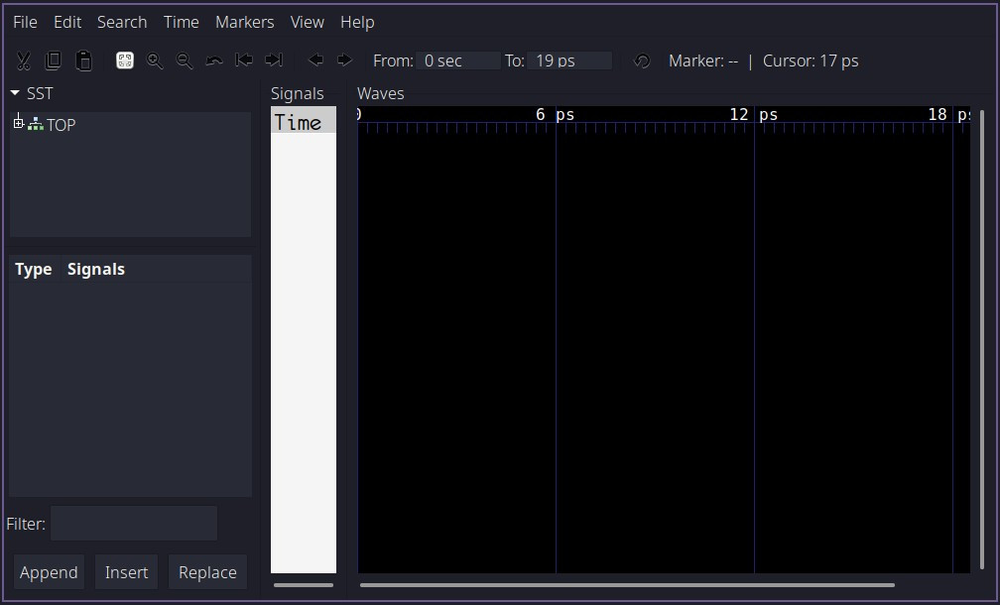

(Рис. 3: Окно новой сессии GTKWave)

Следуйте показанным шагам, чтобы загрузить сигналы из DUT и просмотреть их временные диаграммы:


(Рис. 4: Просмотр временных диаграмм в GTKWave)

Поздравляю! Вы только что завершили вашу самую первую симуляцию с использованием Verilator!

## Наблюдения

Во-первых, вы могли заметить, что в нашей симуляции нет никаких значений 'x' (неопределённых значений). Это потому, что Verilator является симулятором с двумя состояниями, и по умолчанию все сигналы инициализируются в 0. Это хорошо для скорости (так как 2 состояния — меньше, чем 4), но не идеально, если мы хотим проверить корректность логики сброса. Мы подробнее изучим это позже.

Во-вторых, полпериода такта занимает 1 пикосекунду. Это стандартный таймскейл Verilator, и в данном случае он не означает какую-то конкретную временную величину.

Что дальше?
Теперь, после прочтения этого руководства, у вас, надеюсь, появилось базовое понимание принципов работы Verilator. Но, как видите, мы пока только коснулись верхушки айсберга. Продолжайте к части 2, где мы добавим базовую функциональность верификации в наш тестбенч на C++.

# Часть 2: Основы верификации SystemVerilog с использованием C++

В Части 1 мы обсудили основы использования Verilator и написания тестбенчей на C++ для модулей Verilog/SystemVerilog. В этом руководстве мы улучшим тестбенч, добавив случайные начальные значения сигналов, добавим сигнал сброса, а также добавим входные стимулы и проверку выходных данных, чтобы начать работу с базовой функциональностью верификации.

## Начало работы

Это руководство является прямым продолжением Части 1. Вы можете получить готовые исходные коды для примера проекта Verilator, используемого в этом уроке, с Github и исследовать их как пожелаете:

```bash
git clone https://github.com/n-kremeris/verilator_basics
git checkout verilator_pt2
```

Или следовать руководству ниже, продолжая с Части 1.

### Длинные команды — для троглодитов

Прежде чем делать что-либо с нашим тестбенчем, стоит сказать, что никому не нравится вводить одни и те же команды снова и снова. А поскольку мы не пещерные люди, мы будем использовать (Make)[https://www.gnu.org/software/make/], чтобы быстро собирать и запускать нашу симуляцию, быстро продвигая наши возможности проектирования аппаратного обеспечения в каменный век.

Большинство команд сборки, используемых в Makefile ниже, должны быть знакомы из Части 1, но давайте коротко их повторим на всякий случай:

```css
verilator -Wall --trace -cc alu.sv --exe tb_alu.cpp
```

Это конвертирует наш источник ```alu.sv``` в C++ и генерирует файлы сборки для создания исполняемого файла симуляции.
Мы используем ```-Wall``` для включения всех ошибок C++, ```--trace``` для включения трассировки временных диаграмм, ```-cc alu.sv``` для конвертации нашего модуля ``alu.sv`` в C++, и ```--exe tb_alu.cpp```, чтобы сказать Verilator, какой файл является нашим тестбенчем на C++.

```cpp
make -C obj_dir -f Valu.mk Valu```

Это собирает наш исполняемый файл симуляции из тестбенча и преобразованных исходников.
Мы говорим Make сменить рабочий каталог на ```obj_dir```, использовать файл сборки с именем ```Valu.mk``` и собрать цель с именем Valu.

```bash
./obj_dir/Valu
```

Это запускает наш исполняемый файл симуляции, который симулирует тестбенч и генерирует временные диаграммы.

В вашем рабочем каталоге создайте файл с именем ```Makefile``` и вставьте следующее содержимое:

```make
MODULE=alu

.PHONY:sim
sim: waveform.vcd

.PHONY:verilate
verilate: .stamp.verilate

.PHONY:build
build: obj_dir/Valu

.PHONY:waves
waves: waveform.vcd
	@echo
	@echo "### WAVES ###"
	gtkwave waveform.vcd

waveform.vcd: ./obj_dir/V$(MODULE)
	@echo
	@echo "### SIMULATING ###"
	@./obj_dir/V$(MODULE)

./obj_dir/V$(MODULE): .stamp.verilate
	@echo
	@echo "### BUILDING SIM ###"
	make -C obj_dir -f V$(MODULE).mk V$(MODULE)

.stamp.verilate: $(MODULE).sv tb_$(MODULE).cpp
	@echo
	@echo "### VERILATING ###"
	verilator -Wall --trace -cc $(MODULE).sv --exe tb_$(MODULE).cpp
	@touch .stamp.verilate

.PHONY:lint
lint: $(MODULE).sv
	verilator --lint-only $(MODULE).sv

.PHONY: clean
clean:
	rm -rf .stamp.*;
	rm -rf ./obj_dir
	rm -rf waveform.vcd
```
Этот ```Makefile``` должен быть понятен тем, кто знаком с Make.
Если вы раньше не использовали Make, пожалуйста, ознакомьтесь с другим руководством по использованию Make для симуляции.

После того как вы сохраните файл, вы сможете быстро пересобрать всю симуляцию, запустив в терминале ```make sim```, открыть ```GTKWave``` с помощью ```make waves```, выполнить вериляцию вашего дизайна с помощью ```make verilate``` или собрать верилированные исходники с помощью ```make build```.

Обратите внимание, что здесь также есть дополнительная команда ```make lint```, которая вызывает Verilator с ключом ```--lint-only```. Это полезно для быстрой проверки ваших исходных файлов Verilog/SystemVerilog на ошибки. Эту проверку можно использовать даже если вы не используете Verilator для симуляции.

И наконец, есть команда ```make clean```, которая удаляет весь мусор, сгенерированный в процессе сборки.

И с этим всем покончено — давайте заставим наш тестбенч засиять.

## Случайные начальные значения

Одно из наблюдений из Части 1 — это то, что Verilator является симулятором с двумя состояниями, что значит, что он поддерживает только логические значения ```1``` и ```0```, и не поддерживает ```X``` (и лишь ограниченно поддерживает ```Z```). Поэтому Verilator по умолчанию инициализирует все сигналы в ```0```, что видно на Рис.1 из наших предыдущих результатов симуляции:


Рис. 1: По умолчанию все инициализировано равным 0

Кроме того, если у вас есть код, который присваивает X (проводу?) или регистру, то по умолчанию он также получает значение 0.

Однако мы можем изменить это поведение с помощью параметров командной строки — мы можем заставить Verilator инициализировать все сигналы в ```1``` или, что лучше, в случайные значения. Это позволит нам проверить, работает ли наш сигнал сброса, как только мы добавим его в тестбенч.

Чтобы сделать так, чтобы тестбенч инициализировал сигналы случайными значениями, сначала нужно вызвать ```Verilated::commandArgs(argc, argv);``` перед созданием объекта DUT:

```cpp
int main(int argc, char** argv, char** env) {
    Verilated::commandArgs(argc, argv);
    Valu *dut = new Valu;
    <...>
```
Затем мы должны обновить команду сборки вериляции, добавив ```--x-assign unique``` и ```--x-initial unique```. Строка 31 в нашем Makefile теперь должна выглядеть так:

```make
verilator -Wall --trace --x-assign unique --x-initial unique -cc $(MODULE).sv --exe tb_$(MODULE).cpp
```

И наконец, мы должны передать ```+verilator+rand+reset+2``` нашему исполняемому файлу симуляции, чтобы установить метод инициализации сигналов во время выполнения в случайный. Это значит, что строка 21 в Makefile должна выглядеть так:

```make
@./obj_dir/V$(MODULE) +verilator+rand+reset+2
```

Теперь, если мы сделаем ```make clean``` и ```make waves```, мы увидим, что сигналы инициализируются случайными значениями в начале симуляции:


Рис. 2: Случайная инициализация.

Теперь, когда сигналы рандомизированы, давайте посмотрим, как применить наш сигнал сброса.

## Сброс DUT
Чтобы сбросить наш DUT и его входные сигналы, мы обновим основной цикл нашего тестбенча вот так:

```cpp

while (sim_time < MAX_SIM_TIME) {
    dut->rst = 0;
    if(sim_time > 1 && sim_time < 5){
        dut->rst = 1;
        dut->a_in = 0;
        dut->b_in = 0;
        dut->op_in = 0;
        dut->in_valid = 0;
    }

    dut->clk ^= 1;
    dut->eval();
    m_trace->dump(sim_time);
    sim_time++;
}
```

В строке 3 я произвольно выбрал, что хочу, чтобы сброс происходил между фронтами тактов на 3 и 5. Вы, конечно, можете изменить это при необходимости.

На строке 4 сброс устанавливается в высокий уровень, а на последующих строках все входы DUT сбрасываются в 0.

Строки 11-14 не изменены. Мы инвертируем тактовый сигнал и увеличиваем счётчик времени симуляции.

Строка 2 добавлена, чтобы сбрасывать счётчик обратно в 0 при последующих итерациях цикла. В совокупности строки 2-3-4 эквивалентны следующему коду на SystemVerilog:

```sv
always_comb begin
    dut.rst = 1'b0;
    if (sim_time >= 3 && sim_time < 6) begin
        dut.rst = 1'b1;
    end
end
```
Повторный запуск симуляции теперь даёт нам следующее:


Рис. 3: Сигнал сброса в действии.

Как видно на Рисунке 3, наш сигнал сброса успешно генерируется в тестбенче. Чтобы сделать основной цикл немного чище, давайте вынесем код сброса в отдельную функцию за пределами ```main()```:

```cpp
void dut_reset (Valu *dut, vluint64_t &sim_time){
    dut->rst = 0;
    if(sim_time >= 3 && sim_time < 6){
        dut->rst = 1;
        dut->a_in = 0;
        dut->b_in = 0;
        dut->op_in = 0;
        dut->in_valid = 0;
    }
}```

Затем добавим вызов ```dut_reset``` в главный цикл:

```cpp
while (sim_time < MAX_SIM_TIME) {
    dut_reset(dut, sim_time);

    dut->clk ^= 1;
    dut->eval();
    m_trace->dump(sim_time);
    sim_time++;
}
```

Теперь, когда наш сброс работает, давайте посмотрим на добавление реальных стимулов и кода верификации.

## Базовая верификация

На данный момент у нас в основном цикле симуляции следующее:

```cpp
while (sim_time < MAX_SIM_TIME) {
    dut_reset(dut, sim_time);

    dut->clk ^= 1;
    dut->eval();
    m_trace->dump(sim_time);
    sim_time++;
}
```

Теперь, если бы мы симулировали тестбенч на Verilog/SystemVerilog как DUT вместо нашего модуля ALU, мы могли бы добавить проверку ```Verilated::gotFinish()``` и остановить симуляцию, если это значение становится ```true```. Это происходит, когда вызывается ```$finish()``` из Verilog/SystemVerilog. Наш тестбенч на C++ тогда был бы достаточен для симуляции тестбенча на Verilog/SystemVerilog.

Но нам этого недостаточно, так как нам нужно вставить стимулы и код верификации где-то в главный цикл тестбенча на C++, чтобы управлять и проверять наш DUT.

### Счётчик фронтов тактового сигнала

Существует много способов добиться нужного результата, но вот что мы сделаем сейчас:

Во-первых, мы создадим новую переменную для подсчёта положительных фронтов тактового сигнала. Эта переменная будет того же типа, что и sim_time:

```cpp
vluint64_t sim_time = 0;
vluint64_t posedge_cnt = 0;```

Далее мы модифицируем наш код генерации тактового сигнала, добавив счётчик положительных фронтов:

```cpp
dut->clk ^= 1;            // Инвертировать тактовый сигнал
dut->eval();              // Оценить DUT на текущем фронте
if(dut->clk == 1){
    posedge_cnt++;        // Увеличить счётчик при положительном фронте
}
m_trace->dump(sim_time);  // Сохранить в waveform.vcd
sim_time++;               // Увеличить время симуляции
```
Добавление этого счётчика между ```eval``` и ```dump``` даёт нам что-то похожее на следующий код на Verilog:

```sv
initial posedge_cnt <= '0;
always_ff @ (posedge clk, posedge rst) begin
    posedge_cnt <= posedge_cnt + 1'b1;
end
```
И на этом этапе мы наконец можем начать верифицировать нашу ALU.

### Примитивные стимулы и проверки для DUT

Давайте снова посмотрим на ожидаемые временные диаграммы для нашего ALU:


Рис. 4: Ожидаемое поведение ALU

Игнорируя входы a, b и операцию, а также выходные данные, давайте сначала проверим, что наш сигнал входной валидности (input valid) проходит до выхода.

Мы знаем, что у нас есть 2 регистрационные стадии, которые, если упростить, выглядели бы так:

```verilog
always_ff @ (posedge clk) begin
    in_valid_r <= in_valid;
    out_valid <= out_valid_r;
end
```

Таким образом, если мы подадим 1 на ```in_valid``` на 5-м положительном фронте тактового сигнала, то мы должны увидеть 1 на ```out_valid``` через два тактовых цикла, или другими словами, на 7-м положительном фронте. Вот как мы это проверяем:

```cpp
while (sim_time < MAX_SIM_TIME) {
    dut_reset(dut, sim_time);

    dut->clk ^= 1;
    dut->eval();

    dut->in_valid = 0;
    if (dut->clk == 1){
        posedge_cnt++;
        if (posedge_cnt == 5){
            dut->in_valid = 1;       // установить in_valid на 5-м фронте
        }
        if (posedge_cnt == 7){
            if (dut->out_valid != 1) // проверить out_valid на 7-м фронте
                std::cout << "ERROR!" << std::endl;
        }
    }

    m_trace->dump(sim_time);
    sim_time++;
}
```

То, что выполняет выделенный код, будет аналогично этому:

```verilog
always_comb begin
    in_valid = 0;
    if (posedge_cnt == 5)
        in_valid = 1;

    if (posedge_cnt == 7)
        assert (out_valid == 1) else $error("ERROR!")
end
```

А вот как это всё работает при симуляции:

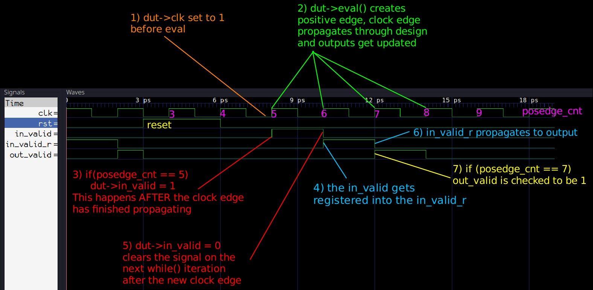

Рис. 5: Графическое объяснение проверки valid

Главное здесь — убедиться, что код генерации стимулов и проверки, который вы пишете, следует этому порядку действий:

- Установите тактовую частоту на 1, выполните оценку для создания положительного фронта, а затем установите входные данные / проверьте выходные данные перед сбросом и увеличением времени моделирования.

- На следующем положительном фронте тактового сигнала внутри цикла ```while()``` входные данные, заданные ранее, будут переданы в схему во время ```eval```, а затем сразу после вычисления входные данные должны быть сброшены до значений по умолчанию.

## Мониторинг сигналов, подобный утверждениям (assertions)

Установка ```in_valid``` на 5-м фронте и проверка, что ```out_valid``` равен 1, конечно, работает, но если мы захотим проверить валидность на большем числе тактов, нам придётся добавить намного больше проверок. Более того, мы не проверяем, что ```out_valid``` равен 0 там, где это должно быть, а это значит, что ```out_valid``` мог бы "застрять" на 1, и тестбенч не провалился бы. Поэтому наш верификационный код можно значительно улучшить, написав немного C++ кода для непрерывного мониторинга ```in_valid``` и ```out_valid```, аналогично тому, как это делают утверждения в SystemVerilog.

Мы можем написать для этого функцию следующим образом:

```cpp
#define VERIF_START_TIME 7
void check_out_valid(Valu *dut, vluint64_t &sim_time){
    static unsigned char in_valid = 0; // in_valid текущего цикла
    static unsigned char in_valid_d = 0; // задержанный in_valid
    static unsigned char out_valid_exp = 0; // ожидаемое значение out_valid

    if (sim_time >= VERIF_START_TIME) {
        // обратите внимание на порядок!
        out_valid_exp = in_valid_d;
        in_valid_d = in_valid;
        in_valid = dut->in_valid;
        if (out_valid_exp != dut->out_valid) {
            std::cout << "ERROR: out_valid mismatch, "
                << "exp: " << (int)(out_valid_exp)
                << " recv: " << (int)(dut->out_valid)
                << " simtime: " << sim_time << std::endl;
        }
    }
}
```

```VERIF_START_TIME``` нужен, чтобы гарантировать, что этот проверочный код не выполняется до или во время сброса, чтобы предотвратить ложные срабатывания ошибок. Если посмотреть на Рис. 5, видно, что ```rst``` возвращается в 0 на отметке 6ps (что равно sim_time = 6), поэтому sim_time = 7 — это точка, с которой мы должны начинать проверку valid.

Код проверки довольно прост — он просто моделирует конвейер регистров между ```in_valid``` и ```out_valid```. Мы можем заменить оригинальный код вышеописанной функцией следующим образом:

```cpp
while (sim_time < MAX_SIM_TIME) {
    dut_reset(dut, sim_time);

    dut->clk ^= 1;
    dut->eval();

    if (dut->clk == 1){
        dut->in_valid = 0;
        posedge_cnt++;
        if (posedge_cnt == 5){
            dut->in_valid = 1;
        }
        check_out_valid(dut, sim_time);
    }

    m_trace->dump(sim_time);
    sim_time++;
}
```

Если вы сейчас запустите симуляцию, ошибок не будет, потому что мы уже проверили и знаем, что сигнал valid правильно передается. Однако, чтобы окончательно убедиться, что новый код работает, мы можем пойти в наш ```alu.sv``` и изменить выходную стадию так, чтобы ```out_valid``` всегда устанавливался в 1:

```verilog
always_ff @ (posedge clk, posedge rst) begin
    if (rst) begin
        out       <= '0;
        out_valid <= '0;
    end else begin
        out       <= result;
        out_valid <= 1'b1;  //**** здесь должно быть in_valid_r ****//
    end
end
```

Запустив симуляции снова, мы получим следующий вывод:

```perl
### SIMULATING ###
./obj_dir/Valu +verilator+rand+reset+2
ERROR: out_valid mismatch, exp: 0 recv: 1 simtime: 8
ERROR: out_valid mismatch, exp: 0 recv: 1 simtime: 10
ERROR: out_valid mismatch, exp: 0 recv: 1 simtime: 14
ERROR: out_valid mismatch, exp: 0 recv: 1 simtime: 16
ERROR: out_valid mismatch, exp: 0 recv: 1 simtime: 18
```

## Генерация случайного valid сигнала

Перед тем как завершить эту часть серии по Verilator, давайте также быстро заменим это единственное присваивание ```in_valid``` на что-то, что будет случайно устанавливать его в 1 или 0.

Для этого мы можем подключить заголовок C++ ```cstdlib```:

```cpp
#include <cstdlib>
```

и использовать функцию генерации псевдослучайных чисел ```rand()``` для генерации случайных 1 и 0 в пользовательской функции ```set_rnd_out_valid```:

```cpp
void set_rnd_out_valid(Valu *dut, vluint64_t &sim_time){
    if (sim_time >= VERIF_START_TIME) {
        dut->in_valid = rand() % 2; // генерировать значения 0 и 1
    }
}
```

Также нам нужно инициализировать генератор случайных чисел с помощью вызова ```srand```, который можно поместить прямо в начало функции main:

```cpp
int main(int argc, char** argv, char** env) {
    srand (time(NULL));
``` 

Нам также следует увеличить ```MAX_SIM_TIME``` до чего-то более существенного, например до 300:

```cpp
#define MAX_SIM_TIME 300
```

И после запуска ```make sim``` и ```make waves```, вот результаты нашей новой самопроверяющейся случайной симуляции:


Рис. 6: Обновленные симуляции с случайными значениями

## Готовый тестбенч

Вот текущая завершённая версия нашего C++ тестбенча:

```cpp
#include <stdlib.h>
#include <iostream>
#include <cstdlib>
#include <verilated.h>
#include <verilated_vcd_c.h>
#include "Valu.h"
#include "Valu___024unit.h"

#define MAX_SIM_TIME 300
#define VERIF_START_TIME 7
vluint64_t sim_time = 0;
vluint64_t posedge_cnt = 0;

void dut_reset (Valu *dut, vluint64_t &sim_time){
    dut->rst = 0;
    if(sim_time >= 3 && sim_time < 6){
        dut->rst = 1;
        dut->a_in = 0;
        dut->b_in = 0;
        dut->op_in = 0;
        dut->in_valid = 0;
    }
}

void check_out_valid(Valu *dut, vluint64_t &sim_time){
    static unsigned char in_valid = 0; // in_valid текущего цикла
    static unsigned char in_valid_d = 0; // задержанный in_valid
    static unsigned char out_valid_exp = 0; // ожидаемое значение out_valid

    if (sim_time >= VERIF_START_TIME) {
        out_valid_exp = in_valid_d;
        in_valid_d = in_valid;
        in_valid = dut->in_valid;
        if (out_valid_exp != dut->out_valid) {
            std::cout << "ERROR: out_valid mismatch, "
                << "exp: " << (int)(out_valid_exp)
                << " recv: " << (int)(dut->out_valid)
                << " simtime: " << sim_time << std::endl;
        }
    }
}

void set_rnd_out_valid(Valu *dut, vluint64_t &sim_time){
    if (sim_time >= VERIF_START_TIME) {
        dut->in_valid = rand() % 2;
    }
}

int main(int argc, char** argv, char** env) {
    srand (time(NULL));
    Verilated::commandArgs(argc, argv);
    Valu *dut = new Valu;

    Verilated::traceEverOn(true);
    VerilatedVcdC *m_trace = new VerilatedVcdC;
    dut->trace(m_trace, 5);
    m_trace->open("waveform.vcd");

    while (sim_time < MAX_SIM_TIME) {
        dut_reset(dut, sim_time);

        dut->clk ^= 1;
        dut->eval();

        if (dut->clk == 1){
            dut->in_valid = 0;
            posedge_cnt++;
            set_rnd_out_valid(dut, sim_time);
            check_out_valid(dut, sim_time);
        }

        m_trace->dump(sim_time);
        sim_time++;
    }

    m_trace->close();
    delete dut;
    exit(EXIT_SUCCESS);
}
```

## Заключение
Способ написания тестбенчей на C++ определённо отличается от того, как проектируют тестбенчи на Verilog/SystemVerilog, но из примеров, приведённых в этом руководстве, видно, как отдельные функциональные элементы, которые были бы написаны на Verilog, выглядят аналогично в C++. Поэтому, если вы хотите применить свои навыки написания тестбренчей на Verilog к C++, важно хорошо понимать правильный порядок вызовов C++ для создания фронтов тактового сигнала, стимуляции/проверки сигналов и вывода значений формы волны.

И хотя текущая версия нашего тестбенча всё ещё довольно базовая, она уже начинает напоминать более продвинутую верификационную среду. Тестбенч теперь инициализирует все сигналы случайными значениями и содержит как случайные стимулы,  так и непрерывный мониторинг по крайней мере одного из выходов.

# Часть 3: Традиционный пример верефикации

В Части 1 и Части 2 мы обсудили основы использования Verilator и написания тестбенчей на C++ для модулей Verilog/SystemVerilog, а также как выполнять основные задачи верификации: задавать входные сигналы, наблюдать выходы, генерировать случайные стимулы и реализовывать непрерывный мониторинг.

В этом руководстве мы рассмотрим написание простого тестбенча для проверки функциональности сложения и вычитания нашего АЛУ.

# Начало работы

Это руководство является прямым продолжением Части 2. Вы можете получить готовые исходники для примерного проекта Verilator, используемого в этом уроке, с GitHub и изучить их по своему усмотрению:

```bash
git clone https://github.com/n-kremeris/verilator_basics
git checkout verilator_pt3
```

Или следуйте приведённым ниже инструкциям, продолжая с Части 2.

## Делаем typedef ```operation_t``` доступным в тестбенче на C++

Прежде чем мы сможем начать проверять, правильно ли наш АЛУ складывает или вычитает два числа, нам сначала нужно сделать наш typedef операции доступным в тестбенче ```tb_alu.cpp```.

В начале кода нашего АЛУ у нас есть следующее:

```verilog
typedef enum logic [1:0] {
  add = 2'h1,
  sub = 2'h2,
  nop = 2'h0
} operation_t /*verilator public*/;
```

Обратите внимание на комментарий ```/*verilator public*/``` после имени ```operation_t```. Это говорит Verilator преобразовать этот typedef в C++ и сделать его общедоступным — это происходит во время шага верилации (конвертация HDL в C++).

Такие комментарии называются директивами или прагмами — они дают Verilator дополнительную информацию о том, как обрабатывать ваш HDL-код. Список таких директив можно найти в руководстве по расширениям языка Verilator.

Если вы посмотрите в папку ```obj_dir```, где находятся артефакты конверсии, вы найдёте файл ```Valu___024unit.h```, который содержит верифицированную версию нашего перечисления typedef:

```cpp
// TYPEDEFS
// That were declared public
enum operation_t {
    add = 1U,
    sub = 2U,
    nop = 0U
};
```
Если бы мы не добавили комментарий ```/*verilator public*/```, этот typedef не был бы доступен в нашем заголовочном файле.

Так как мы уже включили этот заголовок в наш ```tb_alu.cpp``` (```#include "Valu___024unit.h"```), мы теперь можем использовать определения внутри перечисления (enum) для задания входа op_in нашего АЛУ.

Значения перечисления затем могут быть доступны в нашем тестбенче следующим образом:

```cpp
Valu___024unit::operation_t::add
Valu___024unit::operation_t::sub
```
На этом этапе у нас есть всё необходимое, чтобы приступить к проверке функциональности сложения и вычитания нашего АЛУ.

## Пример традиционной (временной) верификации

В Части 2 был продемонстрирован примитивный метод проектирования тестбенча, который проверял корректность работы сигнала ```out_valid``` у нашего АЛУ.

Мы проверяли, что пайплайн между ```in_valid``` и ```out_valid``` работает правильно, задавая ```1``` на ```in_valid``` на пятом такте и проверяя, что ```out_valid``` равен ```1``` на седьмом такте:

```cpp
if (posedge_cnt == 5){
    dut->in_valid = 1; // устанавливаем in_valid на 5-м такте
}
if (posedge_cnt == 7){
    if (dut->out_valid != 1) // проверяем out_valid на 7-м такте
        std::cout << "ERROR!" << std::endl;
}
```
Этот пример сам по себе довольно слабый (а что если ```out_valid``` всегда застрял на ```1```?), но он хорошо иллюстрирует суть. Я лично называю это традиционным или временным стилем верификации, потому что мы явно подаём конкретные входные значения в определённые моменты времени и проверяем, что выходные значения соответствуют ожидаемым после некоторого времени. Этот стиль отлично подходит для быстрой проверки небольших схем, хотя может быть не лучшим выбором при работе со сложными модулями.

### Временные стимулы

Если вы следуете этому руководству после завершения Части 2, ваш основной цикл сейчас должен выглядеть так:

```cpp
while (sim_time < MAX_SIM_TIME) {
    dut_reset(dut, sim_time);

    dut->clk ^= 1;
    dut->eval();

    if (dut->clk == 1){
        dut->in_valid = 0;
        posedge_cnt++;
        set_rnd_out_valid(dut, sim_time);
        check_out_valid(dut, sim_time);
    }
    m_trace->dump(sim_time);
    sim_time++;
}
```

Давайте выполним операцию сложения на такте 10 и вычитания на такте 20. Для этого мы уберём функцию случайной передачи, которая находится в строке 10 выше, и заменим её на оператор switch следующим образом:

```cpp
while (sim_time < MAX_SIM_TIME) {
    dut_reset(dut, sim_time);

    dut->clk ^= 1;
    dut->eval();

    if (dut->clk == 1){
        dut->in_valid = 0;
        posedge_cnt++;
        switch (posedge_cnt){
            case 10:
                dut->in_valid = 1;
                dut->a_in = 5;
                dut->b_in = 3;
                dut->op_in = Valu___024unit::operation_t::add;
                break;

            case 20:
                dut->in_valid = 1;
                dut->a_in = 5;
                dut->b_in = 3;
                dut->op_in = Valu___024unit::operation_t::sub;
                break;
        }
        check_out_valid(dut, sim_time);
    }

    m_trace->dump(sim_time);
    sim_time++;
}
```

Как видно, в обоих случаях мы устанавливаем ```dut->in_valid``` в ```1```, задаём некоторые входные операнды в ```dut->a_in``` и ```dut->b_in```, а затем устанавливаем ```dut->op_in``` в желаемую операцию: сложение на 10-м такте и вычитание на 20-м. При симуляции мы можем увидеть, как это работает на рис. 1:

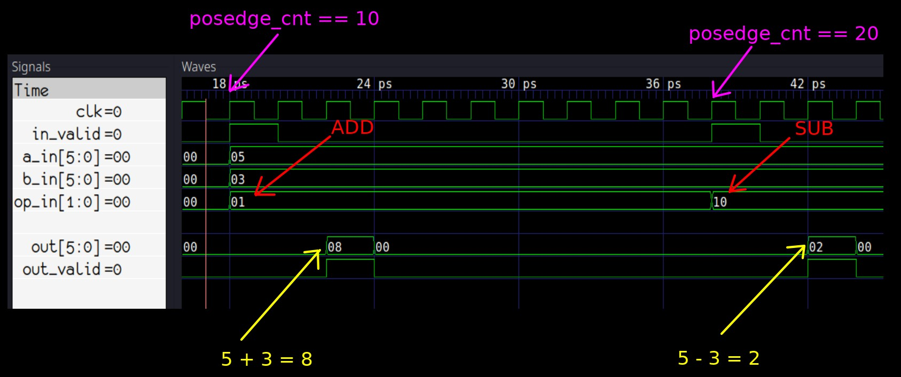
Рис. 1: Результаты симуляции сложения и вычитания

Из рисунка 1 видно, что АЛУ работает корректно, но на самом деле мы должны проверять это прямо в коде.

### Проверка результатов по времени

Мы знаем, что конвейер АЛУ всегда занимает фиксированное количество — 2 такта — чтобы обработать наши входные данные и вернуть результат на выходах, поэтому мы можем добавить проверки на 12-м и 22-м тактах для верификации результатов:

```cpp
switch (posedge_cnt){
    case 10:
        dut->in_valid = 1;
        dut->a_in = 5;
        dut->b_in = 3;
        dut->op_in = Valu___024unit::operation_t::add;
        break;

    case 12:
        if (dut->out != 8)
            std::cout << "Addition failed @ " << sim_time << std::endl;
        break;

    case 20:
        dut->in_valid = 1;
        dut->a_in = 5;
        dut->b_in = 3;
        dut->op_in = Valu___024unit::operation_t::sub;
        break;

    case 22:
        if (dut->out != 2)
            std::cout << "Subtraction failed @ " << sim_time << std::endl;
        break;
}
```

Нам не нужно явно проверять, что ```out_valid``` корректен в случаях 12 и 22 — это по-прежнему делает наша функция ```check_out_valid()```.

Если мы сейчас запустим симуляцию, мы увидим, что она проходит без проблем, потому что АЛУ написано правильно. Однако, если мы откроем ```alu.sv``` и изменим вектор результата ```result```:

```verilog
//sub: result = a_in_r + (~b_in_r+1'b1); // оригинал
sub: result = a_in_r + (~b_in_r+6'h3);   // модифицировано
```

Мы увидим, что симуляция провалится и укажет нам, где была обнаружена ошибка:

```perl
### SIMULATING ###
./obj_dir/Valu +verilator+rand+reset+2
Subtraction failed @ 42
```

## Заключение
Это руководство демонстрирует примитивный пример верификационного кода на C++, который можно использовать для выполнения базовых задач верификации. Существует множество вариаций того, как можно структурировать такой код — вы можете использовать операторы ```switch```, как показано здесь, отдельные ```if```- выражения или разбивать код на отдельные функции. Однако, скорее всего, вы согласитесь, что такой метод верификации, хотя простой и быстрый в реализации, на самом деле недостаточен для более сложных проектов.

## Что дальше?

Теперь, когда вы хорошо поняли, как подавать стимулы и проверять ваш проект с помощью Verilator, в Части 4 будет показано, как писать рандомизированные транзакционные тестбенчи (в стиле UVM) на C++.

# Часть 4: Современный транзакционный (UVM) стиль тестбенча на C++

В Части 1 и Части 2 мы обсудили основы использования Verilator и написания тестбенчей на C++ для модулей на Verilog/SystemVerilog, а также некоторые базовые задачи верификации: подачу входных сигналов, наблюдение за выходами, генерацию случайных стимулов и непрерывную проверку с помощью утверждений. В Части 3 мы построили и исследовали традиционный стиль тестбенча, написанного на C++.

В этом руководстве мы рассмотрим более современные методы верификации, а именно — транзакционные тестбенчи в стиле UVM. Если вы ранее не сталкивались с транзакционными тестбенчами, это руководство, надеюсь, даст вам чёткое понимание того, как они работают и как устроены. С другой стороны, если вы уже использовали UVM, это руководство подкинет вам идеи, как применить концепции UVM при построении тестбенчей на чистом C++.

## Начало работы

Я предполагаю, что вы уже прочли и выполнили части 1, 2 и 3 моего цикла руководств по Verilator перед тем как читаете это руководство. Эта часть будет немного другой — вместо пошагового построения кода, мы сразу изучим готовый тестбенч транзакционного стиля, построенный на основе кода из предыдущих частей.

Исходные коды, используемые в этом руководстве, доступны на Github:

```bash
git clone https://github.com/n-kremeris/verilator_basics
git checkout verilator_pt4
```

### Что такое транзакционные тестбенчи?

Постоянно растущая сложность FPGA и ASIC дизайнов приводит к ужесточению требований к верификации. Возросший спрос на продвинутые тестбенчи породил появление новых методологий и инструментов, таких как OVM, VVM, UVM, SystemC, а также различных Python-фреймворков. Все эти инструменты направлены на одну цель — облегчение построения мощных, самопроверяющих тестбенчей из переиспользуемых компонентов, с одновременным увеличением покрытия кода, минимизацией дублирования и избавлением инженеров по верификации от необходимости бесконечно пялиться на осциллограммы. Один из главных способов достижения этой цели — это поощрение написания тестбенчей транзакционного стиля, которые, к счастью, мы также можем реализовать на чистом C++ вместе с Verilator.

Транзакционный тестбенч — это тестбенч, который использует транзакции (что, по сути, просто красивое название для обмена данными или управляющими пакетами), которые обеспечивают абстракцию поверх прямого присваивания значений входным контактам и непосредственной проверки значений выходных контактов устройства, проходящего тестирование (DUT). 

Традиционный тестбенч на VHDL, Verilog, SystemVerilog или C++ (как мы видели в Части 1) обычно имеет экземпляр DUT, а также длинный поведенческий код с циклами и условными операторами, который последовательно подаёт сигналы на входы DUT для перевода его в определённые состояния. Как правило, такие тестбенчи проверяются на корректность визуальным просмотром осциллограмм, и хотя можно добавить самопроверку через утверждения или мониторинг, это обычно не поощряется.

В отличие от этого, транзакционный тестбенч поощряет строгое разделение на различные функциональные блоки, которые общаются между собой через транзакции. Базовый транзакционный тестбенч может состоять из:

- блока генерации стимулов для DUT (генератор транзакций / последовательность);

- блока, подающего эти данные на DUT (драйвер);

- блока, который наблюдает выходы DUT и генерирует результаты (монитор);

- блока, собирающего пакеты данных и сравнивающего их для проверки (табло);

- блока, собирающего данные и рассчитывающего функциональное покрытие (ковередж).

Сразу видно главный минус транзакционных тестбенчей — это сложность: из-за множества отдельных блоков базовая симуляция запускается медленнее. Однако за эти дополнительные усилия вы получаете непревзойдённую гибкость и повторное использование кода.

Например, если у вас есть драйвер для интерфейса типа A, вы можете использовать его с любым другим DUT с таким же интерфейсом типа A — достаточно просто передать ему новые данные. Если интерфейс заменяется с типа A на тип B, вы просто меняете драйвер с A на B, оставляя остальной тестбенч без изменений.

### Подходят ли мне транзакционные тестбенчи?

Да, если вы готовы потратить время на обучение и освоение этой дополнительной сложности. Всё просто. Единственное исключение, на мой взгляд, — это когда DUT очень маленький. В таком случае, возможно, не стоит тратить время на построение транзакционного тестбенча, если модуль можно завершить за пару дней.

## Рандомизированные транзакционные (в UVM стиле) тестбенчи на чистом C++ с Verilator

Для тех, кто знаком с UVM на SystemVerilog, будет приятно узнать, что тестбенчи в стиле UVM довольно легко пишутся и на чистом C++. Структуры наподобие драйверов, мониторов и табло просто реализуются, и вы также можете реализовать покрытие, а также последовательные структуры, приложив немного дополнительных усилий.

Реализация современных транзакционных тестбенчей на чистом C++ вместо SystemC или UVM-SystemC имеет преимущество в простоте старта, а иногда и в более высокой производительности. Минус — многое из того, что уже есть в SystemC или UVM, придётся реализовать вручную. Теоретически, можно создать тестбенч на SystemVerilog UVM, преобразовать его в C++ с помощью Verilator и управлять им базовым C++ тестбенчем. Однако поддержка UVM в Verilator пока ещё не полноценная.

Учитывая всё это, в данном руководстве мы создадим базовый транзакционный тестбенч на чистом C++, без сторонних библиотек. Мы напишем структуры, которые условно представляют транзакции, драйверы, мониторы и табло. Это даст вам необходимые знания для создания мощных тестбенчей на C++, а также понятную и простую в использовании основу для последующих проектов.

## Базовая блок-схема транзакционного тестбенча

Вот базовый пример того, как устроен современный транзакционный тестбенч:

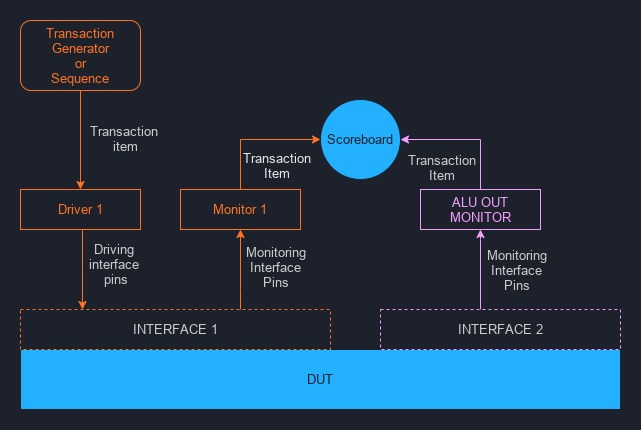

Рис. 1: Блок-схема базового транзакционного тестового стенда

Если вы новичок в таком стиле верификации, названия компонентов могут показаться незнакомыми. Вот их объяснение:

### Транзакция и элемент транзакции

Транзакция — это высокоуровневая операция обмена данными, а элемент транзакции — это просто пакет данных, то есть набор информации или инструкций. Обычно реализуется как класс или структура и содержит данные, отправляемые в DUT или получаемые от него.

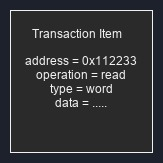

Рис. 2: Элемент транзакции

### Генератор транзакций

Это класс или блок кода, который создаёт элементы транзакций, используемые как инструкции для подачи на входы DUT.

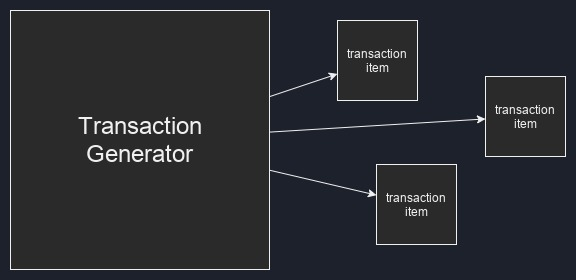

Рис. 3: Генератор транзакций

### Драйвер

Эти структуры берут элементы транзакций и, на основе содержащихся данных, управляют физическими входами входного интерфейса (устанавливая 1 и 0), чтобы ввести данные в DUT. Иногда драйверы требуются и для сложных выходных интерфейсов.

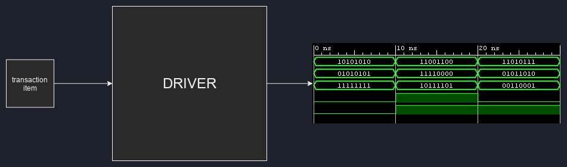

Рис. 4: Драйвер

### Интерфейс

Интерфейс — это просто набор или группа контактов, которые используются для конкретной функции. Например, FIFO обычно имеет два интерфейса: входной и выходной, а двухтактовая память (dual-clock RAM) может иметь четыре: вход для порта A, выход для порта A, вход для порта B, выход для порта B.

Интерфейс может быть классом или структурой, которая объединяет функционально связанные контакты, или, как будет в нашем случае, это также может быть неявная группировка контактов без явного объединения в коде.

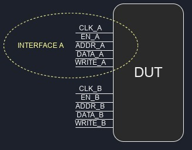

Рис. 5: Интерфейс

### Монитор

Это по сути полная противоположность драйвера — вместо того чтобы управлять физическими состояниями пинов на интерфейсах, мониторы пассивно наблюдают (мониторят) за тем, что происходит на интерфейсе. Мониторы обычно подключаются к выходному интерфейсу, где они используются для проверки выходных данных устройства под тестом. Кроме того, вы можете увидеть их подключёнными к входным интерфейсам, где они могут проверять, что связанный драйвер корректно управляет интерфейсом.

То, что они делают с данными, полученными в результате наблюдаемых изменений сигналов, зависит от разработчика тестбенча. Мониторы могут быть полностью автономными и самопроверяющими, то есть они могут напрямую выполнять код, который проверяет правильность изменений сигналов по мере появления событий на интерфейсе. Однако, чаще мониторы проектируются так, чтобы генерировать новые элементы транзакций из наблюдаемых изменений состояний контактов интерфейса. Эти элементы транзакций затем отправляются в анализирующие порты табло.

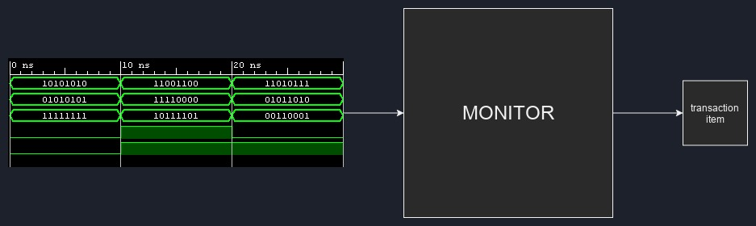

Рис. 6: Монитор

### Табло

Структура табло обычно содержит наибольшую часть самопроверяющего кода тестбенча. Одно табло имеет один или несколько анализирующих (слушающих) портов, которые используются для получения элементов транзакций от мониторов. Табло выполняет проверки на полученных элементах транзакций, чтобы убедиться, что наблюдаемые входные стимулы приводят к корректным выходам, и определяет, прошёл тестбенч или нет.

Обычно в тестбенче используют одно табло, но ничто не мешает вам создать столько, сколько захотите.

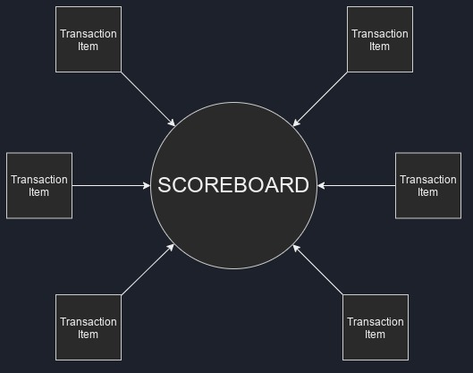

Рис. 7: Табло

Давайте разберём, как работают транзакционные тестбенчи на примере чего-то, что, вероятно, знакомо каждому читателю — кофе!

## Ароматная аналогия

Представьте, что вы только что купили новую кофемашину и хотите её протестировать. Вы также зовёте в гости своего друга, который случайно является профессиональным бариста, чтобы он вам помог. Будучи перфекционистом, он требует, чтобы вы дали ему точные инструкции для желаемого напитка в следующем формате:

```markdown
brew_info {
    brew_type;
    water_quantity;
    coffee_quantity;
    coffee_grind_size;
    cup;
}
```

Итак, вы берёте лист бумаги и создаёте инструкции для идеальной чашки кофе:

```markdown
brew_info my_cup_config;
my_cup_config.brew_type = espresso
my_cup_config.water_quantity = 50g
my_cup_config.coffee_quantity = 25g
my_cup_config.coffee_grind_size = 7
my_cup_config.cup = small blue cup
```
Затем вы передаёте этот ```my_cup_config``` своему другу, который анализирует предоставленные данные этого элемента транзакции и начинает варить кофе именно так, как описано, управляя входами вашей CUT (Coffeemaker-Under-Test — кофемашина под тестом). У кофемашины есть входной интерфейс, который состоит из кнопок запуска и остановки потока воды, регулятора температуры и других элементов, а также выходной интерфейс — то есть носики, из которых течёт кофе.

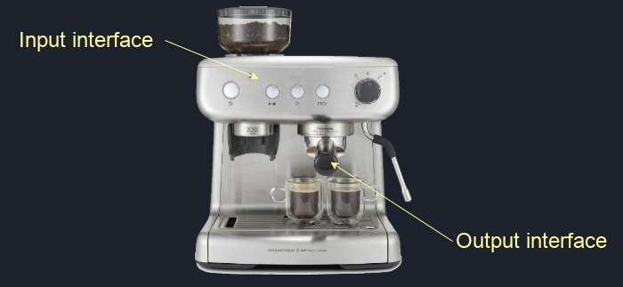

Рис. 8: CUT и его интерфейсы

Вы уверены в способностях своего друга, так что вряд ли он напутает с вашими инструкциями. Однако вы просите свою сестру встать рядом с кофемашиной на всякий случай и наблюдать за процессом приготовления кофе, записывая то, что она видит. И она делает это так:

```markdown
brew_info observed_cup_config;
observed_cup_config.brew_type = espresso
observed_cup_config.water_quantity = 50g
observed_cup_config.coffee_quantity = 25g
observed_cup_config.coffee_grind size = 7
observed_cup_config.cup = small blue cup
```
Как видите, кофе был приготовлен именно так, как требовалось. Однако если бы ваш друг случайно сварил кофе на холодной воде или забыл бы перемолоть зёрна заранее, вы бы это узнали, потому что у вас есть элемент транзакции, который ваша сестра записала и передала вам.

Теперь, исходя из того, что мы наблюдаем работу кофемашины, которой управляем определённым образом, есть некоторые очевидные ожидания. Во-первых, ожидается, что выходной интерфейс кофемашины произведёт кофе, а не чай, горячий шоколад или колу. Во-вторых, ожидается, что жидкость будет иметь определённые качества в результате выбранного процесса заваривания.

После того как кофе готов, вы смотрите на чашку, пробуете напиток, фиксируете свои ощущения и делаете заметки на ещё одном листке бумаги как настоящий ценитель:

```markdown
coffee_characteristics the_coffee_chars;
the_coffee_chars.crema = lots;
the_coffee_chars.sweetness = average;
the_coffee_chars.strength = like a kick from a mule;
the_coffee_chars.cup = small blue cup;
```

Так как вы дали своему другу конкретные инструкции, как приготовить этот чёрный энергетический эликсир, вы точно знаете, каким он должен быть на вкус. Поэтому вы можете использовать данные из ```observed_cup_config``` и ```the_coffee_chars```, чтобы проверить, был ли кофе сварен правильно, используя табло:

```markdown
if observed_cup_config.brew_type == espresso then the_coffee.crema should be 'lots'
if observed_cup_config.water_quantity/coffee_quantity >= 2 then the_coffee.strength should be 'high'
// и так далее...
```
Если чашка соответствует вашим ожиданиям, можно сказать, что, насколько нам известно, кофемашина работает правильно. Надеюсь, эта аналогия помогла вам лучше понять тему.

## Структура и компоненты транзакционного тестбенча для ALU

Подобно базовой блок-схеме на рис. 1, вот структура транзакционного тестбенча для нашего ALU:

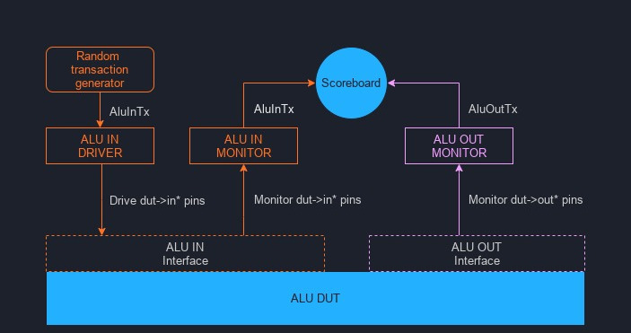

Рис. 9: Блок-схема транзакционного тестового стенда

Если вы следовали инструкциям по началу работы выше, теперь мы можем изучить код, который находится в тестбенче ```tb_alu.cpp```.

## Элемент транзакции AluInTx

У ALU есть входной интерфейс, состоящий из пинов ```op_in```, ``a_in``, ```b_in``` и ```in_valid```. Поэтому нам нужен класс элемента транзакции, который сможет содержать данные для управления этими контактами. Это можно сделать следующим образом:

```cpp
class AluInTx {
    public:
        uint32_t a;
        uint32_t b;
        enum Operation {
            add = Valu___024unit::operation_t::add,
            sub = Valu___024unit::operation_t::sub,
            nop = Valu___024unit::operation_t::nop
        } op;
};
```

Числовые значения для ```a_in``` и ```b_in``` можно легко хранить в типе ```uint32_t```, который представляет собой беззнаковое 32-битное целое число.

Verilator допускает использование ```uint8_t``` для сигналов шириной до 8 бит, ```uint16_t``` — до 16 бит, ```uint32_t``` — до 32 бит, и ```vluint64_t``` — до 64 бит, и если ширина сигнала меньше или равна размеру переменной, компилятор выполнит автоматическое приведение типов по мере необходимости.

Чтобы задать операцию для операндов ```a``` и ```b```, мы создаём перечисление ```op```, где значения берутся из сгенерированного Verilator кода SystemVerilog ALU. Это избавляет нас от необходимости каждый раз писать длинный префикс ```Valu___024unit::operation_t::```.

Наконец, нам не нужно хранить информацию о ```in_valid``` в ```AluInTx``` — драйвер сам будет управлять ```in_valid``` на основе полученного ```AluInTx```.

## Генератор элементов транзакции rndAluInTx

Теперь, когда у нас есть шаблон для транзакции ```AluInTx```, нам нужен код, который будет создавать объекты этого типа и присваивать случайные значения операндам. Это делается в генераторе транзакций:

```cpp
AluInTx* rndAluInTx(){
    //20% шанс сгенерировать транзакцию
    if(rand()%5 == 0){
        AluInTx *tx = new AluInTx();
        tx->op = AluInTx::Operation(rand() % 3); // Наш ENUM имеет значения 0, 1, 2
        tx->a = rand() % 11 + 10; // генерируем a в диапазоне 10-20
        tx->b = rand() % 6;  // генерируем b в диапазоне 0-5
        return tx;
    } else {
        return NULL;
    }
}
```

Каждый раз при вызове функции ```rndAluInTx()``` она случайным образом либо:

1. выделяет память под объект ```AluInTx``` (строка 4), присваивает случайные значения ``op``, ```a``` и ```b```, и возвращает указатель на вновь созданный объект (строка 8);

2. либо немедленно возвращает NULL (строка 10), что означает, что транзакция не была сгенерирована.

Причина случайного пропуска генерации каждой второй транзакции — это создание пауз между командами, отправляемыми ALU. Возвращение NULL — не единственный способ сделать это: можно пойти противоположным путём и создать последовательность, которая зависит от некоторой временной переменной (например, тиков симуляции или счётчика положительных фронтов), а затем генерировать транзакции только в определённые моменты времени.

## Драйвер интерфейса ввода AluInDrv

Как только мы сгенерируем элемент транзакции ```AluInTx``` с помощью генератора ```rndAluInTx```, ```AluInTx``` передается в драйверный блок, который управляет входным интерфейсом ALU, используя информацию из этого элемента транзакции. Вот код драйвера из нашего тестбенча:

```cpp
class AluInDrv {
    private:
        Valu *dut;
    public:
        AluInDrv(Valu *dut){
            this->dut = dut;
        }

        void drive(AluInTx *tx){
            // мы всегда начинаем с установки in_valid в 0, и устанавливаем его в 1 позже, только если это необходимо
            dut->in_valid = 0;

            // Ничего не передаём, если элемент транзакции не существует
            if(tx != NULL){
                if (tx->op != AluInTx::nop) {
                    // Если операция не является NOP, мы передаём её на
                    // пины входного интерфейса
                    dut->in_valid = 1;
                    dut->op_in = tx->op;
                    dut->a_in = tx->a;
                    dut->b_in = tx->b;
                }
                // Освобождаем память, удаляя элемент tx
                // после того как он был использован
                delete tx;
            }
        }
};
```

Конструктор ```AluInDrv``` требует дескриптор на объект dut. Нам нужно иметь дескриптор устройства, проходящего тестирование (DUT), внутри драйверов и мониторов, чтобы иметь доступ к его выводам.

На строке 12 видно, что входной сигнал ```in_valid``` всегда по умолчанию устанавливается в ```0```. Это потому что, если у нас нет допустимого ```AluInTx``` и при этом он не является ```NOP```, входные данные для ALU не будут считаться валидными. Примерный эквивалент на SystemVerilog будет таким:

```systemverilog
always_comb begin
    dut.in_valid = 1'b0;
    if ( tx item существует && операция != NOP ) begin
        dut.in_valid = 1'b1;
    end
end
```

Если элемент транзакции не NULL, то на строке 26 происходит удаление (освобождение памяти), где хранится объект транзакции. Это очень важно сделать — как только элемент используется (записывается в DUT), срок его службы заканчивается, и он должен быть удалён, иначе у нас будет утечка памяти.

Заметьте, что C++ поддерживает умное управление памятью, что я настоятельно рекомендую использовать. Однако для целей объяснения, я считаю, что ручное управление памятью лучше иллюстрирует срок жизни элементов транзакций.

## Монитор входного интерфейса AluInMon

```AluInMon``` следит за входным интерфейсом ALU, выполняя противоположные действия драйверу, который мы рассмотрели ранее.

```cpp
class AluInMon {
    private:
        Valu *dut;
        AluScb *scb;
    public:
        AluInMon(Valu *dut, AluScb *scb){
            this->dut = dut;
            this->scb = scb;
        }

        void monitor(){
            if (dut->in_valid == 1) {
                // Если на входном интерфейсе есть валидные данные,
                // создаём новый элемент транзакции AluInTx и заполняем
                // его данными, считанными с пинов интерфейса
                AluInTx *tx = new AluInTx();
                tx->op = AluInTx::Operation(dut->op_in);
                tx->a = dut->a_in;
                tx->b = dut->b_in;

                // затем передаём элемент транзакции в scoreboard
                scb->writeIn(tx);
            }
        }
};
```

Здесь на строке 12 мы наблюдаем сигнал ```in_valid``` на входе ALU. Если вход валидный, монитор создаёт новый элемент транзакции ```AluInTx```, считывает значения ```op_in```, ```a_in```, ```b_in``` контактов и помещает их в ```AluInTx``` переменные ```op```, ```a```, и ```b```.

Этот новый элемент транзакции сообщает нам, какую операцию мы отправили на входы ALU, что будет нужно для проверки корректности выходных данных ALU. Поэтому на строке 22 новая транзакция записывается в таблицу для последующего использования.

## Элемент транзакции AluOutTx

Точно так же, как нам нужен был ```AluInTx``` элемент транзакции для операций с интерфейсом ввода, нам нужен ```AluOutTx``` элемент транзакции для хранения информации о результатах, получаемых с помощью интерфейса вывода.

Однако, поскольку единственное, что мы получаем с выхода — это одно значение результата, ```AluOutTx``` содержит только одну переменную:

```cpp
class AluOutTx {
    public:
        uint32_t out;
};
```

## Монитор выходного интерфейса AluOutMon

Здесь вступает в действие элемент ```AluOutTx```. Точно так же, как монитор входа, ```AluOutMon``` наблюдает выходной интерфейс аналогичным образом:

```cpp
class AluOutMon {
    private:
        Valu *dut;
        AluScb *scb;
    public:
        AluOutMon(Valu *dut, AluScb *scb){
            this->dut = dut;
            this->scb = scb;
        }

        void monitor(){
            if (dut->out_valid == 1) {
                // Если на выходном интерфейсе валидные данные,
                // создаём новый элемент AluOutTx и заполняем
                // его результатом, считанным с пинов интерфейса
                AluOutTx *tx = new AluOutTx();
                tx->out = dut->out;

                // затем передаём элемент транзакции в scoreboard
                scb->writeOut(tx);
            }
        }
};
```

```AluOutMon``` терпеливо ждёт, пока сигнал ```out_valid``` не станет равным 1. Когда это происходит, создаётся новый элемент ```AluOutTx``` (строка 16), значение на выходных контактах испытуемого устройства сохраняется в ```out``` переменной в ```AluOutTx``` элементе, а затем элемент передаётся на табло.

## Табло AluScb

Табло, на мой взгляд, это самый важный блок в тестбенче — это главный мозг всей этой операции. Табло — это место, где хранится и проверяется вся правда о жизни, Вселенной и вообще обо всём:

```cpp
// Табло ALU
class AluScb {
    private:
        std::deque<AluInTx*> in_q;

    public:
        // Порт монитора входного интерфейса
        void writeIn(AluInTx *tx){
            // Поместить полученный элемент транзакции в очередь для последующей обработки
            in_q.push_back(tx);
        }

        // Порт монитора выходного интерфейса
        void writeOut(AluOutTx* tx){
            // Мы никогда не должны получать данные из выходного интерфейса
            // до тех пор, пока на входной интерфейс не будет подано значение
            if(in_q.empty()){
                std::cout <<"Фатальная ошибка в AluScb: пустая очередь AluInTx" << std::endl;
                exit(1);
            }

            // Извлекаем элемент транзакции из начала очереди входных элементов
            AluInTx* in;
            in = in_q.front();
            in_q.pop_front();

            switch(in->op){
                // На выходе не должен появляться валидный сигнал, если операция отсутствует,
                // поэтому мы не должны получать транзакцию с операцией NOP
                case AluInTx::nop :
                    std::cout << "Фатальная ошибка в AluScb, получен NOP на входе" << std::endl;
                    exit(1);
                    break;

                // Получена транзакция сложения
                case AluInTx::add :
                    if (in->a + in->b != tx->out) {
                        std::cout << std::endl;
                        std::cout << "AluScb: несоответствие при сложении" << std::endl;
                        std::cout << "  Ожидалось: " << in->a + in->b
                                  << "  Фактически: " << tx->out << std::endl;
                        std::cout << "  Время симуляции: " << sim_time << std::endl;
                    }
                    break;

                // Получена транзакция вычитания
                case AluInTx::sub :
                    if (in->a - in->b != tx->out) {
                        std::cout << std::endl;
                        std::cout << "AluScb: несоответствие при вычитании" << std::endl;
                        std::cout << "  Ожидалось: " << in->a - in->b
                                  << "  Фактически: " << tx->out << std::endl;
                        std::cout << "  Время симуляции: " << sim_time << std::endl;
                    }
                    break;
            }
            // Так как элементы транзакций были размещены в куче, важно
            // освободить память после их использования
            delete in;
            delete tx;
        }
};
```

Ух ты, это большой кусок кода. С самого начала создаётся очередь для хранения элементов транзакций ```AluInTx``` в табло:

```cpp
std::deque<AluInTx*> in_q;
```

Каждый раз, когда в ALU отправляется допустимая операция, монитор входного интерфейса записывает элемент ```AluInTx``` в табло через метод writeIn (строка 8). Элемент ```AluInTx``` необходимо будет сравнить с соответствующим элементом ```AluOutTx```, чтобы проверить правильность результата ALU. Так как ALU конвейерный, можно отправить несколько команд на входной интерфейс до того, как придут какие-либо выходные элементы ```AluOutTx```. Поэтому элементы ```AluInTx``` нужно сохранять для последующей проверки, и очередь идеально подходит для этой задачи.

Метод ```writeOut``` (строка 14) — это место, где происходит вся проверка результатов. Сначала, на строке 17, проверяется, не выдаёт ли ALU случайный мусор на выходе — мы знаем, что результат на выходе должен появиться только после того, как допустимая операция была подана на вход, поэтому никогда не должно быть такого момента, когда результат на выходе появился раньше, чем хотя бы один элемент ```AluInTx``` в очереди.

Далее, если очередь ```in_q``` не пуста, мы извлекаем первый (самый старый) элемент ```AluInTx``` и переходим к оператору ```switch``` на строке 27. Первый случай ```switch``` (строка 30) проверяет правильность работы тестбенча — валидный сигнал не должен появляться на входе при операции ```NOP```, и если элемент ```AluInTx``` с операцией ```NOP``` попал в табло, это значит, что драйвер ```AluInDrv``` работает некорректно.

В оставшихся случаях, в зависимости от того, является ли операция сложением (строка 36) или вычитанием (строка 47), мы складываем или вычитаем операнды из ```AluInTx``` и сравниваем с результатом в ```AluOutTx```.

Наконец, в конце метода ```writeOut```, элементы транзакций удаляются (строки 59 и 60), так как они больше не нужны.

## Могучий главный цикл и как всё это связывается воедино

Вот она — последняя часть головоломки. Главный цикл — это место, где происходит вся верификационная магия. Функция ```main``` содержит создание всех блоков тестбенча (мониторы, драйвер, табло), а затем в главном цикле итеративно вызываются функции всех этих блоков до окончания симуляции. Или до тех пор, пока тестбенч не завершится с ошибкой. Вот код функции main и основного симуляционного цикла:

```cpp
int main(int argc, char** argv, char** env) {
    <...>

    AluInTx   *tx;

    // Создаём драйвер, табло и блоки мониторов входа и выхода
    AluInDrv  *drv    = new AluInDrv(dut);
    AluScb    *scb    = new AluScb();
    AluInMon  *inMon  = new AluInMon(dut, scb);
    AluOutMon *outMon = new AluOutMon(dut, scb);

    while (sim_time < MAX_SIM_TIME) {
        dut_reset(dut, sim_time);
        dut->clk ^= 1;
        dut->eval();

        // Все действия по управлению/мониторингу выполняются на положительном фронте
        if (dut->clk == 1){

            if (sim_time >= VERIF_START_TIME) {
                // Генерация случайной транзакции AluInTx
                tx = rndAluInTx();

                // Передача транзакции драйверу ALU,
                // который управляет входами на основе данных в транзакции
                drv->drive(tx);

                // Мониторинг входного интерфейса
                inMon->monitor();

                // Мониторинг выходного интерфейса
                outMon->monitor();
            }
        }
        // конец обработки положительного фронта

        m_trace->dump(sim_time);
        sim_time++;
    }

    <...>
    delete dut;
    delete outMon;
    delete inMon;
    delete scb;
    delete drv;
    exit(EXIT_SUCCESS);
}
```

Давайте посмотрим, как это всё работает. После создания блоков тестбенча (строки 14-17), симуляция входит в главный цикл на строке 19, который выполняется до конца симуляционного времени.

На каждой итерации цикла проверяется, наступил ли положительный фронт тактового сигнала (строка 25). Если да, тестбенч генерирует транзакцию ```AluInTx``` (строка 28).

Эта транзакция передаётся драйверу ```AluInDrv``` (строка 33), который управляет входными линиями ALU по информации из транзакции.

На этом же фронте монитор ```AluInMon``` наблюдает входные линии (строка 36) и из наблюдений формирует новый элемент ```AluInTx```, который записывается в табло.

Также на этом же фронте монитор ```AluOutMon``` следит за выходами ALU (строка 39), но транзакции ```AluOutTx``` пока не создаются из-за задержки в ALU по конвейеру — нужно минимум две итерации цикла, прежде чем результаты появятся.

После завершения симуляции все блоки тестбенча удаляются для освобождения памяти (строки 46-50).

## Симуляция

Теперь, когда вы знаете, как работает тестбенч, можно попробовать запустить симуляцию и посмотреть результаты. Если вы клонировали проект, достаточно выполнить ```make``` в каталоге проекта — это соберёт и запустит тестбенч. Никакого интересного вывода не будет, потому что ALU и тестбенч работают корректно, тест проходит без ошибок.

Но это не очень весело, поэтому давайте посмотрим, что будет, если что-то пойдёт не так.

## Плохие результаты ALU

Это легко обнаружить — если ALU выдаёт неправильные результаты, табло сразу пожалуется. Если мы модифицируем ALU вот так:

```verilog
out       <= 6'h5; // должно быть "<= result"
out_valid <= in_valid_r;
```

Тогда табло тут же засечёт ошибку:

```verilog
AluScb: add mismatch
  Expected: 15  Actual: 5
  Simtime: 204

AluScb: sub mismatch
  Expected: 11  Actual: 5
  Simtime: 234

AluScb: add mismatch
  Expected: 17  Actual: 5
  Simtime: 236
```

## Неожиданный out_valid в ALU

Если мы сделаем так, чтобы ALU всегда сигнализировал валидный выход:

```verilog
out       <= result;
out_valid <= 1'b1; // должно быть "<= in_valid_r"
```

Тогда тестовый стенд немедленно завершит работу с фатальной ошибкой при первом обнаружении некорректного корректного вывода:

```verilog
./obj_dir/Valu +verilator+rand+reset+2 
Fatal Error in AluScb: empty AluInTx queue
make: *** [Makefile:23: waveform.vcd] Error 1
```
Это потому что табло не ожидает увидеть выходные данные, если на вход ранее не подавалась команда.

## Волны!

Если у вас установлен GTKWave, можно выполнить ```make waves```, чтобы посмотреть на случайно сгенерированные транзакции в виде волн.

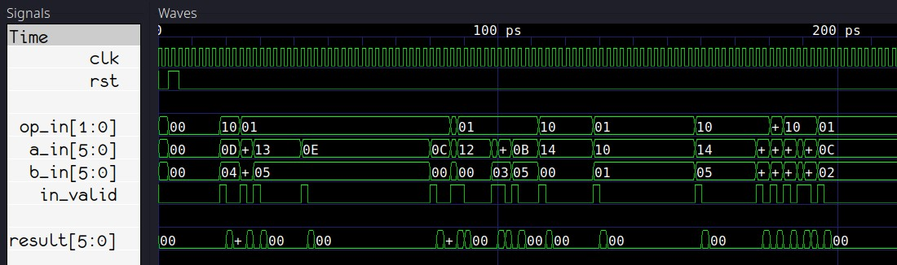

Рис. 10: Волны!

## Заключение

После всего этого текста вы, наверняка, уже сделали для себя выводы о Verilator и транзакционных тестбенчах, так что мне не нужно ничего писать. Я же решил продолжать использовать Verilator и тестбенчи на чистом C++, где это возможно — цена, скорость и гибкость слишком хороши.

А вы как думаете?

## Что дальше?

Идеально было бы добавить ещё проверки в функцию генерации ```rndAluInTx()```. А ещё тестбенч сейчас не выполняет важную проверку перед завершением работы. Подсказка: переменная ```in_q```. 

Наконец, код можно сделать намного приятнее, используя современные функции C++, например, заменив ```AluInTx``` необработанные указатели ```AluOutTx``` на умные указатели. Нет предела совершенству!

Ещё можно поэкспериментировать с другими блоками — последовательностями, слушателями, блоками покрытия (см. Приложение A). Хорошее упражнение — попробовать реализовать их для этого тестбенча.

# Приложение A: Другие термины/компоненты

**Последовательность** может представлять собой блок кода, который заменяет или дополняет генератор транзакций. Последовательность — это именно то, что следует из названия: по сути, это список шагов, описывающих действия, которые должен выполнять тестовый стенд в определённые моменты времени. Последовательность может содержать, например, шаги, которые создают одну транзакцию или несколько транзакций с определёнными значениями или со случайными значениями, или выполняют другие задачи, такие как настройка различных блоков тестового стенда или проверка результатов сложным последовательным или временным способом, который нельзя легко реализовать в мониторах или табло. Чтобы выполнять задачи/проверки в определённое время, можно использовать переменные для отслеживания времени (например, счётчик времени моделирования, счётчик положительных переходов, счётчик отрицательных переходов).

**Слушатель**, также известный как подписчик, — это своего рода уменьшенная версия табло с одним портом. Он может содержать код проверки, специфичный для интерфейса, который, возможно, не подходит для основного табло.

**Охват** — это термин, используемый для описания тщательности проверки. Например, если вы проверяете модуль оперативной памяти, единственный способ убедиться, что ваш модуль корректно работает со всеми адресами, — это имитировать операции чтения/записи для всего диапазона адресов. Это эквивалентно полному охвату.

Следовательно, если вы проверяете только то, что операции чтения/записи работают по адресу 0, ваш тест может пройти успешно, но охват будет практически нулевым.

Однако если вы протестируете широкий диапазон случайных адресов, у вас будет достойный охват, и вы можете рассчитывать на то, что в какой-то степени ваш модуль будет корректно работать во всём диапазоне адресов. Это сэкономит вам время моделирования, потому что вместо проверки каждого возможного адреса вы можете смоделировать операции чтения/записи для крайних значений (минимального и максимального адресов) и нескольких случайных адресов из диапазона.

**Блок покрытия** похож на табло, в котором он прослушивает один или несколько мониторов, но вместо проверки правильности он регистрирует и сообщает о покрытии, то есть отслеживает, какие входные данные, выходные данные и состояния испытуемого устройства были зафиксированы. Возвращаясь к примеру с модулем ОЗУ, вы можете захотеть убедиться, что вы проверили все возможные адреса или, может быть, только минимальный и максимальный адреса, а также произвольное количество адресов в оставшемся диапазоне.