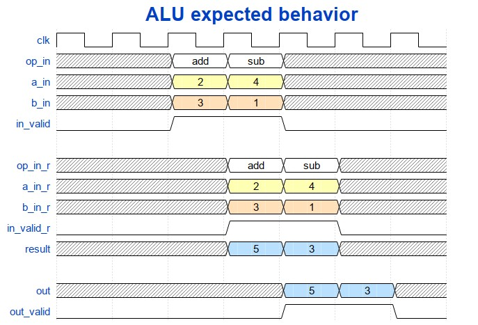
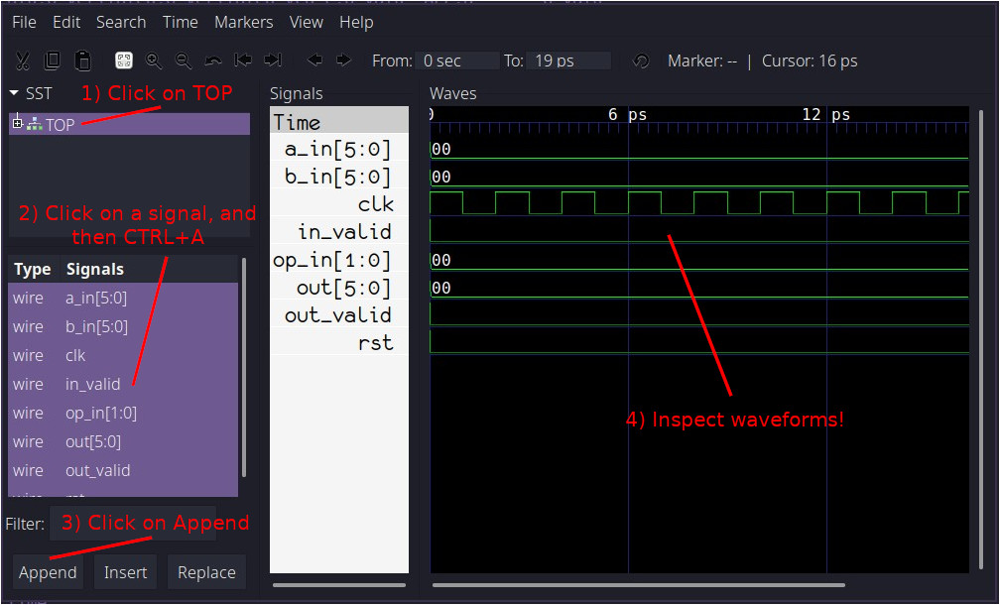
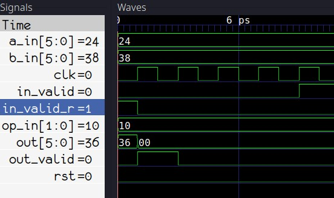
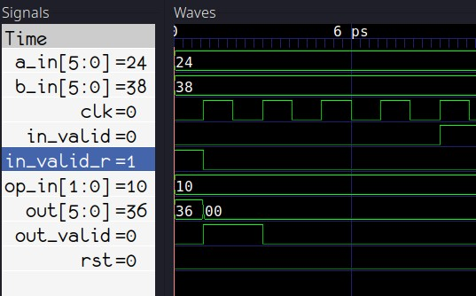
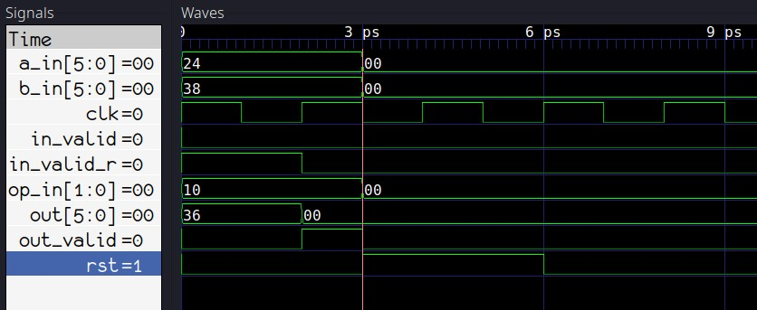
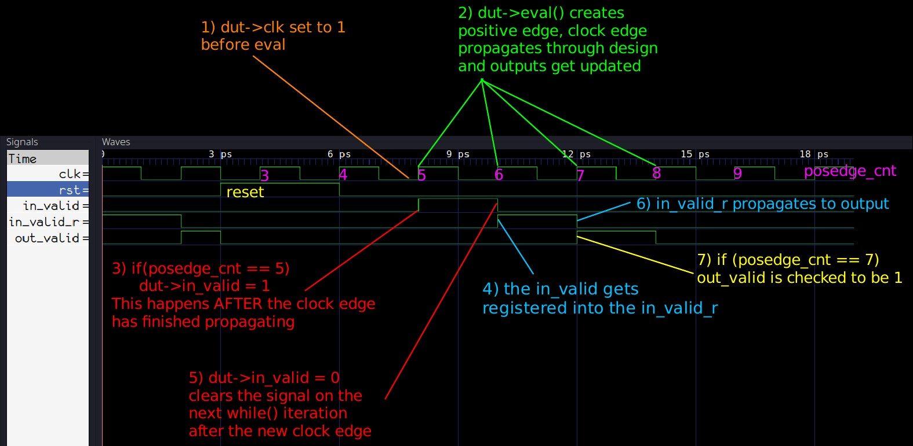
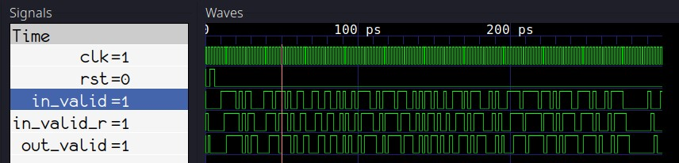

# Часть 1: Инструкция

Verilator — это инструмент, который компилирует исходные тексты на Verilog и SystemVerilog в высокооптимизированный (и опционально многопоточный) точный цикл C++ или SystemC код. Преобразованные модули можно инстанцировать и использовать в тестбенчах на C++ или SystemC для целей верификации и/или моделирования.

## Зачем использовать Verilator?

Verilator — это, по сути, симулятор Verilog/SystemVerilog. Он промышленного уровня, очень быстрый, бесплатный и с открытым исходным кодом, но это не прямой аналог таким инструментам, как Modelsim, Questa Sim, Synopsys VCS, Vivado Xsim и другим симуляторам, основанным на событиях. Verilator — это цикл-ориентированный симулятор, что означает, что он не вычисляет события внутри одного такта и не симулирует точное временное поведение схемы. Вместо этого состояние схемы обычно пересчитывается один раз за такт, поэтому любые внутритактовые "глитчи" (скачки сигнала) не видны, а задержки сигналов по времени не поддерживаются. Это одновременно и плюс, и минус по сравнению с другими симуляторами.

### Скорость

Так как Verilator является цикл-ориентированным, его нельзя использовать для таймингового моделирования, симуляции с обратной аннотацией временных параметров (back-annotated netlists), асинхронной (безтактной) логики, или вообще для любых изменений сигналов, которые завязаны на время — все выходы переключаются мгновенно при каждом вызове схемы.

Однако, именно за счёт игнорирования всего, что происходит между фронтами тактов, симуляции в Verilator идут чрезвычайно быстро. Он отлично подходит для функционального моделирования синхронных цифровых схем с одним или несколькими тактами, а также для создания программных моделей из кода на Verilog/SystemVerilog, которые можно использовать при разработке ПО.

### Качество кода

Так как Verilator использует цикл-ориентированный подход, он не может полностью поддерживать стандарты IEEE Verilog и SystemVerilog. Тем не менее, инструменты синтеза обычно тоже не полностью совместимы с этими стандартами.

В результате Verilator очень строго относится к коду на Verilog/SystemVerilog, который ему передают. Помимо того, что он не поддерживает временные задержки, он также не примет большую часть неконструкционного (несинтезируемого) кода (за исключением таких элементов, как ```$display()```, ```$finish()```, ```$fatal()```), поэтому, как правило, нельзя просто взять ваш тестбенч на SystemVerilog и скомпилировать его в Verilator без серьёзных изменений. Если ваш код не поддерживается, вы быстро об этом узнаете — Verilator выдаст кучу предупреждений и ошибок.

Благодаря тому, что Verilator не поддерживает несинтезируемый код, возникает интересный побочный эффект — его поведение ближе к инструментам синтеза по сравнению с другими симуляторами. Это вынуждает писать код более "чистый" с точки зрения синтеза, что потенциально сокращает количество проблем на более поздних стадиях разработки.

### Стоимость

Verilator — это инструмент с открытым исходным кодом и абсолютно бесплатный как в смысле стоимости, так и свободы использования. Для симуляции схемы с помощью Verilator создаётся нативный исполняемый файл из преобразованного HDL-кода и тестбенча на C++ с помощью компилятора GCC и системы сборки Make. Так как весь инструментарий бесплатен, нет никаких ограничений по количеству запускаемых экземпляров или числу пользователей. Благодаря высокой скорости работы Verilator позволяет быстро выполнять симуляции даже сложных схем на старых компьютерах и ноутбуках, так что нет необходимости в дорогом вычислительном оборудовании. 


Рис.1: Пользователи Verilator

## Начало работы

Это руководство написано для тех, кто в первую очередь знаком с Verilog/SystemVerilog и немного с C/C++, но ещё ни разу не работал с Verilator.

В данной работе предполагается, что вы используете какую-либо версию Linux на своём компьютере и что у вас уже установлены Verilator, GTKWave, Make и GCC.

```shell
    git clone https://github.com/n-kremeris/verilator_basics
    git checkout verilator_pt1
```

## Наш DUT

Чтобы проверить, как работает Verilator, нам нужно какое-то устройство для тестирования (DUT — device under test). В данной работе представлена простая АЛУ на SystemVerilog, которую мы будем проверять в этой серии обучающих материалов из нескольких частей. Исходный код приведён ниже:

``` sv
/****** alu.sv ******/
typedef enum logic [1:0] {
     add     = 2'h1,
     sub     = 2'h2,
     nop     = 2'h0
} operation_t /*verilator public*/;

module alu #(
        parameter WIDTH = 6
) (
        input clk,
        input rst,

        input  operation_t  op_in,
        input  [WIDTH-1:0]  a_in,
        input  [WIDTH-1:0]  b_in,
        input               in_valid,

        output logic [WIDTH-1:0]  out,
        output logic              out_valid
);

        operation_t  op_in_r;
        logic  [WIDTH-1:0]  a_in_r;
        logic  [WIDTH-1:0]  b_in_r;
        logic               in_valid_r;
        logic  [WIDTH-1:0]  result;

        // Register all inputs
        always_ff @ (posedge clk, posedge rst) begin
                if (rst) begin
                        op_in_r     <= '0;
                        a_in_r      <= '0;
                        b_in_r      <= '0;
                        in_valid_r  <= '0;
                end else begin
                        op_in_r    <= op_in;
                        a_in_r     <= a_in;
                        b_in_r     <= b_in;
                        in_valid_r <= in_valid;
                end
        end

        // Compute the result
        always_comb begin
                result = '0;
                if (in_valid_r) begin
                        case (op_in_r)
                                add: result = a_in_r + b_in_r;
                                sub: result = a_in_r + (~b_in_r+1'b1);
                                default: result = '0;
                        endcase
                end
        end

        // Register outputs
        always_ff @ (posedge clk, posedge rst) begin
                if (rst) begin
                        out       <= '0;
                        out_valid <= '0;
                end else begin
                        out       <= result;
                        out_valid <= in_valid_r;
                end
        end

endmodule;
```

Чтобы следовать этому руководству, создайте новый рабочий каталог и сохраните исходный код АЛУ под именем alu.sv.

Как вы можете видеть, это АЛУ очень простое. Оно имеет два регистрационных этапа, не поддерживает остановку (stalling) и выполняет только две операции: сложение и вычитание. Вот пример временной диаграммы, показывающей, как мы ожидаем, что АЛУ будет работать:



Рис. 2: Примитивный конвейер АЛУ

Из рисунка 2 видно, что на первом этапе входные сигналы записываются в регистры, а на втором этапе комбинационный результат также записывается в выходные регистры. С этим пониманием давайте теперь рассмотрим шаги, необходимые для создания базового тестбенча.

## Преобразование SystemVerilog в C++

### Верификация с помощью Verilator

Как упоминалось во введении, Verilator требует, чтобы тестбенч на C++ компилировался в исполняемый файл системы. Однако мы не можем просто так включить наш SystemVerilog ALU в тестбенч на C++: сначала нам нужно использовать Verilator, чтобы преобразовать код SystemVerilog в C++, или «верилировать» его, что в самом базовом виде выполняется так:

```css
verilator --cc alu.sv
```
Параметр --cc говорит Verilator выполнить преобразование в C++. Verilator также поддерживает преобразование в SystemC (для этого используется параметр --sc), но мы не будем использовать эту функцию сейчас.
  
### Результаты преобразования

Выполнение приведённой выше команды создаёт новую папку с именем ```obj_dir``` в нашем рабочем каталоге. Именно туда попадают все наши преобразованные исходники:

```
$ ls -l obj_dir/
Valu___024unit.cpp  Valu___024unit__Slow.cpp  Valu.cpp  Valu.mk
Valu__Syms.cpp  Valu__ver.d  Valu___024unit.h  Valu_classes.mk
Valu.h  Valu__Slow.cpp  Valu__Syms.h  Valu__verFiles.dat
```

Сгенерированные файлы с расширением ```.mk``` будут использоваться с ```Make``` для сборки нашего исполняемого файла симуляции, а файлы ```.h``` и ```.cpp``` содержат заголовки C++ и исходные коды реализации, полученные в результате преобразования из SystemVerilog. 

Два файла, которые нас сейчас интересуют больше всего:

- ```Valu.h``` — это основной заголовочный файл, содержащий определение класса преобразованного «ALU». Именно этот класс мы будем «инстанцировать» в нашем тестбенче на C++ как DUT.

- ```Valu___024unit.h``` — это внутренний заголовок для класса «ALU», который содержит определение типа operation_t.

## Разработка базового тестбенча для Verilator

### Пример тестбенча на C++

Теперь, когда наш DUT (устройство под тестированием) преобразован в C++, мы можем начать писать тестбенч. Тестбенч будет находиться в новом файле с именем ```tb_alu.cpp```. Давайте начнем с разбора минимального примера кода тестбенча на C++:

```cpp
#include <stdlib.h>
#include <iostream>
#include <verilated.h>
#include <verilated_vcd_c.h>
#include "Valu.h"
#include "Valu___024unit.h"

#define MAX_SIM_TIME 20
vluint64_t sim_time = 0;

int main(int argc, char** argv, char** env) {
    Valu *dut = new Valu;

    Verilated::traceEverOn(true);
    VerilatedVcdC *m_trace = new VerilatedVcdC;
    dut->trace(m_trace, 5);
    m_trace->open("waveform.vcd");

    while (sim_time < MAX_SIM_TIME) {
        dut->clk ^= 1;
        dut->eval();
        m_trace->dump(sim_time);
        sim_time++;
    }

    m_trace->close();
    delete dut;
    exit(EXIT_SUCCESS);
}
```

Первые несколько строк с директивами ```#include``` в основном понятны сами по себе. Мы подключаем <verilated.h> и <verilated_vcd_c.h>, которые идут с установкой Verilator, чтобы получить доступ к основным функциям Verilator и записывать временные диаграммы в файл формата VCD (value change dump).

Как уже упоминалось, ```"Valu.h"``` содержит основной класс нашего Verilated-модуля АЛУ, а ```"Valu___024unit.h"``` содержит преобразованное Verilator определение нашего перечисления typedef.

Далее идут две строки:

```cpp
#define MAX_SIM_TIME 20
vluint64_t sim_time = 0;
```

Мы используем переменную ```sim_time``` для отслеживания момента завершения симуляции. Существует несколько способов остановки симуляции, но сейчас мы просто завершим её после 20 фронтов тактового сигнала.

Затем идет основная функция main():

```cpp

int main(int argc, char** argv, char** env) {
    Valu *dut = new Valu;

    Verilated::traceEverOn(true);
    VerilatedVcdC *m_trace = new VerilatedVcdC;
    dut->trace(m_trace, 5);
    m_trace->open("waveform.vcd");

    /* <...> */

    m_trace->close();
    delete dut;
    exit(EXIT_SUCCESS);
}
```
Строка ```Valu dut = new Valu;``` создаёт экземпляр преобразованного модуля АЛУ. В SystemVerilog это примерно аналогично записи ```alu dut (.);```.

Следующие четыре строки настраивают запись временных диаграмм. Мы создаём объект ```m_trace``` и передаём его нашему ```dut``` в строке ```dut->trace(m_trace, 5);```. Параметр 5 ограничивает глубину трассировки до 5 уровней вниз по иерархии DUT.

Наконец, переходим к части, которая выполняет симуляцию:

```cpp

while (sim_time < MAX_SIM_TIME) {
    dut->clk ^= 1;
    dut->eval();
    m_trace->dump(sim_time);
    sim_time++;
}
```

Во время каждой итерации цикла строка ```dut->clk ^= 1;``` инвертирует сигнал тактового генератора АЛУ (создавая фронты/спады такта). Это будет единственный тактовый сигнал, который мы используем в тестбенче.

Вызов ```dut->eval();``` производит вычисление всех сигналов модуля АЛУ, а ```m_trace->dump(sim_time);``` записывает все трассированные сигналы в файл временных диаграмм. Как видно, модель вычисляется только по фронтам тактового сигнала.

Переменная времени симуляции затем увеличивается, и цикл продолжается до достижения ```MAX_SIM_TIME```. Обратите внимание, что это не реальное время — переменная просто считает, сколько раз мы инвертировали такт.

Как видно, этот тестбенч пока что только тактирует модель, но это хорошая отправная точка для дальнейшей разработки.

### Сборка исполняемого файла симуляции

Теперь, когда тестбенч написан, нам нужно собрать исполняемый файл для запуска симуляции.

В отличие от некоторых других симуляторов (например, Modelsim), где вы либо открываете исходники через графический интерфейс, либо передаёте их в исполняемый файл Modelsim, приложение Verilator не используется напрямую для симуляции тестбенча.

Приложение Verilator служит только для преобразования Verilog в C++ и генерации инструкций для сборки с помощью ```Make```. Симулятором здесь является сам тестбенч на C++.

Тестбенч и преобразованные HDL-файлы представляют собой обычное приложение на C++, которое компилируется и запускается на вашем компьютере. Запуск скомпилированного исполняемого файла — это и есть процесс симуляции, а для сборки используется компилятор GCC.

Чтобы собрать исполняемый файл симуляции, нужно снова запустить Verilator для генерации файлов ```.mk``` с добавлением нашего тестбенча на C++ — это делается так:

```bash
$ verilator -Wall --trace -cc alu.sv --exe tb_alu.cpp
```
Дополнительно мы используем такие параметры:

- ```-Wall``` — включает все предупреждения компилятора C++. Необязательно, но полезно для новичков;

- ```--trace``` — включает запись временных диаграмм.

Для сборки исполняемого файла выполняем команду:

``` bash

$ make -C obj_dir -f Valu.mk Valu
```

Параметр ```-C obj_dir``` говорит ```make``` работать в каталоге ```obj_dir```. С помощью ```-f Valu.mk``` мы указываем нужный Makefile. Наконец, говорим make собрать цель ```Valu```, которая и есть имя компилируемого тестбенча.

Если сборка прошла успешно, вы найдёте исполняемый файл ```Valu``` в папке ```obj_dir```.

### Запуск тестбенча

После сборки просто запустите бинарник ```Valu``` для запуска симуляции:

```bash

$ ./obj_dir/Valu
$
```

На первый взгляд, кажется, что ничего не произошло. И это ожидаемо — в коде тестбенча нет никаких printf или cout. Однако запуск симуляции создал файл с временными диаграммами под именем ```waveform.vcd``` в рабочем каталоге.

### Просмотр временных диаграмм Verilator

Вы можете открыть этот файл временных диаграмм с помощью программы ```GTKWave```:

```bash
gtkwave waveform.vcd
```

Откроется окно GTKWave, которое будет выглядеть примерно так:


(Рис. 3: Окно новой сессии GTKWave)

Следуйте показанным шагам, чтобы загрузить сигналы из DUT и просмотреть их временные диаграммы:



(Рис. 4: Просмотр временных диаграмм в GTKWave)

Поздравляю! Вы только что завершили вашу самую первую симуляцию с использованием Verilator!

## Наблюдения

Во-первых, вы могли заметить, что в нашей симуляции нет никаких значений 'x' (неопределённых значений). Это потому, что Verilator является симулятором с двумя состояниями, и по умолчанию все сигналы инициализируются в 0. Это хорошо для скорости (так как 2 состояния — меньше, чем 4), но не идеально, если мы хотим проверить корректность логики сброса. Мы подробнее изучим это позже.

Во-вторых, полпериода такта занимает 1 пикосекунду. Это стандартный таймскейл Verilator, и в данном случае он не означает какую-то конкретную временную величину.

Что дальше?
Теперь, после прочтения этого руководства, у вас, надеюсь, появилось базовое понимание принципов работы Verilator. Но, как видите, мы пока только коснулись верхушки айсберга. Продолжайте к части 2, где мы добавим базовую функциональность верификации в наш тестбенч на C++.

# Часть 2: Основы верификации SystemVerilog с использованием C++

В Части 1 мы обсудили основы использования Verilator и написания тестбенчей на C++ для модулей Verilog/SystemVerilog. В этом руководстве мы улучшим тестбенч, добавив случайные начальные значения сигналов, добавим сигнал сброса, а также добавим входные стимулы и проверку выходных данных, чтобы начать работу с базовой функциональностью верификации.

## Начало работы

Это руководство является прямым продолжением Части 1. Вы можете получить готовые исходные коды для примера проекта Verilator, используемого в этом уроке, с Github и исследовать их как пожелаете:

```bash
git clone https://github.com/n-kremeris/verilator_basics
git checkout verilator_pt2
```

Или следовать руководству ниже, продолжая с Части 1.

### Длинные команды — для троглодитов

Прежде чем делать что-либо с нашим тестбенчем, стоит сказать, что никому не нравится вводить одни и те же команды снова и снова. А поскольку мы не пещерные люди, мы будем использовать (Make)[https://www.gnu.org/software/make/], чтобы быстро собирать и запускать нашу симуляцию, быстро продвигая наши возможности проектирования аппаратного обеспечения в каменный век.

Большинство команд сборки, используемых в Makefile ниже, должны быть знакомы из Части 1, но давайте коротко их повторим на всякий случай:

```css
verilator -Wall --trace -cc alu.sv --exe tb_alu.cpp
```

Это конвертирует наш источник ```alu.sv``` в C++ и генерирует файлы сборки для создания исполняемого файла симуляции.
Мы используем ```-Wall``` для включения всех ошибок C++, ```--trace``` для включения трассировки временных диаграмм, ```-cc alu.sv``` для конвертации нашего модуля ``alu.sv`` в C++, и ```--exe tb_alu.cpp```, чтобы сказать Verilator, какой файл является нашим тестбенчем на C++.

```cpp
make -C obj_dir -f Valu.mk Valu```

Это собирает наш исполняемый файл симуляции из тестбенча и преобразованных исходников.
Мы говорим Make сменить рабочий каталог на ```obj_dir```, использовать файл сборки с именем ```Valu.mk``` и собрать цель с именем Valu.

```bash
./obj_dir/Valu
```

Это запускает наш исполняемый файл симуляции, который симулирует тестбенч и генерирует временные диаграммы.

В вашем рабочем каталоге создайте файл с именем ```Makefile``` и вставьте следующее содержимое:

```make
MODULE=alu

.PHONY:sim
sim: waveform.vcd

.PHONY:verilate
verilate: .stamp.verilate

.PHONY:build
build: obj_dir/Valu

.PHONY:waves
waves: waveform.vcd
	@echo
	@echo "### WAVES ###"
	gtkwave waveform.vcd

waveform.vcd: ./obj_dir/V$(MODULE)
	@echo
	@echo "### SIMULATING ###"
	@./obj_dir/V$(MODULE)

./obj_dir/V$(MODULE): .stamp.verilate
	@echo
	@echo "### BUILDING SIM ###"
	make -C obj_dir -f V$(MODULE).mk V$(MODULE)

.stamp.verilate: $(MODULE).sv tb_$(MODULE).cpp
	@echo
	@echo "### VERILATING ###"
	verilator -Wall --trace -cc $(MODULE).sv --exe tb_$(MODULE).cpp
	@touch .stamp.verilate

.PHONY:lint
lint: $(MODULE).sv
	verilator --lint-only $(MODULE).sv

.PHONY: clean
clean:
	rm -rf .stamp.*;
	rm -rf ./obj_dir
	rm -rf waveform.vcd
```
Этот ```Makefile``` должен быть понятен тем, кто знаком с Make.
Если вы раньше не использовали Make, пожалуйста, ознакомьтесь с другим руководством по использованию Make для симуляции.

После того как вы сохраните файл, вы сможете быстро пересобрать всю симуляцию, запустив в терминале ```make sim```, открыть ```GTKWave``` с помощью ```make waves```, выполнить вериляцию вашего дизайна с помощью ```make verilate``` или собрать верилированные исходники с помощью ```make build```.

Обратите внимание, что здесь также есть дополнительная команда ```make lint```, которая вызывает Verilator с ключом ```--lint-only```. Это полезно для быстрой проверки ваших исходных файлов Verilog/SystemVerilog на ошибки. Эту проверку можно использовать даже если вы не используете Verilator для симуляции.

И наконец, есть команда ```make clean```, которая удаляет весь мусор, сгенерированный в процессе сборки.

И с этим всем покончено — давайте заставим наш тестбенч засиять.

## Случайные начальные значения

Одно из наблюдений из Части 1 — это то, что Verilator является симулятором с двумя состояниями, что значит, что он поддерживает только логические значения ```1``` и ```0```, и не поддерживает ```X``` (и лишь ограниченно поддерживает ```Z```). Поэтому Verilator по умолчанию инициализирует все сигналы в ```0```, что видно на Рис.1 из наших предыдущих результатов симуляции:



Рис. 1: По умолчанию все инициализировано равным 0

Кроме того, если у вас есть код, который присваивает X (проводу?) или регистру, то по умолчанию он также получает значение 0.

Однако мы можем изменить это поведение с помощью параметров командной строки — мы можем заставить Verilator инициализировать все сигналы в ```1``` или, что лучше, в случайные значения. Это позволит нам проверить, работает ли наш сигнал сброса, как только мы добавим его в тестбенч.

Чтобы сделать так, чтобы тестбенч инициализировал сигналы случайными значениями, сначала нужно вызвать ```Verilated::commandArgs(argc, argv);``` перед созданием объекта DUT:

```cpp
int main(int argc, char** argv, char** env) {
    Verilated::commandArgs(argc, argv);
    Valu *dut = new Valu;
    <...>
```
Затем мы должны обновить команду сборки вериляции, добавив ```--x-assign unique``` и ```--x-initial unique```. Строка 31 в нашем Makefile теперь должна выглядеть так:

```make
verilator -Wall --trace --x-assign unique --x-initial unique -cc $(MODULE).sv --exe tb_$(MODULE).cpp
```

И наконец, мы должны передать ```+verilator+rand+reset+2``` нашему исполняемому файлу симуляции, чтобы установить метод инициализации сигналов во время выполнения в случайный. Это значит, что строка 21 в Makefile должна выглядеть так:

```make
@./obj_dir/V$(MODULE) +verilator+rand+reset+2
```

Теперь, если мы сделаем ```make clean``` и ```make waves```, мы увидим, что сигналы инициализируются случайными значениями в начале симуляции:



Рис. 2: Случайная инициализация.

Теперь, когда сигналы рандомизированы, давайте посмотрим, как применить наш сигнал сброса.

## Сброс DUT
Чтобы сбросить наш DUT и его входные сигналы, мы обновим основной цикл нашего тестбенча вот так:

```cpp

while (sim_time < MAX_SIM_TIME) {
    dut->rst = 0;
    if(sim_time > 1 && sim_time < 5){
        dut->rst = 1;
        dut->a_in = 0;
        dut->b_in = 0;
        dut->op_in = 0;
        dut->in_valid = 0;
    }

    dut->clk ^= 1;
    dut->eval();
    m_trace->dump(sim_time);
    sim_time++;
}
```

В строке 3 я произвольно выбрал, что хочу, чтобы сброс происходил между фронтами тактов на 3 и 5. Вы, конечно, можете изменить это при необходимости.

На строке 4 сброс устанавливается в высокий уровень, а на последующих строках все входы DUT сбрасываются в 0.

Строки 11-14 не изменены. Мы инвертируем тактовый сигнал и увеличиваем счётчик времени симуляции.

Строка 2 добавлена, чтобы сбрасывать счётчик обратно в 0 при последующих итерациях цикла. В совокупности строки 2-3-4 эквивалентны следующему коду на SystemVerilog:

```sv
always_comb begin
    dut.rst = 1'b0;
    if (sim_time >= 3 && sim_time < 6) begin
        dut.rst = 1'b1;
    end
end
```
Повторный запуск симуляции теперь даёт нам следующее:



Рис. 3: Сигнал сброса в действии.

Как видно на Рисунке 3, наш сигнал сброса успешно генерируется в тестбенче. Чтобы сделать основной цикл немного чище, давайте вынесем код сброса в отдельную функцию за пределами ```main()```:

```cpp
void dut_reset (Valu *dut, vluint64_t &sim_time){
    dut->rst = 0;
    if(sim_time >= 3 && sim_time < 6){
        dut->rst = 1;
        dut->a_in = 0;
        dut->b_in = 0;
        dut->op_in = 0;
        dut->in_valid = 0;
    }
}```

Затем добавим вызов ```dut_reset``` в главный цикл:

```cpp
while (sim_time < MAX_SIM_TIME) {
    dut_reset(dut, sim_time);

    dut->clk ^= 1;
    dut->eval();
    m_trace->dump(sim_time);
    sim_time++;
}
```

Теперь, когда наш сброс работает, давайте посмотрим на добавление реальных стимулов и кода верификации.

## Базовая верификация

На данный момент у нас в основном цикле симуляции следующее:

```cpp
while (sim_time < MAX_SIM_TIME) {
    dut_reset(dut, sim_time);

    dut->clk ^= 1;
    dut->eval();
    m_trace->dump(sim_time);
    sim_time++;
}
```

Теперь, если бы мы симулировали тестбенч на Verilog/SystemVerilog как DUT вместо нашего модуля ALU, мы могли бы добавить проверку ```Verilated::gotFinish()``` и остановить симуляцию, если это значение становится ```true```. Это происходит, когда вызывается ```$finish()``` из Verilog/SystemVerilog. Наш тестбенч на C++ тогда был бы достаточен для симуляции тестбенча на Verilog/SystemVerilog.

Но нам этого недостаточно, так как нам нужно вставить стимулы и код верификации где-то в главный цикл тестбенча на C++, чтобы управлять и проверять наш DUT.

### Счётчик фронтов тактового сигнала

Существует много способов добиться нужного результата, но вот что мы сделаем сейчас:

Во-первых, мы создадим новую переменную для подсчёта положительных фронтов тактового сигнала. Эта переменная будет того же типа, что и sim_time:

```cpp
vluint64_t sim_time = 0;
vluint64_t posedge_cnt = 0;```

Далее мы модифицируем наш код генерации тактового сигнала, добавив счётчик положительных фронтов:

```cpp
dut->clk ^= 1;            // Инвертировать тактовый сигнал
dut->eval();              // Оценить DUT на текущем фронте
if(dut->clk == 1){
    posedge_cnt++;        // Увеличить счётчик при положительном фронте
}
m_trace->dump(sim_time);  // Сохранить в waveform.vcd
sim_time++;               // Увеличить время симуляции
```
Добавление этого счётчика между ```eval``` и ```dump``` даёт нам что-то похожее на следующий код на Verilog:

```sv
initial posedge_cnt <= '0;
always_ff @ (posedge clk, posedge rst) begin
    posedge_cnt <= posedge_cnt + 1'b1;
end
```
И на этом этапе мы наконец можем начать верифицировать нашу ALU.

### Примитивные стимулы и проверки для DUT

Давайте снова посмотрим на ожидаемые временные диаграммы для нашего ALU:


Рис. 4: Ожидаемое поведение ALU

Игнорируя входы a, b и операцию, а также выходные данные, давайте сначала проверим, что наш сигнал входной валидности (input valid) проходит до выхода.

Мы знаем, что у нас есть 2 регистрационные стадии, которые, если упростить, выглядели бы так:

```verilog
always_ff @ (posedge clk) begin
    in_valid_r <= in_valid;
    out_valid <= out_valid_r;
end
```

Таким образом, если мы подадим 1 на ```in_valid``` на 5-м положительном фронте тактового сигнала, то мы должны увидеть 1 на ```out_valid``` через два тактовых цикла, или другими словами, на 7-м положительном фронте. Вот как мы это проверяем:

```cpp
while (sim_time < MAX_SIM_TIME) {
    dut_reset(dut, sim_time);

    dut->clk ^= 1;
    dut->eval();

    dut->in_valid = 0;
    if (dut->clk == 1){
        posedge_cnt++;
        if (posedge_cnt == 5){
            dut->in_valid = 1;       // установить in_valid на 5-м фронте
        }
        if (posedge_cnt == 7){
            if (dut->out_valid != 1) // проверить out_valid на 7-м фронте
                std::cout << "ERROR!" << std::endl;
        }
    }

    m_trace->dump(sim_time);
    sim_time++;
}
```

То, что выполняет выделенный код, будет аналогично этому:

```verilog
always_comb begin
    in_valid = 0;
    if (posedge_cnt == 5)
        in_valid = 1;

    if (posedge_cnt == 7)
        assert (out_valid == 1) else $error("ERROR!")
end
```

А вот как это всё работает при симуляции:



Рис. 5: Графическое объяснение проверки valid

Главное здесь — убедиться, что код генерации стимулов и проверки, который вы пишете, следует этому порядку действий:

- Установите тактовую частоту на 1, выполните оценку для создания положительного фронта, а затем установите входные данные / проверьте выходные данные перед сбросом и увеличением времени моделирования.

- На следующем положительном фронте тактового сигнала внутри цикла ```while()``` входные данные, заданные ранее, будут переданы в схему во время ```eval```, а затем сразу после вычисления входные данные должны быть сброшены до значений по умолчанию.

## Мониторинг сигналов, подобный утверждениям (assertions)

Установка ```in_valid``` на 5-м фронте и проверка, что ```out_valid``` равен 1, конечно, работает, но если мы захотим проверить валидность на большем числе тактов, нам придётся добавить намного больше проверок. Более того, мы не проверяем, что ```out_valid``` равен 0 там, где это должно быть, а это значит, что ```out_valid``` мог бы "застрять" на 1, и тестбенч не провалился бы. Поэтому наш верификационный код можно значительно улучшить, написав немного C++ кода для непрерывного мониторинга ```in_valid``` и ```out_valid```, аналогично тому, как это делают утверждения в SystemVerilog.

Мы можем написать для этого функцию следующим образом:

```cpp
#define VERIF_START_TIME 7
void check_out_valid(Valu *dut, vluint64_t &sim_time){
    static unsigned char in_valid = 0; // in_valid текущего цикла
    static unsigned char in_valid_d = 0; // задержанный in_valid
    static unsigned char out_valid_exp = 0; // ожидаемое значение out_valid

    if (sim_time >= VERIF_START_TIME) {
        // обратите внимание на порядок!
        out_valid_exp = in_valid_d;
        in_valid_d = in_valid;
        in_valid = dut->in_valid;
        if (out_valid_exp != dut->out_valid) {
            std::cout << "ERROR: out_valid mismatch, "
                << "exp: " << (int)(out_valid_exp)
                << " recv: " << (int)(dut->out_valid)
                << " simtime: " << sim_time << std::endl;
        }
    }
}
```

```VERIF_START_TIME``` нужен, чтобы гарантировать, что этот проверочный код не выполняется до или во время сброса, чтобы предотвратить ложные срабатывания ошибок. Если посмотреть на Рис. 5, видно, что ```rst``` возвращается в 0 на отметке 6ps (что равно sim_time = 6), поэтому sim_time = 7 — это точка, с которой мы должны начинать проверку valid.

Код проверки довольно прост — он просто моделирует конвейер регистров между ```in_valid``` и ```out_valid```. Мы можем заменить оригинальный код вышеописанной функцией следующим образом:

```cpp
while (sim_time < MAX_SIM_TIME) {
    dut_reset(dut, sim_time);

    dut->clk ^= 1;
    dut->eval();

    if (dut->clk == 1){
        dut->in_valid = 0;
        posedge_cnt++;
        if (posedge_cnt == 5){
            dut->in_valid = 1;
        }
        check_out_valid(dut, sim_time);
    }

    m_trace->dump(sim_time);
    sim_time++;
}
```

Если вы сейчас запустите симуляцию, ошибок не будет, потому что мы уже проверили и знаем, что сигнал valid правильно передается. Однако, чтобы окончательно убедиться, что новый код работает, мы можем пойти в наш ```alu.sv``` и изменить выходную стадию так, чтобы ```out_valid``` всегда устанавливался в 1:

```verilog
always_ff @ (posedge clk, posedge rst) begin
    if (rst) begin
        out       <= '0;
        out_valid <= '0;
    end else begin
        out       <= result;
        out_valid <= 1'b1;  //**** здесь должно быть in_valid_r ****//
    end
end
```

Запустив симуляции снова, мы получим следующий вывод:

```perl
### SIMULATING ###
./obj_dir/Valu +verilator+rand+reset+2
ERROR: out_valid mismatch, exp: 0 recv: 1 simtime: 8
ERROR: out_valid mismatch, exp: 0 recv: 1 simtime: 10
ERROR: out_valid mismatch, exp: 0 recv: 1 simtime: 14
ERROR: out_valid mismatch, exp: 0 recv: 1 simtime: 16
ERROR: out_valid mismatch, exp: 0 recv: 1 simtime: 18
```

## Генерация случайного valid сигнала

Перед тем как завершить эту часть серии по Verilator, давайте также быстро заменим это единственное присваивание ```in_valid``` на что-то, что будет случайно устанавливать его в 1 или 0.

Для этого мы можем подключить заголовок C++ ```cstdlib```:

```cpp
#include <cstdlib>
```

и использовать функцию генерации псевдослучайных чисел ```rand()``` для генерации случайных 1 и 0 в пользовательской функции ```set_rnd_out_valid```:

```cpp
void set_rnd_out_valid(Valu *dut, vluint64_t &sim_time){
    if (sim_time >= VERIF_START_TIME) {
        dut->in_valid = rand() % 2; // генерировать значения 0 и 1
    }
}
```

Также нам нужно инициализировать генератор случайных чисел с помощью вызова ```srand```, который можно поместить прямо в начало функции main:

```cpp
int main(int argc, char** argv, char** env) {
    srand (time(NULL));
``` 

Нам также следует увеличить ```MAX_SIM_TIME``` до чего-то более существенного, например до 300:

```cpp
#define MAX_SIM_TIME 300
```

И после запуска ```make sim``` и ```make waves```, вот результаты нашей новой самопроверяющейся случайной симуляции:



Рис. 6: Обновленные симуляции с случайными значениями

## Готовый тестбенч

Вот текущая завершённая версия нашего C++ тестбенча:

```cpp
#include <stdlib.h>
#include <iostream>
#include <cstdlib>
#include <verilated.h>
#include <verilated_vcd_c.h>
#include "Valu.h"
#include "Valu___024unit.h"

#define MAX_SIM_TIME 300
#define VERIF_START_TIME 7
vluint64_t sim_time = 0;
vluint64_t posedge_cnt = 0;

void dut_reset (Valu *dut, vluint64_t &sim_time){
    dut->rst = 0;
    if(sim_time >= 3 && sim_time < 6){
        dut->rst = 1;
        dut->a_in = 0;
        dut->b_in = 0;
        dut->op_in = 0;
        dut->in_valid = 0;
    }
}

void check_out_valid(Valu *dut, vluint64_t &sim_time){
    static unsigned char in_valid = 0; // in_valid текущего цикла
    static unsigned char in_valid_d = 0; // задержанный in_valid
    static unsigned char out_valid_exp = 0; // ожидаемое значение out_valid

    if (sim_time >= VERIF_START_TIME) {
        out_valid_exp = in_valid_d;
        in_valid_d = in_valid;
        in_valid = dut->in_valid;
        if (out_valid_exp != dut->out_valid) {
            std::cout << "ERROR: out_valid mismatch, "
                << "exp: " << (int)(out_valid_exp)
                << " recv: " << (int)(dut->out_valid)
                << " simtime: " << sim_time << std::endl;
        }
    }
}

void set_rnd_out_valid(Valu *dut, vluint64_t &sim_time){
    if (sim_time >= VERIF_START_TIME) {
        dut->in_valid = rand() % 2;
    }
}

int main(int argc, char** argv, char** env) {
    srand (time(NULL));
    Verilated::commandArgs(argc, argv);
    Valu *dut = new Valu;

    Verilated::traceEverOn(true);
    VerilatedVcdC *m_trace = new VerilatedVcdC;
    dut->trace(m_trace, 5);
    m_trace->open("waveform.vcd");

    while (sim_time < MAX_SIM_TIME) {
        dut_reset(dut, sim_time);

        dut->clk ^= 1;
        dut->eval();

        if (dut->clk == 1){
            dut->in_valid = 0;
            posedge_cnt++;
            set_rnd_out_valid(dut, sim_time);
            check_out_valid(dut, sim_time);
        }

        m_trace->dump(sim_time);
        sim_time++;
    }

    m_trace->close();
    delete dut;
    exit(EXIT_SUCCESS);
}
```

## Заключение
Способ написания тестбенчей на C++ определённо отличается от того, как проектируют тестбенчи на Verilog/SystemVerilog, но из примеров, приведённых в этом руководстве, видно, как отдельные функциональные элементы, которые были бы написаны на Verilog, выглядят аналогично в C++. Поэтому, если вы хотите применить свои навыки написания тестбренчей на Verilog к C++, важно хорошо понимать правильный порядок вызовов C++ для создания фронтов тактового сигнала, стимуляции/проверки сигналов и вывода значений формы волны.

И хотя текущая версия нашего тестбенча всё ещё довольно базовая, она уже начинает напоминать более продвинутую верификационную среду. Тестбенч теперь инициализирует все сигналы случайными значениями и содержит как случайные стимулы,  так и непрерывный мониторинг по крайней мере одного из выходов.