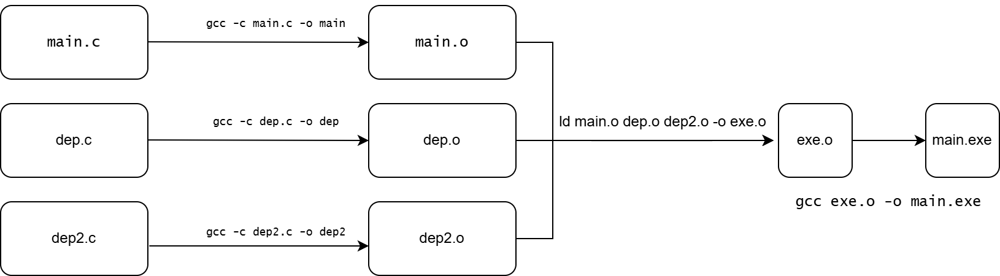

## Руководство по программированию
### 3.0 Введение
В этом разделе мы рассмотрим, как программировать под BiriscV. Изучим процесс сборки и запуска приложения, каким методом собирается программа, как она загружается в память и запускается. 

#### 3.0.1 Настройка окружения
Для программирования под BiriscV необходимо установить следующие инструменты:
- [RISC-V GCC Toolchain](https://github.com/stnolting/riscv-gcc-prebuilt). Скачать релиз для `rv32i` и распаковать его в место, которое надо добавить в $PATH
- SystemC. Установить следующей командой 
```bash
    wget https://github.com/accellera-official/systemc/archive/refs/tags/3.0.1.tar.gz && \
    tar -xvzf 3.0.1.tar.gz && rm 3.0.1.tar.gz && \
    cd systemc-3.0.1 && \
    mkdir objdir && cd objdir && \
    export CXX=g++ && \
    ../configure && make && make install && \
    cd .. && rm -rf objdir
```
- Verilator. Установить командой из [репозитория](https://github.com/verilator/verilator) 
```bash
git clone https://github.com/verilator/verilator
cd verilator
autoconf         # Create ./configure script
./configure      # Configure and create Makefile
make -j `nproc`  # Build Verilator itself (if error, try just 'make')
sudo make install
```

### 3.1 Запуск 

Процесс магии, что происходит за выполнением команды `make` в папке `sw` (что содержит примеры для выполнения) можно разделить на несколько этапов:
- **Компиляция**. GCC компилирует исходный код в объектный файл. Помимо компиляции .c файлов, также .S (с большой буквы) обрабатываются gcc и позволяют, например, подключать другой код используя `#include`
- **Линковка**. Линковщик объединяет множество объектных фалйов, а также динамические библиотеки в один исполняемый файл. Работа линковщика заключается также в том, чтобы указать адрес исполнения программы, а также адреса всех используемых разделов памяти. На выходе после линковщика получается ELF файл, который содержит все необходимые данные для загрузки в память и исполнения.
- **Загрузка**. ELF файл загружается в память и запускается

#### 3.1.1 Компиляция

Если из директории Make вызвать компиляцию примеров в директории `sw`, можно посмотреть с какими аргументами вызывается. Разберем сборку поподробнее

```bash
riscv64-unknown-elf-gcc \
    -march=rv32im_zicsr -mabi=ilp32   # целевая ISA и ABI
    -O2                               # оптимизация по скорости, без агрессивных трюков
    -g                                # отладочная информация (можно убрать для релиза)
    -nostartfiles -nostdlib           # не тянуть стандартный CRT-старт-ап и libc
    -T tcm.ld                         # скрипт линковки (или default.ld)
    -o hello.elf hello.c              # выходной ELF и исходники
    -L ../common                      # директория с библиотеками
    -lc -lm -lgcc -lsys               # минимальный набор библиотек
```

Директория `..\common`, помимо скриптов линковщика и общего Makefile, также содержит в себе и 
- ассемблерный файл `startup.S` для запуска -- инициализации системы, настройки обработки исключений и реализации базового механизма обработки различных типов прерываний. Этот код является важным низкоуровневым компонентом, который обеспечивает корректную инициализацию и базовую инфраструктуру обработки исключений, на которой строится дальнейшая работа системы. Скрипт линковщика задает функцию `_start` как точку входа программы
- заголовочный файл `rvconfig.h` -- содержит набор макросов для доступа к CSR-регистрам
- ассемблерный файл `syscall.S` -- реализация системных вызовов, которые позволяют взаимодействовать с операционной системой и выполнять низкоуровневые операции, такие как ввод-вывод. Стоит также обратить внимание, что вывод в консоль реализован так, что до появления символа перевода строки, все данные будут храниться в буфере

Также, уже после сборки, в папке сборки формируется дизасемблерованный файл посредством запуска `riscv64-unknown-elf-objdump -d hello.elf > hello.dis`, используя его можно изучить как была произведена сборка бинарника

#### 3.1.2 Линковка
*Линковка описана куда более подробно, из-за того, что она куда меньше знакома читателям*

> Линковщик (`linker`) -- инструмент, что собирает объектные `.o` файлы на выходе с ассемблера в единый исполняемый файл. Он должен удостовериться что все части сликнованны корректно 


*Линковщик в процессе сборки*

Обычно, линковщик принимает участие
- в процессе компиляции, собирает весь код и библиотеки в один исполняемый файл
- в процессе загрузки программы в оперативную память, подгружая динамические библиотеки

##### Статическая линковка

Происходя во время комплияции программы, статическая линковка позволяет объеденить разрозненные файлы в один. После прохождения статической линковки, программа более не требует существования оригинальных .o файлов

Для упрощения, возьмем чистый ассемблер с двумя файлами -- `math.asm` и `main.asm`

```asm
global add        ; экспортируем функцию

section .text
add:
    ; int add(int a, int b)
    ; a в rdi, b в rsi
    mov rax, rdi   ; rax = a
    add rax, rsi   ; rax += b
    ret
```

```asm
extern add        ; импортируем функцию

section .text
global _start

_start:
    mov rdi, 5     ; первый аргумент (a)
    mov rsi, 7     ; второй аргумент (b)
    call add       ; вызвать внешнюю функцию

    ; Результат в rax, выведем его как exit-код
    mov rdi, rax   ; exit-код
    mov rax, 60    ; системный вызов exit
    syscall
```

Соберем эту программу, используя линковщик
```bash
nasm -f elf64 math.asm -o math.o
nasm -f elf64 main.asm -o main.o

ld main.o math.o -o program
```

И дизасэмблируем ее

```bash
$ objdump -d ./program 

./program:     file format elf64-x86-64


Disassembly of section .text:

0000000000401000 <_start>:
  401000:       bf 05 00 00 00          mov    $0x5,%edi
  401005:       be 07 00 00 00          mov    $0x7,%esi
  40100a:       e8 11 00 00 00          callq  401020 <add>
  40100f:       48 89 c7                mov    %rax,%rdi
  401012:       b8 3c 00 00 00          mov    $0x3c,%eax
  401017:       0f 05                   syscall 
  401019:       0f 1f 80 00 00 00 00    nopl   0x0(%rax)

0000000000401020 <add>:
  401020:       48 89 f8                mov    %rdi,%rax
  401023:       48 01 f0                add    %rsi,%rax
  401026:       c3                      retq   
```

Видим, что функция add появилась внутри файла. А вызов заменился на вызов по определенному адрес (произошла реалокация)

Линковщик находит референсы на символы, и добавляет их в исходный файл. Отследить где конкретный символ был найден, можно используя `--trace-symbol <sym_name>`.


##### Динамическая линковка 
Динмаическая линковка, как и было описано ранее, происходит во время загрузки исполняемого кода в оперативную память. Именно из-за этого, например, запуск какой-нибудь executable почти на пустой системе без должного числа динамических библиотек невозможен. 

В репозитории с примерами также есть вариант статически зависимого кода от библиотеки `libcurl`. Он успешно соберется внутри отдельного dev docker образа, однако, из-за отсуствия этой динамической библиотеки в исполняемой среде запуститься не сможет

```bash
docker build -t curl-broken-runtime .
docker run --rm curl-broken-runtime
> ./main: error while loading shared libraries: libcurl.so.4: cannot open shared object file: No such file or directory
```

Из этого примера очевидно основной плюс и основной минус статической линковки
- Сборка позволяет не подгружать на этапе компиляции в собранный файл тяжелые библиотеки. Помимо `libcurl` такой может являтся, например `libffmpeg` -- мощный комбайн для обработки медиа
- Из-за того, что библиотека подгружается динамически, ее отсуствие в другой среде не позволяет программе даже запуститься

Линковщик может реалоцировать и менять адреса "на лету", благодаря чему запуск идет корректно

Вот продолжение статьи, в том же стиле, на тему `.ld` файлов и конфигурации линковки:

##### Конфигурационные файлы линковщика (.ld)

> Файл линковки (`linker script` или `.ld`) — это специальный конфигурационный файл, который описывает, как линковщик должен разместить различные секции программы в памяти. Особенно важен при разработке низкоуровневого кода: embedded, OS kernel, bootloader, etc.
x
Линковщик по умолчанию умеет работать с простыми программами, размещая `.text`, `.data` и `.bss` в стандартные места. Но для системного программирования часто нужно полный контроль — и тут на сцену выходит `.ld` файл.

В репозитории, в папке `sw/common/default.ld` находится пример такого файла. Он описывает, как разместить секции в памяти, а также задает адреса для различных частей программы.

- Инцииализация
  ```
  // Указываем архитектуру — RISC-V
  OUTPUT_ARCH("riscv")
  
  // Указываем точку входа программы. 
  ENTRY(_start)
  _start = 0;
  
  // Определяем область памяти, доступную для размещения кода и данных.
  MEMORY
  {
    mem : ORIGIN = 0x80000000, LENGTH = 256K
  }
  ```
  
- Секции
  
  - `.text` -- исполняемый код. Подключаются
    
    - `*(.reset)` все секции `.reset` из объектных файлов
      
    - `*(.text .stub .text.* .gnu.linkonce.t.*)` Основной код и вспомогательные фрагменты
      
    - `KEEP (*(.text.*personality*))` Специальные обработчики исключений
      
    - `*(.gnu.warning)` Сообщение предупреждений о линковке
      
  - `.data` -- инициализационные данные. Сохраняются конструкторы и деструкторы, таблицы исключений, различные типы константных и инициализированных данных
    
  - `.bss` — переменные, которые не имеют начального значения. Резервируется место под общие переменные, также 16К под стек и кучу
    
  - `/DISCARD/ : { *(.note.GNU-stack) }` -- из файла убирается опции для исполняемого стэка

Флаг `-T` передает скрипт линковщику.

##### Что можно контролировать через `.ld`

Файл `.ld` позволяет:

- Задать адреса начала памяти (`. = <addr>`)
- Разбить код по кастомным секциям
- Создавать "символы" для взаимодействия с кодом (`_start = .;`)
- Задать точку входа (`ENTRY(_start)`)
- Упаковать данные в конкретный адрес для embedded-систем

#### 3.1.3 Загрузка на устройство

Запустить собранный код можно различными способами, в том числе, например, используя Verilator, тестбенч которого находится в папке `tb_top`

```bash
cd tb/tb_top
make build
build/test.x --elf ../../sw/bin/hello.elf
> Hello, world!
```

Также, используя `--cycles`, можно указать количество тактов, что будет выполнено в симуляции

Исходный код тестбенча на Verilator также находится в этой папке, благодаря чему можно его модифицировать и запускать программы, например
- `MEM_BASE` изменив его на `0x0000000` 
```diff
- #define MEM_BASE 0x80000000
+ #define MEM_BASE 0x00000000
```
- Сделать импровезированный *Debug*, добавив в интерфейс памяти тригеры на чтение
```diff
    uint8_t read(uint32_t addr)
    {
+        printf("READ: %08x\n", addr);
```
Для «железа» ядро biRISC-V подключается к памяти и периферии через AXI-интерфейсы (см. docs/integration.md). Обычно на FPGA резервируют RAM (TCM) по адресу 0x8000_0000 и UART по, например, 0x9200_0000. После синтеза загружайте скомпилированный ELF через загрузчик (SBI) или программатор в память FPGA.