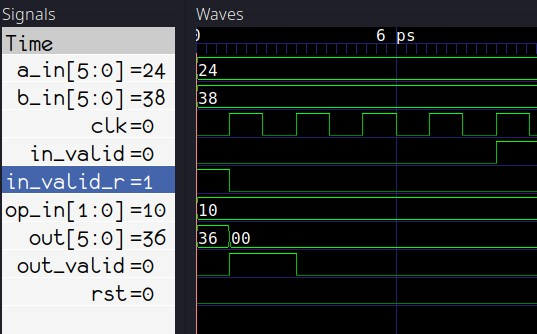
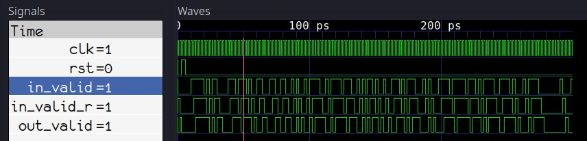

# 2. Основы верификации SystemVerilog с использованием C++

## 2.1 Использование Make
Для быстрой сборки и запуска симуляции будет использована утилита Make.
В рабочем каталоге необходимо создать файл с именем ```Makefile``` и вставить следующее содержимое:

``` make
MODULE=alu

.PHONY:sim
sim: waveform.vcd

.PHONY:verilate
verilate: .stamp.verilate

.PHONY:build
build: obj_dir/Valu

.PHONY:waves
waves: waveform.vcd
	@echo
	@echo "### WAVES ###"
	gtkwave waveform.vcd

waveform.vcd: ./obj_dir/V$(MODULE)
	@echo
	@echo "### SIMULATING ###"
	@./obj_dir/V$(MODULE)

./obj_dir/V$(MODULE): .stamp.verilate
	@echo
	@echo "### BUILDING SIM ###"
	make -C obj_dir -f V$(MODULE).mk V$(MODULE)

.stamp.verilate: $(MODULE).sv tb_$(MODULE).cpp
	@echo
	@echo "### VERILATING ###"
	verilator -Wall --trace -cc $(MODULE).sv --exe tb_$(MODULE).cpp
	@touch .stamp.verilate

.PHONY:lint
lint: $(MODULE).sv
	verilator --lint-only $(MODULE).sv

.PHONY: clean
clean:
	rm -rf .stamp.*;
	rm -rf ./obj_dir
	rm -rf waveform.vcd
```
После сохранения файла, возможно быстро пересобрать всю симуляцию, запустив в терминале ```make sim```, открыть ```GTKWave``` с помощью ```make waves```, выполнить вериляцию дизайна с помощью ```make verilate``` или собрать верилированные исходники с помощью ```make build```.

Обратите внимание, также есть дополнительная команда ```make lint```, которая вызывает Verilator с ключом ```--lint-only```. Это полезно для быстрой проверки ваших исходных файлов Verilog/SystemVerilog на ошибки. 

И наконец, есть команда ```make clean```, которая удаляет весь мусор, сгенерированный в процессе сборки.

## 2.2 Случайные начальные значения

Одно из вышеупомянутых наблюдений в том, что Verilator является симулятором с двумя состояниями, что значит, что он поддерживает только логические значения ```1``` и ```0```, и не поддерживает ```X```. Поэтому Verilator по умолчанию инициализирует все сигналы в ```0```, что видно на Рисунка 5 из предыдущих результатов симуляции:


Рисунок 5 - По умолчанию все инициализировано равным 0

Кроме того, если код, присваивает X регистру, то по умолчанию он также получает значение 0.

Однако это поведение можно изменить с помощью параметров командной строки — можно заставить Verilator инициализировать все сигналы в ```1``` или, что лучше, в случайные значения. Это позволит проверить, работает ли сигнал сброса, как только он будет добавлен в тестбенч.

Чтобы сделать так, чтобы тестбенч инициализировал сигналы случайными значениями, сначала нужно вызвать ```Verilated::commandArgs(argc, argv);``` перед созданием объекта DUT:

```cpp
int main(int argc, char** argv, char** env) {
    Verilated::commandArgs(argc, argv);
    Valu *dut = new Valu;
    <...>
```
Затем необходимо обновить команду сборки вериляции, добавив ```--x-assign unique``` и ```--x-initial unique```. Строка 31 в Makefile теперь должна выглядеть так:

```make
verilator -Wall --trace --x-assign unique --x-initial unique -cc $(MODULE).sv --exe tb_$(MODULE).cpp
```

И наконец, необходимо передать ```+verilator+rand+reset+2``` исполняемому файлу симуляции, чтобы установить метод инициализации сигналов во время выполнения в случайный. Это значит, что строка 21 в Makefile должна выглядеть так:

```make
@./obj_dir/V$(MODULE) +verilator+rand+reset+2
```

Теперь, вызвав ```make clean``` и ```make waves```, будет видно, что сигналы инициализируются случайными значениями в начале симуляции:



Рисунок 6 - Случайная инициализация

## 2.3 Сброс DUT

Чтобы сбросить DUT и его входные сигналы, необходимо обновить основной цикл тестбенча так:

```cpp

while (sim_time < MAX_SIM_TIME) {
    dut->rst = 0;
    if(sim_time > 1 && sim_time < 5){
        dut->rst = 1;
        dut->a_in = 0;
        dut->b_in = 0;
        dut->op_in = 0;
        dut->in_valid = 0;
    }

    dut->clk ^= 1;
    dut->eval();
    m_trace->dump(sim_time);
    sim_time++;
}
```

В строке 3 произвольно выбрано, чтобы сброс происходил между фронтами тактов на 3 и 5. При необходимости это можно изменить.

В строке 4 сброс устанавливается в высокий уровень, а в последующих строках все входы DUT сбрасываются в 0.

Строки 11-14 не изменены. Тактовый сигнал инвертируется и увеличивается счётчик времени симуляции.

Строка 2 добавлена, чтобы сбрасывать счётчик обратно в 0 при последующих итерациях цикла. В совокупности строки 2-3-4 эквивалентны следующему коду на SystemVerilog:

```sv
always_comb begin
    dut.rst = 1'b0;
    if (sim_time >= 3 && sim_time < 6) begin
        dut.rst = 1'b1;
    end
end
```
Повторный запуск симуляции теперь даёт следующее:


Рисунок 7 - Сигнал сброса в действии

Как видно на Рисунке 7, сигнал сброса успешно генерируется в тестбенче. Чтобы сделать основной цикл немного чище, можно вынести код сброса в отдельную функцию за пределами ```main()```:

```cpp
void dut_reset (Valu *dut, vluint64_t &sim_time){
    dut->rst = 0;
    if(sim_time >= 3 && sim_time < 6){
        dut->rst = 1;
        dut->a_in = 0;
        dut->b_in = 0;
        dut->op_in = 0;
        dut->in_valid = 0;
    }
}```

Затем добавнеобходимо добавить вызов ```dut_reset``` в главный цикл:

```cpp
while (sim_time < MAX_SIM_TIME) {
    dut_reset(dut, sim_time);

    dut->clk ^= 1;
    dut->eval();
    m_trace->dump(sim_time);
    sim_time++;
}
```

Теперь, когда сброс работает, можно рассмотреть добавление реальных стимулов и кода верификации.

## 2.4 Базовая верификация

На данный момент в основном цикле симуляции следующее:

```cpp
while (sim_time < MAX_SIM_TIME) {
    dut_reset(dut, sim_time);

    dut->clk ^= 1;
    dut->eval();
    m_trace->dump(sim_time);
    sim_time++;
}
```

Теперь, если симулировать тестбенч на Verilog/SystemVerilog как DUT, вместо модуля ALU, можно было бы добавить проверку ```Verilated::gotFinish()``` и остановить симуляцию, если это значение становится ```true```. Это происходит, когда вызывается ```$finish()``` из Verilog/SystemVerilog. Тогда тестбенч на C++ был бы достаточен для симуляции тестбенча на Verilog/SystemVerilog.

Но этого недостаточно, так как в рамках работы необходимо вставить стимулы и код верификации в главный цикл тестбенча на C++, чтобы управлять и проверять DUT.

### 2.4.1 Счётчик фронтов тактового сигнала

Для настройки счетчика фронтов тактового сигнала, будет создана отдельная переменная для подсчёта положительных фронтов тактового сигнала. Эта переменная будет того же типа, что и sim_time:

```cpp
vluint64_t sim_time = 0;
vluint64_t posedge_cnt = 0;```

Далее необходимо модифицировать код генерации тактового сигнала, добавив счётчик положительных фронтов:

```cpp
dut->clk ^= 1;            // Инвертировать тактовый сигнал
dut->eval();              // Оценить DUT на текущем фронте
if(dut->clk == 1){
    posedge_cnt++;        // Увеличить счётчик при положительном фронте
}
m_trace->dump(sim_time);  // Сохранить в waveform.vcd
sim_time++;               // Увеличить время симуляции
```
Добавление счётчика между ```eval``` и ```dump``` на Verilog можно переписать в седующем виде:

```sv
initial posedge_cnt <= '0;
always_ff @ (posedge clk, posedge rst) begin
    posedge_cnt <= posedge_cnt + 1'b1;
end
```
И на этом этапе можно начать верифицировать АЛУ.

### 2.4.2 Примитивные стимулы и проверки для DUT

Ожидаемые временные диаграммы для АЛУ представлены на рисунке 8:


Рисунок 8 - Ожидаемое поведение АЛУ

Игнорируя входы a, b и операцию, а также выходные данные, сначала необходимо проверить, что сигнал входной валидности (input valid) проходит до выхода.

Есть 2 регистрационные стадии, которые, если упростить, выглядели бы так:

```verilog
always_ff @ (posedge clk) begin
    in_valid_r <= in_valid;
    out_valid <= out_valid_r;
end
```

Таким образом, если на ```in_valid``` подать ```1``` на 5-м положительном фронте тактового сигнала, то можно будет увидеть ```1``` на ```out_valid``` через два тактовых цикла, или другими словами, на 7-м положительном фронте. Код для проверки:

```cpp
while (sim_time < MAX_SIM_TIME) {
    dut_reset(dut, sim_time);

    dut->clk ^= 1;
    dut->eval();

    dut->in_valid = 0;
    if (dut->clk == 1){
        posedge_cnt++;
        if (posedge_cnt == 5){
            dut->in_valid = 1;       // установить in_valid на 5-м фронте
        }
        if (posedge_cnt == 7){
            if (dut->out_valid != 1) // проверить out_valid на 7-м фронте
                std::cout << "ERROR!" << std::endl;
        }
    }

    m_trace->dump(sim_time);
    sim_time++;
}
```

То, что выполняет выделенный код, будет аналогично этому:

```verilog
always_comb begin
    in_valid = 0;
    if (posedge_cnt == 5)
        in_valid = 1;

    if (posedge_cnt == 7)
        assert (out_valid == 1) else $error("ERROR!")
end
```

Результат симуляции представлен на рисунке 9:


Рисунок 9 - Графическое объяснение проверки valid

Необходимо убедиться, что код генерации стимулов и проверки, следует нижеописанному порядку действий:

- Тактовая частота устанавливается на 1, выполняется оценка для создания положительного фронта, а затем устанавливаются входные данные / выходные данные перед сбросом и увеличением времени моделирования.

- На следующем положительном фронте тактового сигнала внутри цикла ```while()``` входные данные, заданные ранее, будут переданы в схему во время ```eval```, а затем сразу после вычисления входные данные должны быть сброшены до значений по умолчанию.

## 2.5 Мониторинг сигналов утверждений (assertions)

Установка ```in_valid``` на 5-м фронте и проверка, что ```out_valid``` равен 1, работает, но если возникнет необходимость проверить валидность на большем числе тактов, придётся добавить намного больше проверок. Более того, в коде не проверяется, что ```out_valid``` равен 0 там, где это должно быть, а это значит, что ```out_valid``` мог бы "застрять" на 1, и тестбенч не выдал бы ошибку. Поэтому верификационный код можно значительно улучшить, написав немного C++ кода для непрерывного мониторинга ```in_valid``` и ```out_valid```, аналогично тому, как это делают утверждения в SystemVerilog.

Функция будет выглядеть следующим образом:

```cpp
#define VERIF_START_TIME 7
void check_out_valid(Valu *dut, vluint64_t &sim_time){
    static unsigned char in_valid = 0; // in_valid текущего цикла
    static unsigned char in_valid_d = 0; // задержанный in_valid
    static unsigned char out_valid_exp = 0; // ожидаемое значение out_valid

    if (sim_time >= VERIF_START_TIME) {
        // обратите внимание на порядок!
        out_valid_exp = in_valid_d;
        in_valid_d = in_valid;
        in_valid = dut->in_valid;
        if (out_valid_exp != dut->out_valid) {
            std::cout << "ERROR: out_valid mismatch, "
                << "exp: " << (int)(out_valid_exp)
                << " recv: " << (int)(dut->out_valid)
                << " simtime: " << sim_time << std::endl;
        }
    }
}
```

```VERIF_START_TIME``` нужен, чтобы гарантировать, что  проверочный код не выполняется до или во время сброса, чтобы предотвратить ложные срабатывания ошибок. Если посмотреть на Рисунок 9, видно, что ```rst``` возвращается в 0 на отметке 6ps (что равно sim_time = 6), поэтому sim_time = 7 — это точка, с которой необходимо начинать проверку valid.

Код проверки моделирует конвейер регистров между ```in_valid``` и ```out_valid```. Оригинальный код вышеописанной функции можно заменить следующим образом:

```cpp
while (sim_time < MAX_SIM_TIME) {
    dut_reset(dut, sim_time);

    dut->clk ^= 1;
    dut->eval();

    if (dut->clk == 1){
        dut->in_valid = 0;
        posedge_cnt++;
        if (posedge_cnt == 5){
            dut->in_valid = 1;
        }
        check_out_valid(dut, sim_time);
    }

    m_trace->dump(sim_time);
    sim_time++;
}
```

Если на данном этапе запустить симуляцию, ошибок не будет, потому что сигнал ```valid``` правильно передается. Однако, чтобы окончательно убедиться, что новый код работает, можно обратиться в ```alu.sv``` и изменить выходную стадию так, чтобы ```out_valid``` всегда устанавливался в 1:

```verilog
always_ff @ (posedge clk, posedge rst) begin
    if (rst) begin
        out       <= '0;
        out_valid <= '0;
    end else begin
        out       <= result;
        out_valid <= 1'b1;  //**** здесь должно быть in_valid_r ****//
    end
end
```

Запустив симуляции снова, вывод будет следующим:

```perl
### SIMULATING ###
./obj_dir/Valu +verilator+rand+reset+2
ERROR: out_valid mismatch, exp: 0 recv: 1 simtime: 8
ERROR: out_valid mismatch, exp: 0 recv: 1 simtime: 10
ERROR: out_valid mismatch, exp: 0 recv: 1 simtime: 14
ERROR: out_valid mismatch, exp: 0 recv: 1 simtime: 16
ERROR: out_valid mismatch, exp: 0 recv: 1 simtime: 18
```

## 2.6 Генерация случайного valid сигнала

Чтобы заменимть единственное присваивание ```in_valid``` на что-то, что будет случайно устанавливать его в 1 или 0, необходимо подключить заголовок C++ ```cstdlib```:

```cpp
#include <cstdlib>
```

и использовать функцию генерации псевдослучайных чисел ```rand()``` для генерации случайных 1 и 0 в пользовательской функции ```set_rnd_out_valid```:

```cpp
void set_rnd_out_valid(Valu *dut, vluint64_t &sim_time){
    if (sim_time >= VERIF_START_TIME) {
        dut->in_valid = rand() % 2; // генерировать значения 0 и 1
    }
}
```

Также необходимо инициализировать генератор случайных чисел с помощью вызова ```srand```, который можно поместить прямо в начало функции main:

```cpp
int main(int argc, char** argv, char** env) {
    srand (time(NULL));
``` 

Следует увеличить ```MAX_SIM_TIME``` до чего-то более существенного, например до 300:

```cpp
#define MAX_SIM_TIME 300
```

И после запуска ```make sim``` и ```make waves```, вот результаты новой самопроверяющейся случайной симуляции представлены на рисунке 10:



Рисунок 10 - Обновленные симуляции с случайными значениями

## 2.7 Готовый тестбенч

Врезультате проделанной работы на данном этапе получилась следующая версия C++ тестбенча:

```cpp
#include <stdlib.h>
#include <iostream>
#include <cstdlib>
#include <verilated.h>
#include <verilated_vcd_c.h>
#include "Valu.h"
#include "Valu___024unit.h"

#define MAX_SIM_TIME 300
#define VERIF_START_TIME 7
vluint64_t sim_time = 0;
vluint64_t posedge_cnt = 0;

void dut_reset (Valu *dut, vluint64_t &sim_time){
    dut->rst = 0;
    if(sim_time >= 3 && sim_time < 6){
        dut->rst = 1;
        dut->a_in = 0;
        dut->b_in = 0;
        dut->op_in = 0;
        dut->in_valid = 0;
    }
}

void check_out_valid(Valu *dut, vluint64_t &sim_time){
    static unsigned char in_valid = 0; // in_valid текущего цикла
    static unsigned char in_valid_d = 0; // задержанный in_valid
    static unsigned char out_valid_exp = 0; // ожидаемое значение out_valid

    if (sim_time >= VERIF_START_TIME) {
        out_valid_exp = in_valid_d;
        in_valid_d = in_valid;
        in_valid = dut->in_valid;
        if (out_valid_exp != dut->out_valid) {
            std::cout << "ERROR: out_valid mismatch, "
                << "exp: " << (int)(out_valid_exp)
                << " recv: " << (int)(dut->out_valid)
                << " simtime: " << sim_time << std::endl;
        }
    }
}

void set_rnd_out_valid(Valu *dut, vluint64_t &sim_time){
    if (sim_time >= VERIF_START_TIME) {
        dut->in_valid = rand() % 2;
    }
}

int main(int argc, char** argv, char** env) {
    srand (time(NULL));
    Verilated::commandArgs(argc, argv);
    Valu *dut = new Valu;

    Verilated::traceEverOn(true);
    VerilatedVcdC *m_trace = new VerilatedVcdC;
    dut->trace(m_trace, 5);
    m_trace->open("waveform.vcd");

    while (sim_time < MAX_SIM_TIME) {
        dut_reset(dut, sim_time);

        dut->clk ^= 1;
        dut->eval();

        if (dut->clk == 1){
            dut->in_valid = 0;
            posedge_cnt++;
            set_rnd_out_valid(dut, sim_time);
            check_out_valid(dut, sim_time);
        }

        m_trace->dump(sim_time);
        sim_time++;
    }

    m_trace->close();
    delete dut;
    exit(EXIT_SUCCESS);
}
```
