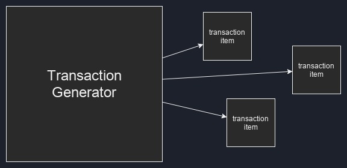
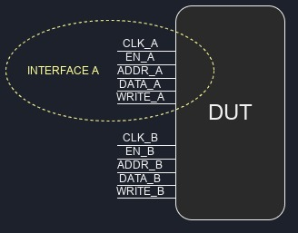
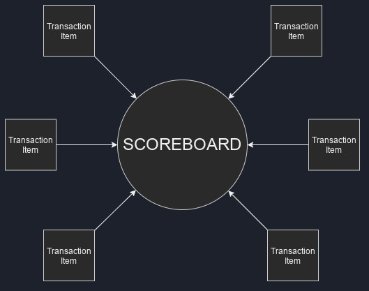

# 4. Современный транзакционный (UVM) стиль тестбенча на C++

В этом руководстве будут рассмотрены более современные методы верификации, а именно — транзакционные тестбенчи в стиле UVM.

## 4.1 Определение транзакционного тестбенча?

Постоянно растущая сложность FPGA и ASIC дизайнов приводит к ужесточению требований к верификации. Возросший спрос на продвинутые тестбенчи породил появление новых методологий и инструментов, таких как OVM, VVM, UVM, SystemC, а также различных Python-фреймворков. Все эти инструменты направлены на одну цель — облегчение построения мощных, самопроверяющих тестбенчей из переиспользуемых компонентов, с одновременным увеличением покрытия кода, минимизацией дублирования и избавлением инженеров по верификации от необходимости постоянно смотреть на осциллограммы. Один из главных способов достижения этой цели — поощрение написания тестбенчей транзакционного стиля, которые, как раз могут быть реализованы на чистом C++ вместе с Verilator.

Транзакционный тестбенч — это тестбенч, который использует транзакции (что, по сути, представляет собой обмен данными или управляющими пакетами), которые обеспечивают абстракцию поверх прямого присваивания значений входным контактам и непосредственной проверки значений выходных контактов устройства, проходящего тестирование (DUT). 

Традиционный тестбенч на VHDL, Verilog, SystemVerilog или C++ обычно имеет экземпляр DUT, а также длинный поведенческий код с циклами и условными операторами, который последовательно подаёт сигналы на входы DUT для перевода его в определённые состояния. Как правило, такие тестбенчи проверяются на корректность визуальным просмотром осциллограмм, и хотя можно добавить самопроверку через утверждения или мониторинг.

В отличие от этого, транзакционный тестбенч поощряет строгое разделение на различные функциональные блоки, которые общаются между собой через транзакции. Базовый транзакционный тестбенч может состоять из:

- блока генерации стимулов для DUT (генератор транзакций / последовательность);

- блока, подающего эти данные на DUT (драйвер);

- блока, который наблюдает выходы DUT и генерирует результаты (монитор);

- блока, собирающего пакеты данных и сравнивающего их для проверки (табло);

- блока, собирающего данные и рассчитывающего функциональное покрытие (ковередж).

Сразу видно главный минус транзакционных тестбенчей — это сложность: из-за множества отдельных блоков базовая симуляция запускается медленнее. Однако этот недостаток перекрывается непревзойдённой гибкостью и повторным использованием кода.

Например, если есть драйвер для интерфейса типа A, его можно использовать его с любым другим DUT с таким же интерфейсом типа A — достаточно просто передать ему новые данные. Если интерфейс заменяется с типа A на тип B, достаточно поменять драйвер с A на B, оставляя остальной тестбенч без изменений.

## 4.2 Рандомизированные транзакционные (в UVM стиле) тестбенчи на чистом C++ с Verilator

Тестбенчи в стиле UVM довольно легко пишутся и на чистом C++. Структуры наподобие драйверов, мониторов и табло просто реализуются, и также возможно реализовать покрытие и последовательные структуры, приложив немного дополнительных усилий.

Реализация современных транзакционных тестбенчей на чистом C++ вместо SystemC или UVM-SystemC имеет преимущество в простоте старта, а иногда и в более высокой производительности. Минус — многое из того, что уже есть в SystemC или UVM, придётся реализовать вручную. Теоретически, можно создать тестбенч на SystemVerilog UVM, преобразовать его в C++ с помощью Verilator и управлять базовым C++ тестбенчем. Однако поддержка UVM в Verilator пока ещё не полноценная.

Учитывая всё это, в данной работе будет создан базовый транзакционный тестбенч на чистом C++, без сторонних библиотек. Будут написсаны структуры, которые условно представляют транзакции, драйверы, мониторы и табло. Это даст необходимые знания для создания мощных тестбенчей на C++, а также понятную и простую в использовании основу для последующих проектов.

## 4.3 Базовая блок-схема транзакционного тестбенча

Вот базовый пример того, как устроен современный транзакционный тестбенч:


Рисунок 12 - Блок-схема базового транзакционного тестового стенда

Описание компонент представлено ниже:

### 4.3.1 Транзакция и элемент транзакции

Транзакция — это высокоуровневая операция обмена данными, а элемент транзакции — это просто пакет данных, то есть набор информации или инструкций. Обычно реализуется как класс или структура и содержит данные, отправляемые в DUT или получаемые от него.


Рисунок 13 - Элемент транзакции

### 4.3.2 Генератор транзакций

Это класс или блок кода, который создаёт элементы транзакций, используемые как инструкции для подачи на входы DUT.



Рисунок 14 - Генератор транзакций

### 4.3.3 Драйвер

Эти структуры берут элементы транзакций и, на основе содержащихся данных, управляют физическими входами входного интерфейса (устанавливая 1 и 0), чтобы ввести данные в DUT. Иногда драйверы требуются и для сложных выходных интерфейсов.


Рисунок 15 - Драйвер

### 4.3.4 Интерфейс

Интерфейс — это просто набор или группа контактов, которые используются для конкретной функции. Например, FIFO обычно имеет два интерфейса: входной и выходной, а двухтактовая память (dual-clock RAM) может иметь четыре: вход для порта A, выход для порта A, вход для порта B, выход для порта B.

Интерфейс может быть классом или структурой, которая объединяет функционально связанные контакты, или, как будет в данном случае, это также может быть неявная группировка контактов без явного объединения в коде.



Рисунок 16 - Интерфейс

### 4.3.5 Монитор

Это по сути полная противоположность драйвера — вместо того чтобы управлять физическими состояниями пинов на интерфейсах, мониторы пассивно наблюдают (мониторят) за тем, что происходит на интерфейсе. Мониторы обычно подключаются к выходному интерфейсу, где они используются для проверки выходных данных устройства под тестом. Кроме того, вы можете увидеть их подключёнными к входным интерфейсам, где они могут проверять, что связанный драйвер корректно управляет интерфейсом.

То, что они делают с данными, полученными в результате наблюдаемых изменений сигналов, зависит от разработчика тестбенча. Мониторы могут быть полностью автономными и самопроверяющими, то есть они могут напрямую выполнять код, который проверяет правильность изменений сигналов по мере появления событий на интерфейсе. Однако, чаще мониторы проектируются так, чтобы генерировать новые элементы транзакций из наблюдаемых изменений состояний контактов интерфейса. Эти элементы транзакций затем отправляются в анализирующие порты табло.


Рисунок 17 - Монитор

### 4.3.6 Табло

Структура табло обычно содержит наибольшую часть самопроверяющего кода тестбенча. Одно табло имеет один или несколько анализирующих (слушающих) портов, которые используются для получения элементов транзакций от мониторов. Табло выполняет проверки на полученных элементах транзакций, чтобы убедиться, что наблюдаемые входные стимулы приводят к корректным выходам, и определяет, прошёл тестбенч или нет.

Обычно в тестбенче используют одно табло, но ничто не мешает вам создать столько, сколько захотите.



Рисунок 18 - Табло

## 4.4 Структура и компоненты транзакционного тестбенча для АЛУ

Подобно базовой блок-схеме на рисункке 12, ниже представлена структура транзакционного тестбенча для АЛУ:


Рисунок 19 - Блок-схема транзакционного тестового стенда

Необходимо изучить код, который находится в тестбенче ```tb_alu.cpp```.

### 4.4.1 Элемент транзакции AluInTx

У ALU есть входной интерфейс, состоящий из пинов ```op_in```, ``a_in``, ```b_in``` и ```in_valid```. Поэтому необходим класс элемента транзакции, который сможет содержать данные для управления этими контактами. Это можно сделать следующим образом:

```cpp
class AluInTx {
    public:
        uint32_t a;
        uint32_t b;
        enum Operation {
            add = Valu___024unit::operation_t::add,
            sub = Valu___024unit::operation_t::sub,
            nop = Valu___024unit::operation_t::nop
        } op;
};
```

Числовые значения для ```a_in``` и ```b_in``` можно легко хранить в типе ```uint32_t```, который представляет собой беззнаковое 32-битное целое число.

Verilator допускает использование ```uint8_t``` для сигналов шириной до 8 бит, ```uint16_t``` — до 16 бит, ```uint32_t``` — до 32 бит, и ```vluint64_t``` — до 64 бит, и если ширина сигнала меньше или равна размеру переменной, компилятор выполнит автоматическое приведение типов по мере необходимости.

Чтобы задать операцию для операндов ```a``` и ```b```, создается перечисление ```op```, где значения берутся из сгенерированного Verilator кода SystemVerilog АЛУ. Это избавляет от необходимости каждый раз писать длинный префикс ```Valu___024unit::operation_t::```.

Наконец, нам нет необходимости хранить информацию о ```in_valid``` в ```AluInTx``` — драйвер сам будет управлять ```in_valid``` на основе полученного ```AluInTx```.

### 4.4.2 Генератор элементов транзакции rndAluInTx

Теперь, когда готов шаблон для транзакции ```AluInTx```, необходимо написать код, который будет создавать объекты этого типа и присваивать случайные значения операндам. Это делается в генераторе транзакций:

```cpp
AluInTx* rndAluInTx(){
    //20% шанс сгенерировать транзакцию
    if(rand()%5 == 0){
        AluInTx *tx = new AluInTx();
        tx->op = AluInTx::Operation(rand() % 3); // ENUM имеет значения 0, 1, 2
        tx->a = rand() % 11 + 10; // генерируем a в диапазоне 10-20
        tx->b = rand() % 6;  // генерируем b в диапазоне 0-5
        return tx;
    } else {
        return NULL;
    }
}
```

Каждый раз при вызове функции ```rndAluInTx()```, она случайным образом либо:

1. выделяет память под объект ```AluInTx``` (строка 4), присваивает случайные значения ``op``, ```a``` и ```b```, и возвращает указатель на вновь созданный объект (строка 8);

2. либо немедленно возвращает NULL (строка 10), что означает, что транзакция не была сгенерирована.

Причина случайного пропуска генерации каждой второй транзакции — это создание пауз между командами, отправляемыми АЛУ. Возвращение NULL — не единственный способ сделать это: можно пойти противоположным путём и создать последовательность, которая зависит от некоторой временной переменной (например, тиков симуляции или счётчика положительных фронтов), а затем генерировать транзакции только в определённые моменты времени.

### 4.4.3 Драйвер интерфейса ввода AluInDrv

Как только будет сгенерирован элемент транзакции ```AluInTx``` с помощью генератора ```rndAluInTx```, ```AluInTx``` передастся в драйверный блок, который управляет входным интерфейсом АЛУ, используя информацию из этого элемента транзакции. Ниже приведен код драйвера из тестбенча:

```cpp
class AluInDrv {
    private:
        Valu *dut;
    public:
        AluInDrv(Valu *dut){
            this->dut = dut;
        }

        void drive(AluInTx *tx){
            // мы всегда начинаем с установки in_valid в 0, и устанавливаем его в 1 позже, только если это необходимо
            dut->in_valid = 0;

            // Ничего не передаём, если элемент транзакции не существует
            if(tx != NULL){
                if (tx->op != AluInTx::nop) {
                    // Если операция не является NOP, мы передаём её на
                    // пины входного интерфейса
                    dut->in_valid = 1;
                    dut->op_in = tx->op;
                    dut->a_in = tx->a;
                    dut->b_in = tx->b;
                }
                // Освобождаем память, удаляя элемент tx
                // после того как он был использован
                delete tx;
            }
        }
};
```

Конструктор ```AluInDrv``` требует дескриптор на объект dut. Необходимо иметь дескриптор устройства, проходящего тестирование (DUT), внутри драйверов и мониторов, чтобы иметь доступ к его выводам.

На строке 12 видно, что входной сигнал ```in_valid``` всегда по умолчанию устанавливается в ```0```. Это связано с тем, что, если нет допустимого ```AluInTx``` и при этом он не является ```NOP```, входные данные для АЛУ не будут считаться валидными. Примерный эквивалент на SystemVerilog будет таким:

```systemverilog
always_comb begin
    dut.in_valid = 1'b0;
    if ( tx item существует && операция != NOP ) begin
        dut.in_valid = 1'b1;
    end
end
```

Если элемент транзакции не NULL, то на строке 26 происходит удаление (освобождение памяти), где хранится объект транзакции. Это очень важно сделать — как только элемент используется (записывается в DUT), срок его службы заканчивается, и он должен быть удалён, иначе будет утечка памяти.

Важно обратить внимание, что C++ поддерживает умное управление памятью. Однако для целей объяснения, ручное управление памятью лучше иллюстрирует срок жизни элементов транзакций.

### 4.4.4 Монитор входного интерфейса AluInMon

```AluInMon``` следит за входным интерфейсом АЛУ, выполняя противоположные действия драйверу, который были рассмотрены ранее.

```cpp
class AluInMon {
    private:
        Valu *dut;
        AluScb *scb;
    public:
        AluInMon(Valu *dut, AluScb *scb){
            this->dut = dut;
            this->scb = scb;
        }

        void monitor(){
            if (dut->in_valid == 1) {
                // Если на входном интерфейсе есть валидные данные,
                // создаём новый элемент транзакции AluInTx и заполняем
                // его данными, считанными с пинов интерфейса
                AluInTx *tx = new AluInTx();
                tx->op = AluInTx::Operation(dut->op_in);
                tx->a = dut->a_in;
                tx->b = dut->b_in;

                // затем передаём элемент транзакции в scoreboard
                scb->writeIn(tx);
            }
        }
};
```

Здесь на строке 12 можно заметить сигнал ```in_valid``` на входе АЛУ. Если вход валидный, монитор создаёт новый элемент транзакции ```AluInTx```, считывает значения ```op_in```, ```a_in```, ```b_in``` контактов и помещает их в ```AluInTx``` переменные ```op```, ```a```, и ```b```.

Этот новый элемент транзакции сообщает, какую операцию отправили на входы АЛУ, что будет нужно для проверки корректности выходных данных АЛУ. Поэтому на строке 22 новая транзакция записывается в таблицу для последующего использования.

### 4.4.5 Элемент транзакции AluOutTx

Точно так же, как ```AluInTx``` элемент транзакции для операций с интерфейсом ввода, ```AluOutTx``` элемент транзакции для хранения информации о результатах, получаемых с помощью интерфейса вывода.

Однако, поскольку единственное, что предоставляется на выходе — это одно значение результата, ```AluOutTx``` содержит только одну переменную:

```cpp
class AluOutTx {
    public:
        uint32_t out;
};
```

### 4.4.6 Монитор выходного интерфейса AluOutMon

Здесь вступает в действие элемент ```AluOutTx```. Точно так же, как монитор входа, ```AluOutMon``` наблюдает выходной интерфейс аналогичным образом:

```cpp
class AluOutMon {
    private:
        Valu *dut;
        AluScb *scb;
    public:
        AluOutMon(Valu *dut, AluScb *scb){
            this->dut = dut;
            this->scb = scb;
        }

        void monitor(){
            if (dut->out_valid == 1) {
                // Если на выходном интерфейсе валидные данные,
                // создаём новый элемент AluOutTx и заполняем
                // его результатом, считанным с пинов интерфейса
                AluOutTx *tx = new AluOutTx();
                tx->out = dut->out;

                // затем передаём элемент транзакции в scoreboard
                scb->writeOut(tx);
            }
        }
};
```

```AluOutMon``` ждёт, пока сигнал ```out_valid``` не станет равным 1. Когда это происходит, создаётся новый элемент ```AluOutTx``` (строка 16), значение на выходных контактах испытуемого устройства сохраняется в ```out``` переменной в ```AluOutTx``` элементе, а затем элемент передаётся на табло.

### 4.4.7 Табло AluScb

Табло - это самый важный блок в тестбенче, это мозг всей операции:

```cpp
// Табло ALU
class AluScb {
    private:
        std::deque<AluInTx*> in_q;

    public:
        // Порт монитора входного интерфейса
        void writeIn(AluInTx *tx){
            // Поместить полученный элемент транзакции в очередь для последующей обработки
            in_q.push_back(tx);
        }

        // Порт монитора выходного интерфейса
        void writeOut(AluOutTx* tx){
            // Мы никогда не должны получать данные из выходного интерфейса
            // до тех пор, пока на входной интерфейс не будет подано значение
            if(in_q.empty()){
                std::cout <<"Фатальная ошибка в AluScb: пустая очередь AluInTx" << std::endl;
                exit(1);
            }

            // Извлекаем элемент транзакции из начала очереди входных элементов
            AluInTx* in;
            in = in_q.front();
            in_q.pop_front();

            switch(in->op){
                // На выходе не должен появляться валидный сигнал, если операция отсутствует,
                // поэтому мы не должны получать транзакцию с операцией NOP
                case AluInTx::nop :
                    std::cout << "Фатальная ошибка в AluScb, получен NOP на входе" << std::endl;
                    exit(1);
                    break;

                // Получена транзакция сложения
                case AluInTx::add :
                    if (in->a + in->b != tx->out) {
                        std::cout << std::endl;
                        std::cout << "AluScb: несоответствие при сложении" << std::endl;
                        std::cout << "  Ожидалось: " << in->a + in->b
                                  << "  Фактически: " << tx->out << std::endl;
                        std::cout << "  Время симуляции: " << sim_time << std::endl;
                    }
                    break;

                // Получена транзакция вычитания
                case AluInTx::sub :
                    if (in->a - in->b != tx->out) {
                        std::cout << std::endl;
                        std::cout << "AluScb: несоответствие при вычитании" << std::endl;
                        std::cout << "  Ожидалось: " << in->a - in->b
                                  << "  Фактически: " << tx->out << std::endl;
                        std::cout << "  Время симуляции: " << sim_time << std::endl;
                    }
                    break;
            }
            // Так как элементы транзакций были размещены в куче, важно
            // освободить память после их использования
            delete in;
            delete tx;
        }
};
```

С самого начала создаётся очередь для хранения элементов транзакций ```AluInTx``` в табло:

```cpp
std::deque<AluInTx*> in_q;
```

Каждый раз, когда в АЛУ отправляется допустимая операция, монитор входного интерфейса записывает элемент ```AluInTx``` в табло через метод writeIn (строка 8). Элемент ```AluInTx``` необходимо сравнить с соответствующим элементом ```AluOutTx```, чтобы проверить правильность результата АЛУ. Так как АЛУ конвейерный, можно отправить несколько команд на входной интерфейс до того, как придут какие-либо выходные элементы ```AluOutTx```. Поэтому элементы ```AluInTx``` нужно сохранять для последующей проверки, и очередь идеально подходит для этой задачи.

Метод ```writeOut``` (строка 14) — это место, где происходит вся проверка результатов. Сначала, на строке 17, проверяется, не выдаёт ли АЛУ случайный мусор на выходе — результат на выходе должен появиться только после того, как допустимая операция была подана на вход, поэтому никогда не должно быть такого момента, когда результат на выходе появился раньше, чем хотя бы один элемент ```AluInTx``` в очереди.

Далее, если очередь ```in_q``` не пуста, из нее извлекается первый (самый старый) элемент ```AluInTx``` и переходит к оператору ```switch``` на строке 27. Первый случай ```switch``` (строка 30) проверяет правильность работы тестбенча — валидный сигнал не должен появляться на входе при операции ```NOP```, и если элемент ```AluInTx``` с операцией ```NOP``` попал в табло, это значит, что драйвер ```AluInDrv``` работает некорректно.

В оставшихся случаях, в зависимости от того, является ли операция сложением (строка 36) или вычитанием (строка 47), необходимо сложить или вычесть операнды из ```AluInTx``` и сравнивнить с результатом в ```AluOutTx```.

В конце метода ```writeOut```, элементы транзакций удаляются (строки 59 и 60), так как они больше не нужны.

## 4.5 Сборфункционала воедино

Главный цикл — это место, где происходит вся верификационная "магия". Функция ```main``` содержит создание всех блоков тестбенча (мониторы, драйвер, табло), а затем в главном цикле итеративно вызываются функции всех этих блоков до окончания симуляции. Или до тех пор, пока тестбенч не завершится с ошибкой. Ниже представлен код функции main и основного симуляционного цикла:

```cpp
int main(int argc, char** argv, char** env) {
    <...>

    AluInTx   *tx;

    // Создаём драйвер, табло и блоки мониторов входа и выхода
    AluInDrv  *drv    = new AluInDrv(dut);
    AluScb    *scb    = new AluScb();
    AluInMon  *inMon  = new AluInMon(dut, scb);
    AluOutMon *outMon = new AluOutMon(dut, scb);

    while (sim_time < MAX_SIM_TIME) {
        dut_reset(dut, sim_time);
        dut->clk ^= 1;
        dut->eval();

        // Все действия по управлению/мониторингу выполняются на положительном фронте
        if (dut->clk == 1){

            if (sim_time >= VERIF_START_TIME) {
                // Генерация случайной транзакции AluInTx
                tx = rndAluInTx();

                // Передача транзакции драйверу ALU,
                // который управляет входами на основе данных в транзакции
                drv->drive(tx);

                // Мониторинг входного интерфейса
                inMon->monitor();

                // Мониторинг выходного интерфейса
                outMon->monitor();
            }
        }
        // конец обработки положительного фронта

        m_trace->dump(sim_time);
        sim_time++;
    }

    <...>
    delete dut;
    delete outMon;
    delete inMon;
    delete scb;
    delete drv;
    exit(EXIT_SUCCESS);
}
```

После создания блоков тестбенча (строки 14-17), симуляция входит в главный цикл на строке 19, который выполняется до конца симуляционного времени.

На каждой итерации цикла проверяется, наступил ли положительный фронт тактового сигнала (строка 25). Если да, тестбенч генерирует транзакцию ```AluInTx``` (строка 28).

Эта транзакция передаётся драйверу ```AluInDrv``` (строка 33), который управляет входными линиями АЛУ по информации из транзакции.

На этом же фронте монитор ```AluInMon``` наблюдает входные линии (строка 36) и из наблюдений формирует новый элемент ```AluInTx```, который записывается в табло.

Также на этом же фронте монитор ```AluOutMon``` следит за выходами АЛУ (строка 39), но транзакции ```AluOutTx``` пока не создаются из-за задержки в АЛУ по конвейеру — нужно минимум две итерации цикла, прежде чем результаты появятся.

После завершения симуляции все блоки тестбенча удаляются для освобождения памяти (строки 46-50).

## 4.6 Симуляция

Для запуска симуляции, достаточно выполнить ```make``` в каталоге проекта — это соберёт и запустит тестбенч. Никакого интересного вывода не будет, потому что АЛУ и тестбенч работают корректно, тест проходит без ошибок.

Но это не очень информативно, поэтому можно посмотреть, что будет, если что-то пойдёт не так.

## 4.7 Плохие результаты АЛУ

Легко обнаружить, если АЛУ выдаёт неправильные результаты, табло сразу пожалуется. Если моделировать АЛУ вот так:

```verilog
out       <= 6'h5; // должно быть "<= result"
out_valid <= in_valid_r;
```

Тогда табло тут же засечёт ошибку:

```verilog
AluScb: add mismatch
  Expected: 15  Actual: 5
  Simtime: 204

AluScb: sub mismatch
  Expected: 11  Actual: 5
  Simtime: 234

AluScb: add mismatch
  Expected: 17  Actual: 5
  Simtime: 236
```

## 4.8 Неожиданный out_valid в АЛУ

Если сделать так, чтобы АЛУ всегда сигнализировало валидный выход:

```verilog
out       <= result;
out_valid <= 1'b1; // должно быть "<= in_valid_r"
```

Тогда тестовый стенд немедленно завершит работу с фатальной ошибкой при первом обнаружении некорректного корректного вывода:

```verilog
./obj_dir/Valu +verilator+rand+reset+2 
Fatal Error in AluScb: empty AluInTx queue
make: *** [Makefile:23: waveform.vcd] Error 1
```
Это потому что табло не ожидает увидеть выходные данные, если на вход ранее не подавалась команда.

## 4.9 Графическое представление

С помощью GTKWave, можно выполнить ```make waves```, чтобы посмотреть на случайно сгенерированные транзакции в виде волн.


Рисунок 20 - Графическое представление
